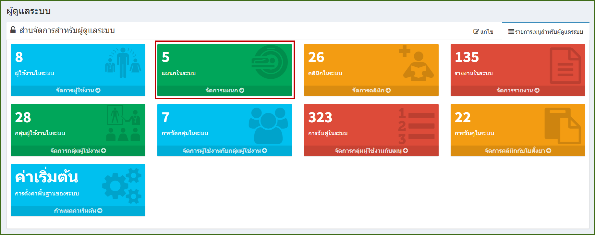
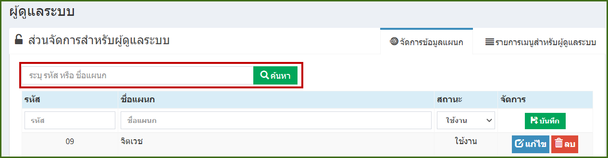
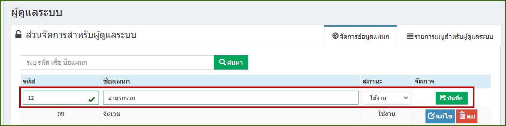
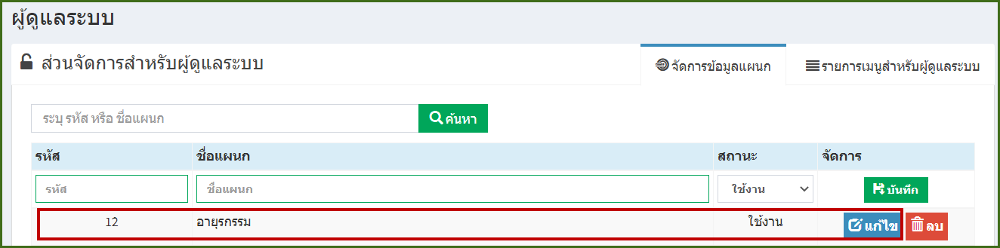
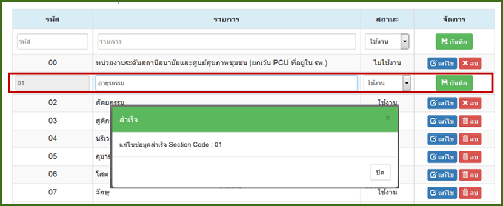
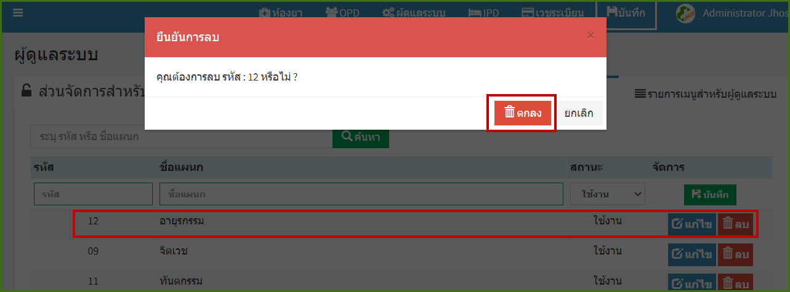

# 702 - จัดการแผนก

คลิกปุ่ม "จัดการผู้ใช้งาน"

1. การค้นหา : ระบุ รหัส / ชื่อรายการ อย่างใดอย่างหนึ่งแล้ว enter หรือกดปุ่มค้นหา ก็จะปรากฎข้อมูล

2. การเพิ่มข้อมูลแผนก : กรอกหมายเลขรหัสแผนก ชื่อแผนก และเลือกสถานะของแผนก (ใช้งาน/ไม่ใช้งาน) แล้วกดปุ่ม "บันทึก"
หมายเหตุ : รหัส กับ ชื่อแผนกต้องไม่ซ้ำกัน

3.  การแก้ไข : ค้นหาข้อมูลแผนกที่ต้องการแก้ไข > กดปุ่ม "แก้ไข"

   เมื่อกดปุ่มแก้ไขแล้ว สามารถแก้ไขชื่อแผนกกับสถานะการใช้งานได้ แต่รหัสไม่สามารถแก้ไขได้ เมื่อแก้ไขเสร็จแล้ว กดปุ่มบันทึกจะมีกล่องข้อความเพื่อบอกว่าแก้ไขเรียบร้อยแล้ว

4. การลบ : ค้นหาข้อมูลแผนกที่ต้องการลบ > กดปุ่ม "ลบ" > จะมีกล่องข้อความยันยืนการลบอีกครั้ง กดปุ่ม "ลบ" 

