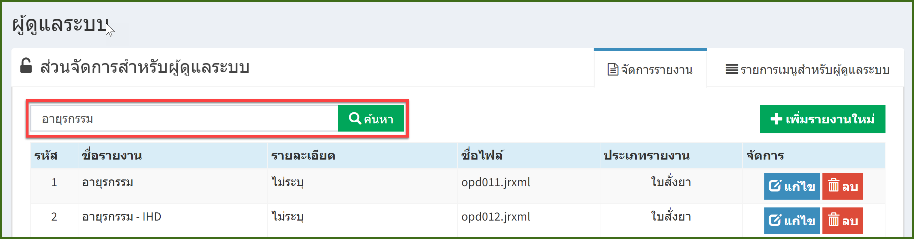
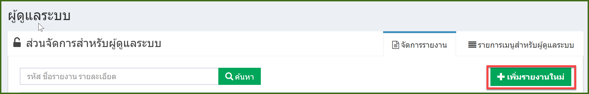
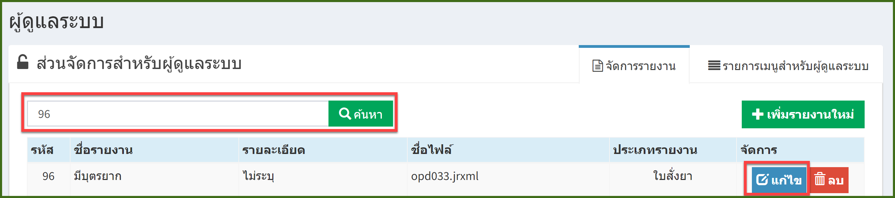
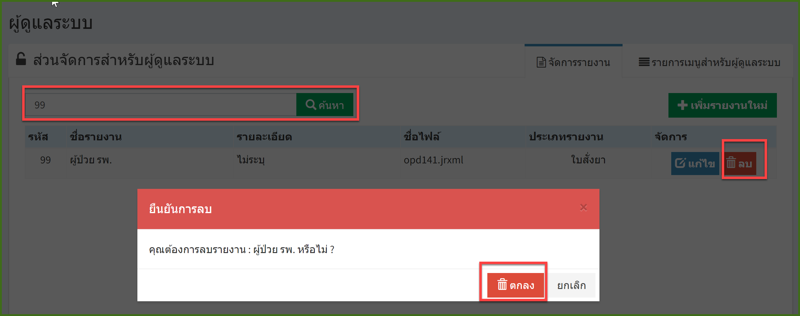

# 704 - จัดการรายงาน

คลิกปุ่ม "จัดการรายงาน"

1. การค้นหา : ระบุ รหัส / ชื่อรายงาน / รายละเอียด  อย่างใดอย่างหนึ่งแล้ว enter หรือกดปุ่มค้นหา ก็จะปรากฎข้อมูล

2. การเพิ่มรายงานใหม่ : กดปุ่ม "เพิ่มรายงานใหม่" 

   จะปรากฏหน้าจอเพิ่มรายงาน> กรอกรายละเอียด > กดปุ่ม "บันทึก"
   
   

3.  การแก้ไข : ค้นหารายงานที่ต้องการแก้ไข > กดปุ่ม "แก้ไข" 

   จะปรากฎหน้าจอ แก้ไขรายงาน > แก้ไขข้อมูล > กดปุ่ม "บันทึก"

4. การลบ : ค้นหารายงานที่ต้องการลบ > กดปุ่ม "ลบ" > จะมีกล่องข้อความยันยืนการลบอีกครั้ง กดปุ่ม "ลบ" 

