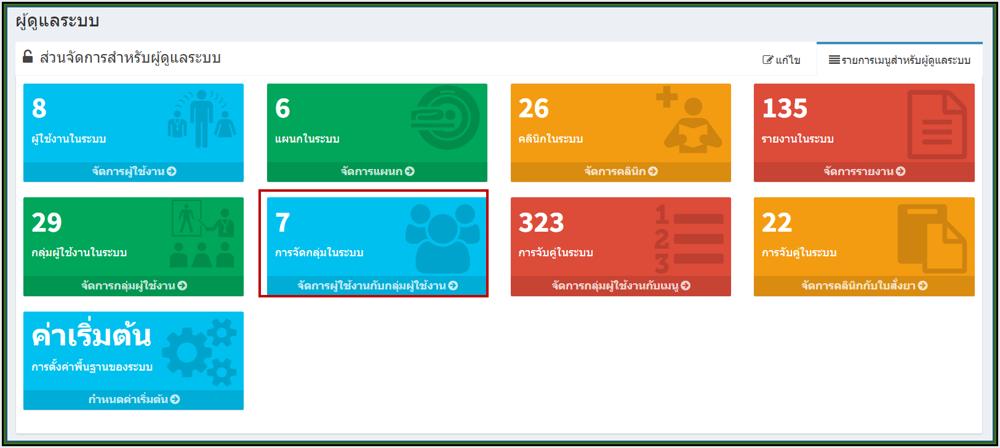
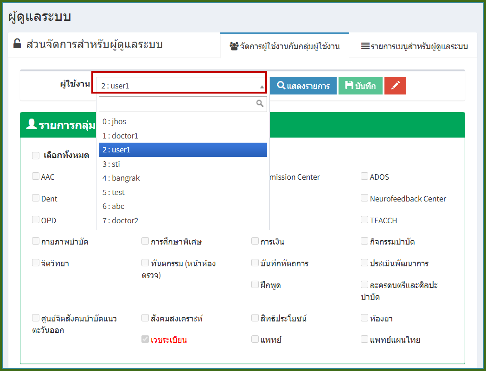
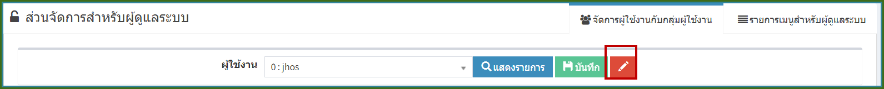
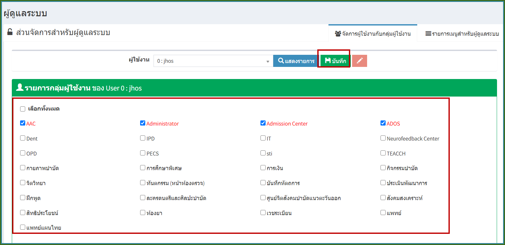
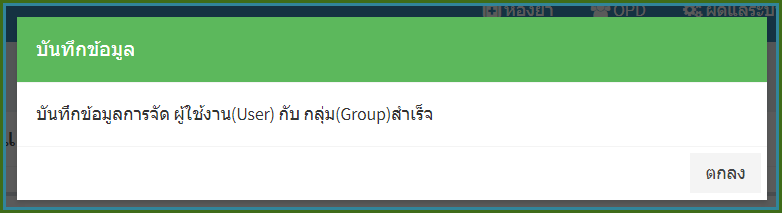

# 706 - จัดการผู้ใช้งานกับกลุ่มผู้ใช้งาน

คลิกปุ่ม "จัดการผู้ใช้งานกับกลุ่มผู้ใช้งาน"

1. เลือก User ที่ต้องการจัดกลุ่ม

**หมายเหตุ : ปุ่ม "แสดงรายการ" ใช้ refresh ข้อมูลให้เป็นปัจจุบัน

2. กดปุ่ม "ปากกาสีแดง" เพื่อทำการเลือกและแก้ไขกลุ่ม

 

3. ทำการเลือกกลุ่มที่ต้องการให้กับ User หากทำการเลือกแล้วจะเป็นตัวอักษรสีแดง > กดปุ่ม "บันทึก"
   

4. เมื่อกดปุ่มบันทึกแล้ว จะมีกล่องข้อความแจ้งว่าบันทึกข้อมูลการจัด User กับ Group สำเร็จ > กดปุ่ม "ตกลง"

