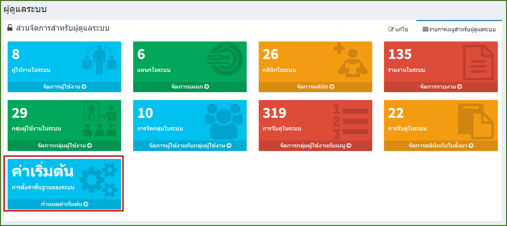
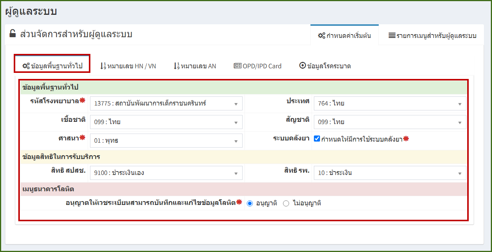
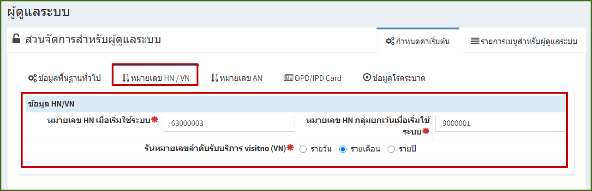
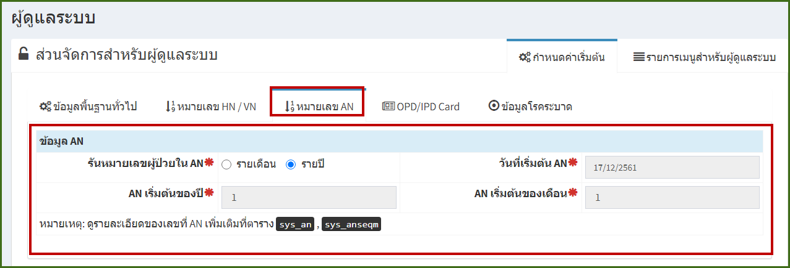
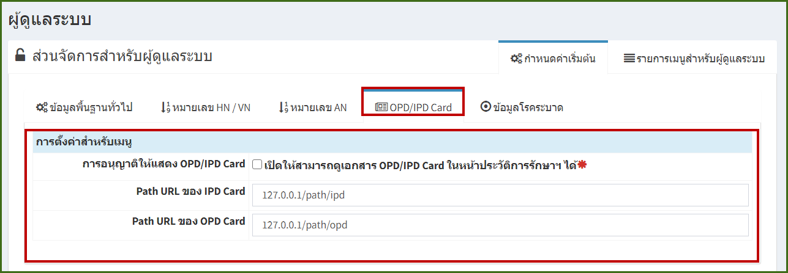
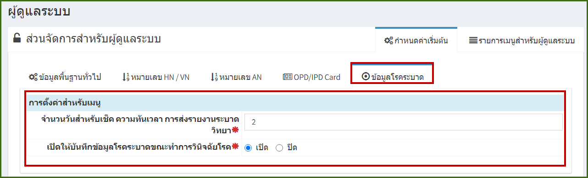

# 709 - กำหนดการค่าเริ่มต้น

คลิกปุ่ม "กำหนดการค่าเริ่มต้น"

1. แถบ "ข้อมูลพื้นฐานทั่วไป" กรอกรายละเอียดต่าง ๆ ให้ครบถ้วน โดยช่องที่มีเครื่องหมาย * ห้ามเป็นค่าว่าง

2. แถบ "หมายเลข HN / VN : แสดงข้อมูล HN / VN
   

3. แถบ "หมายเลข AN : แสดงข้อมูล AN 

4. แถบ "OPD/IPD Card : เดิมจะมีระบบ scan เอกสาร opd ipd card
หากแล้วต้องการเปิดดูใน jhos ต้อง config path ตรงนี้ 

5. แถบ "ข้อมูลโรคระบาด" เป็นการบันทึกข้อมูลเกี่ยวกับโรคระบาด เช่น ต้องบันทึกภายในกี่วันถึงจะเรียกว่าทันเวลา 
และสามารถกำหนดให้แสดง popup ให้กรอกข้อมูลโรคระบาด เมื่อทำการวินิจฉัยโรคที่เป็นโรคระบาด

