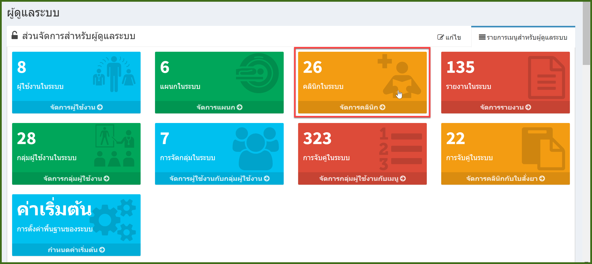
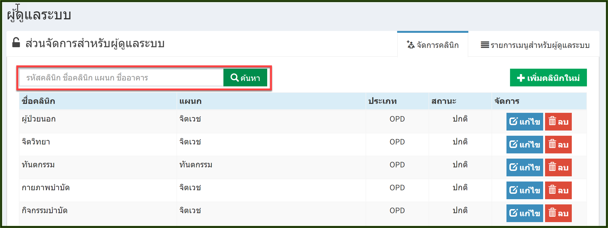
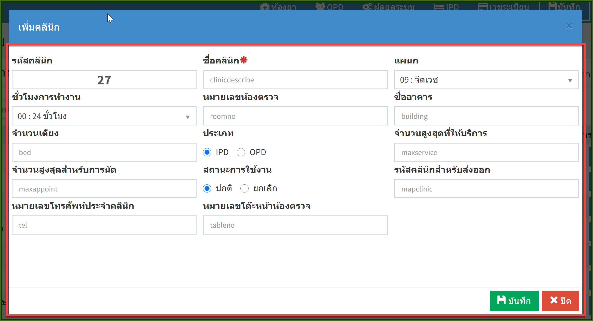
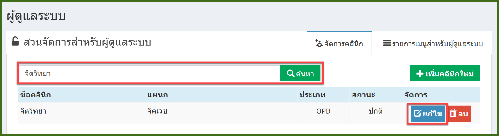
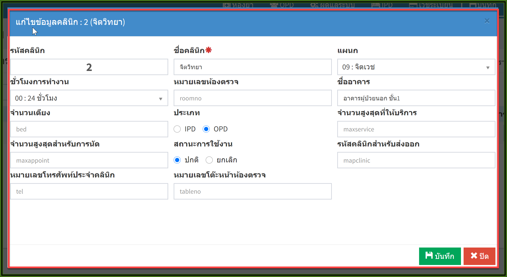
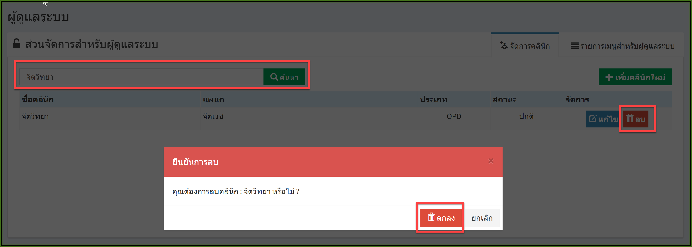

# 703 - จัดการคลินิก

คลิกปุ่ม "จัดการคลินิก"

1. การค้นหา : ระบุ รหัสคลินิก / ชื่อคลินิก / แผนก / ชื่ออาคาร อย่างใดอย่างหนึ่งแล้ว enter หรือกดปุ่มค้นหา ก็จะปรากฎข้อมูล

2. การเพิ่มคลินิกใหม่ : กดปุ่ม "เพิ่มคลินิก" 

   จะปรากฏหน้าจอเพิ่มคลินิก > กรอกรายละเอียด > กดปุ่ม "บันทึก"
   
   

3.  การแก้ไข : ค้นหาคลินิกที่ต้องการแก้ไข > กดปุ่ม "แก้ไข" 

   จะปรากฎหน้าจอ แก้ไขข้อมูลคลินิก > แก้ไขข้อมูล > กดปุ่ม "บันทึก"

4. การลบ : ค้นหาข้อมูลคลินิกที่ต้องการลบ > กดปุ่ม "ลบ" > จะมีกล่องข้อความยันยืนการลบอีกครั้ง กดปุ่ม "ลบ" 

