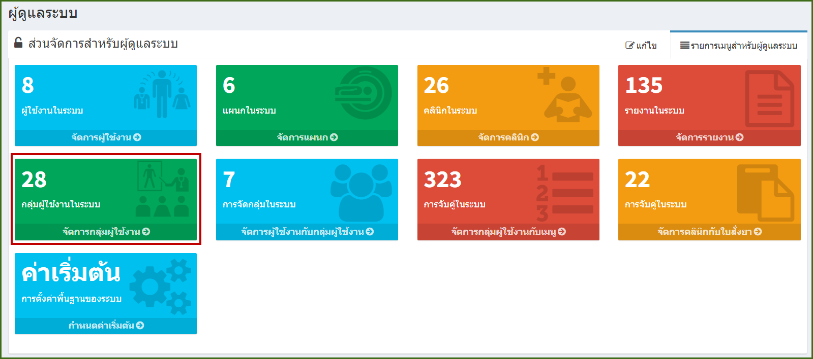
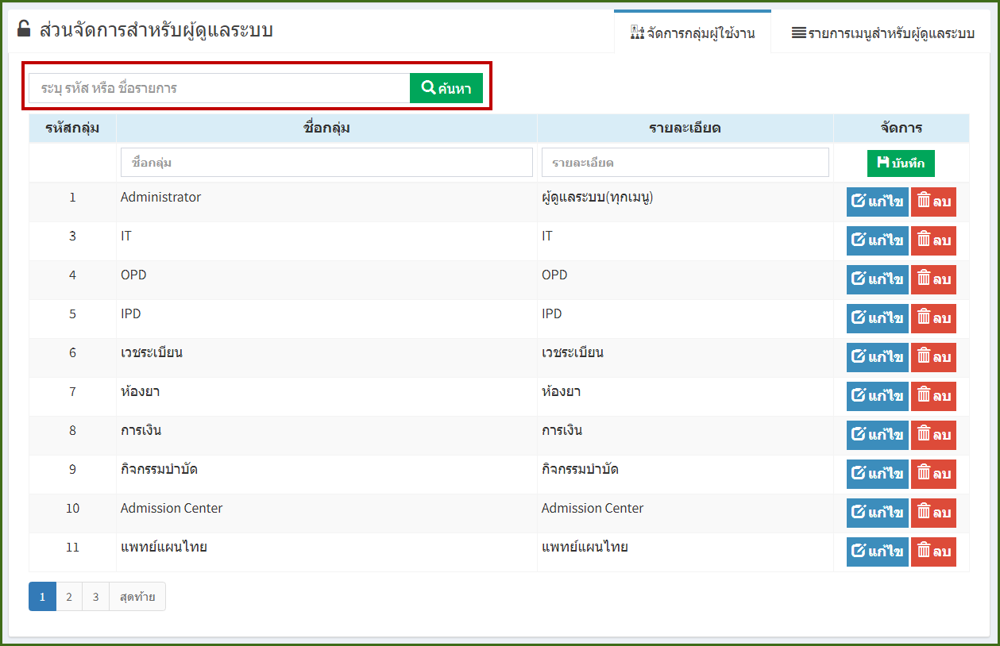
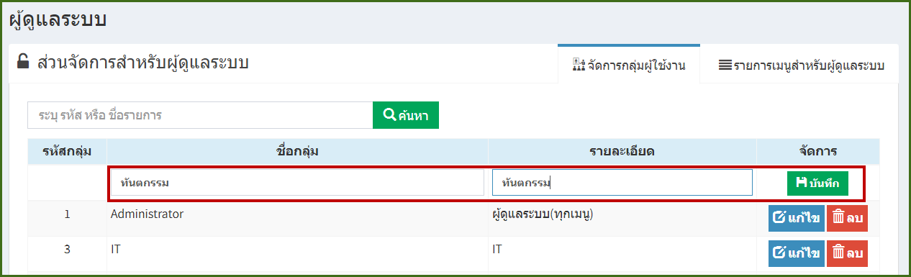
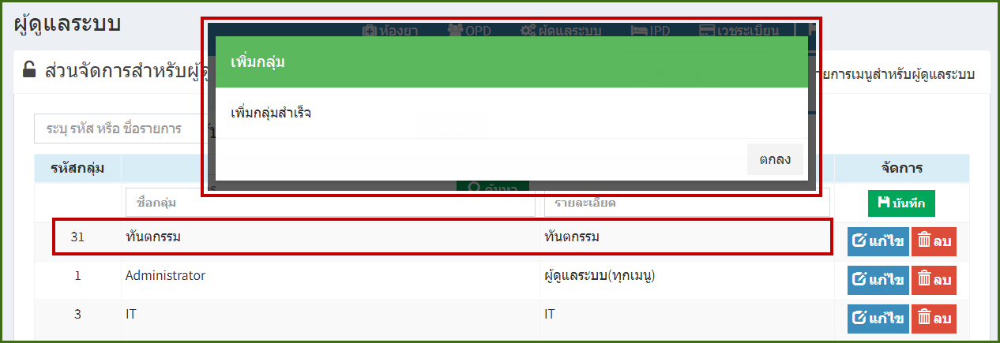
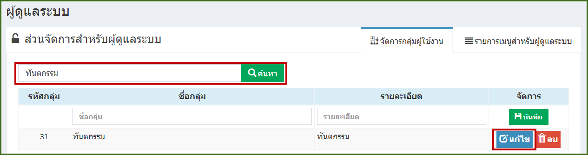
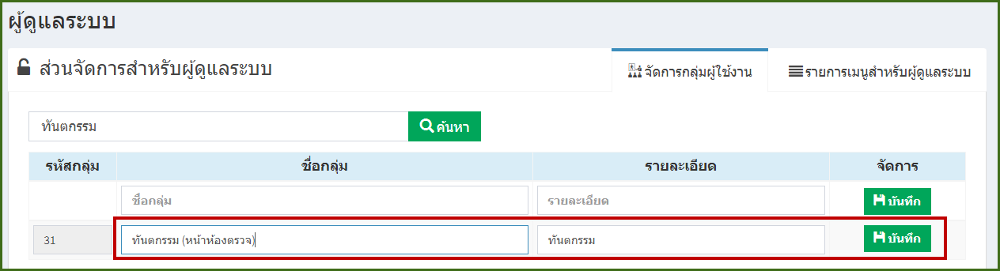
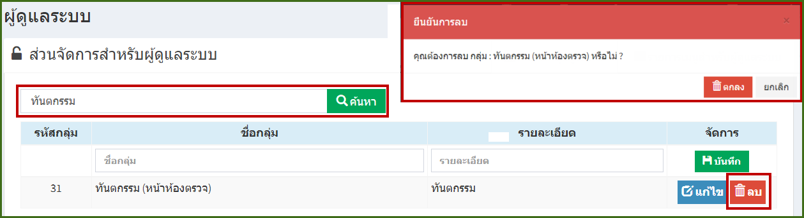

# 705 - จัดการกลุ่มผู้ใช้งาน

คลิกปุ่ม "จัดการกลุ่มผู้ใช้งาน"

1. การค้นหา : ระบุ รหัส / ชื่อรายการ อย่างใดอย่างหนึ่งแล้ว enter หรือกดปุ่มค้นหา ก็จะปรากฎข้อมูล

2. การเพิ่มกลุ่มผู้ใช้งาน : สามารถระบุชื่อกลุ่ม และรายละเอียดที่ต้องการเพิ่ม แล้วกดปุ่ม "บันทึก"

เมื่อกดปุ่มบันทึกแล้ว > จะมีกล่องข้อความแจ้งว่าได้เพิ่มกลุ่มสำเร็จ > กดปุ่ม "ตกลง" ให้สังเหตุว่ากลุ่มผู้ที่ใช้ที่เราทำการเพิ่มก็จะอยู่ในคอลัมน์แรก
   
   

3.  การแก้ไข : ค้นหารายงานที่ต้องการแก้ไข > กดปุ่ม "แก้ไข" 

   สามารถแก้ไขข้อมูล > กดปุ่ม "บันทึก" > จะมีกล่องข้อความการแก้ไขสำเร็จ > กดปุ่ม "ตกลง"

4. การลบ : ค้นหารายงานที่ต้องการลบ > กดปุ่ม "ลบ" > จะมีกล่องข้อความยันยืนการลบอีกครั้ง กดปุ่ม "ตกลง" 

