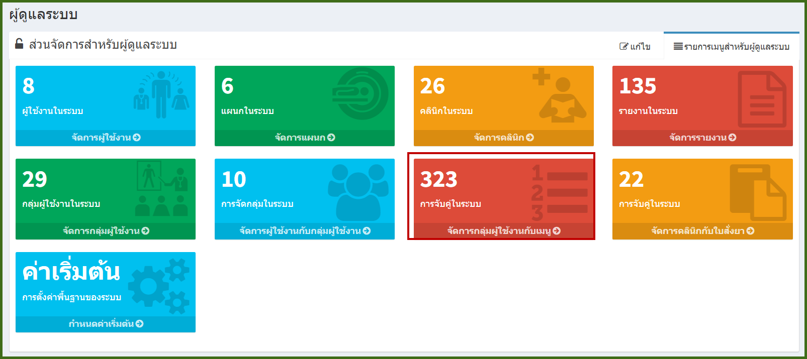
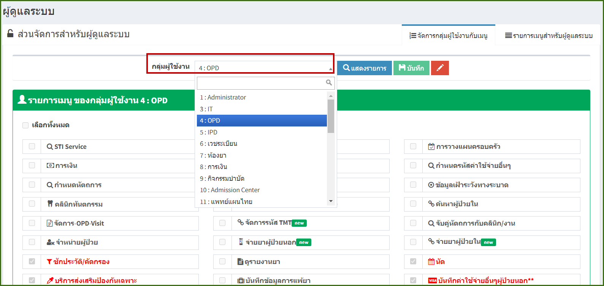
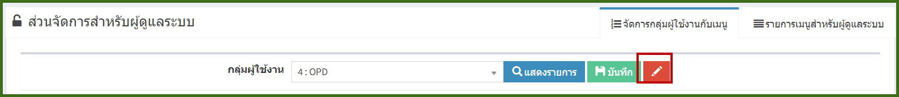
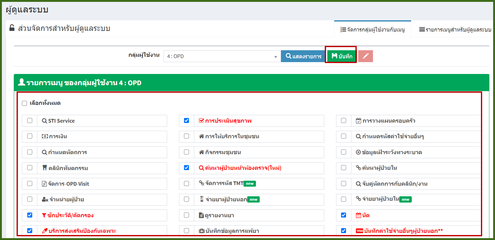
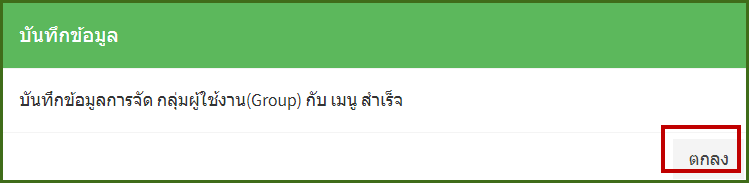

# 707 - จัดการกลุ่มผู้ใช้งานกับเมนู

คลิกปุ่ม "จัดการกลุ่มผู้ใช้งานกับเมนู"

1. เลือกกลุ่มผู้ใช้งานที่ต้องการ

**หมายเหตุ : ปุ่ม "แสดงรายการ" ใช้ refresh ข้อมูลให้เป็นปัจจุบัน

2. กดปุ่ม "ปากกาสีแดง" เพื่อทำการเลือกและแก้ไขกลุ่ม

 

3. ทำการเลือกเมนูที่ต้องการให้กับผู้ใช้งาน หากทำการเลือกแล้วจะเป็นตัวอักษรสีแดง > กดปุ่ม "บันทึก"
   

4. เมื่อกดปุ่มบันทึกแล้ว จะมีกล่องข้อความแจ้งว่าบันทึกข้อมูลการจัด User กับเมนูสำเร็จ > กดปุ่ม "ตกลง"

