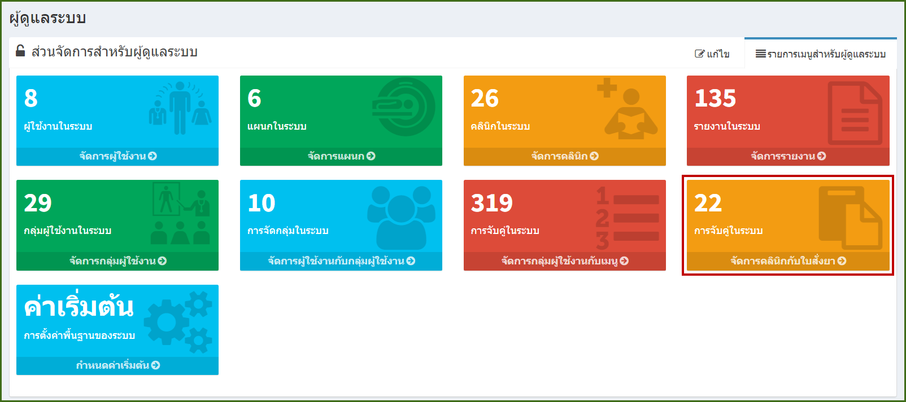
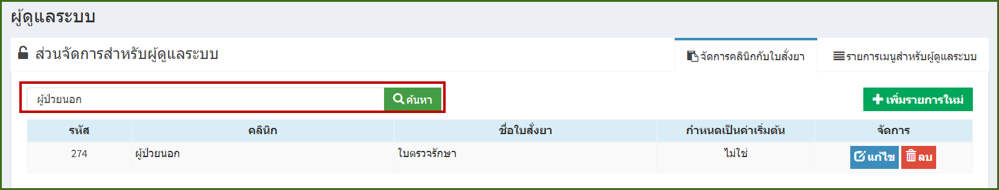
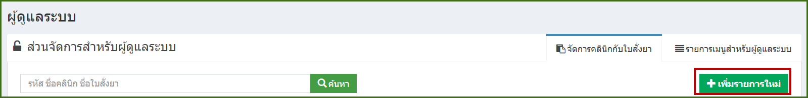
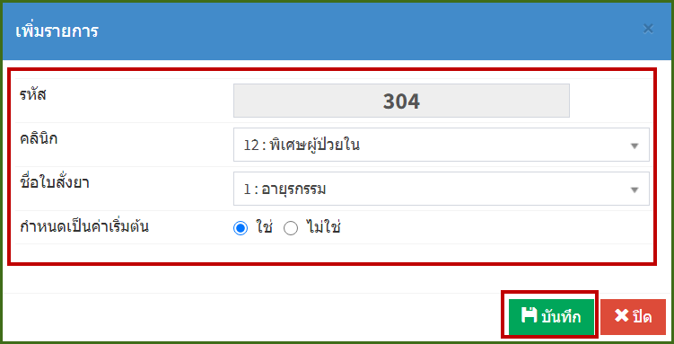
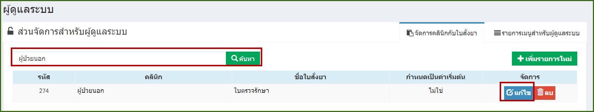
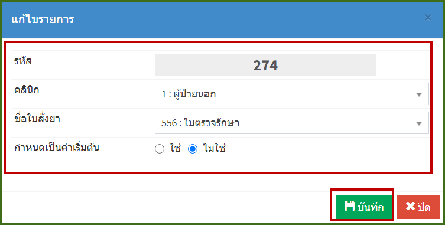
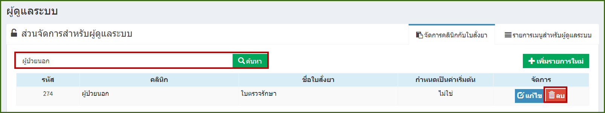
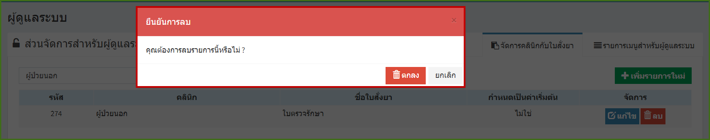

# 708 - จัดการคลินิกกับใบสั่งยา

คลิกปุ่ม "จัดการคลินิกกับใบสั่งยา"

1. การค้นหา : ระบุ รหัส / ชื่อคลินิก /ชื่อใบสั่งยา อย่างใดอย่างหนึ่งแล้ว enter หรือกดปุ่มค้นหา ก็จะปรากฎข้อมูล

2. การเพิ่มการจัดคลินิกกับใบสั่งยา : กดปุ่ม "เพิ่มรายการใหม่" 

จะปรากฎหน้าจอเพิ่มรายการ จะต้องกรอกข้อมูลให้ครบ > กดปุ่ม "บันทึก"

3.  การแก้ไข : ค้นหาข้อมูลข้อมูลคลินิกกับใบสั่งยาที่ต้องการแก้ไข > กดปุ่ม "แก้ไข"

จะปรากฎแก้ไข > กดปุ่ม "บันทึก"

4. การลบ : ค้นหาข้อมูลข้อมูลคลินิกกับใบสั่งยาที่ต้องการลบ > กดปุ่ม "ลบ" > จะมีกล่องข้อความยันยืนการลบอีกครั้ง กดปุ่ม "ลบ" 

