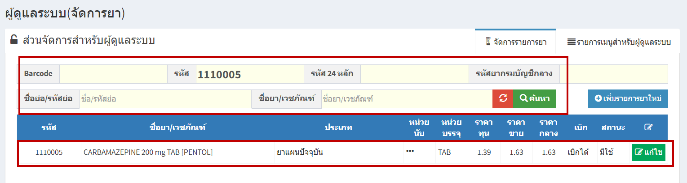
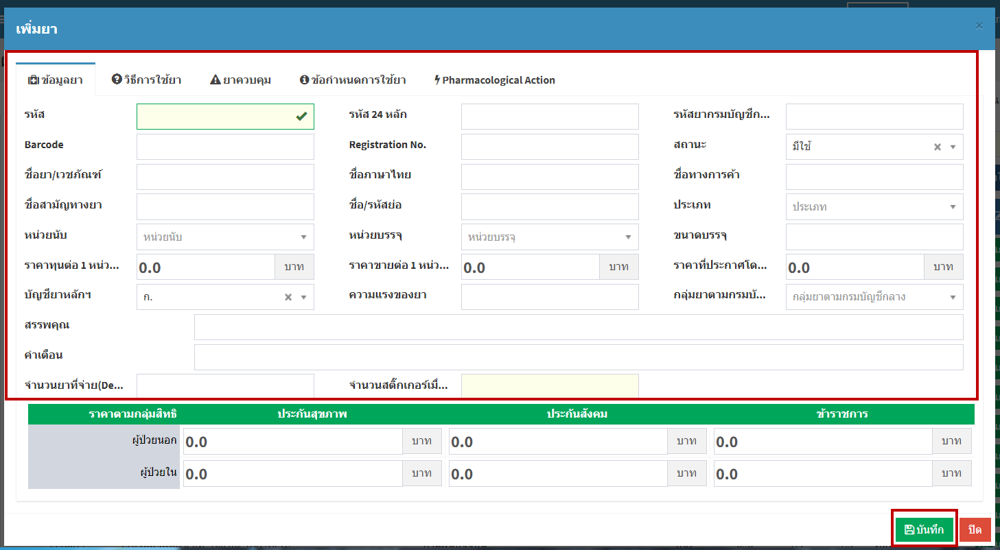
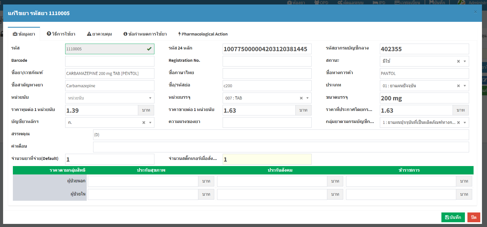

# 710 - จัดการรายการยา

1. การค้นหา > ระบุ รหัส / รหัส 24 หลัก / รหัสยากรมบัญชีกลาง / ชื่อหรือรหัสย่อ / ชื่อยาและเวชภัณฑ์ อย่างใดอย่างหนึ่ง แล้ว enter หรือกดปุ่ม "ค้นหา" > จะปรากฏรายการยา

2. การเพิ่มรายการยาใหม่ > กดปุ่ม การเพิ่มรายการยาใหม่ > กรอกรายละเอียดให้ครบถ้วน > กดปุ่ม "บันทึก"

3. การแก้ไข > ค้นหารายการยาที่ต้องการแก้ไข > กดปุ่มแก้ไข > ทำการแก้ไข > กดปุ่ม "บันทึก"

