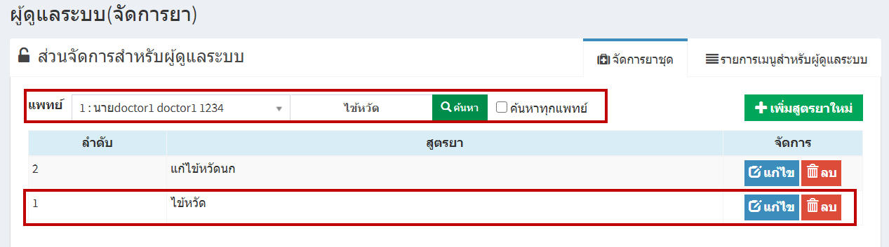
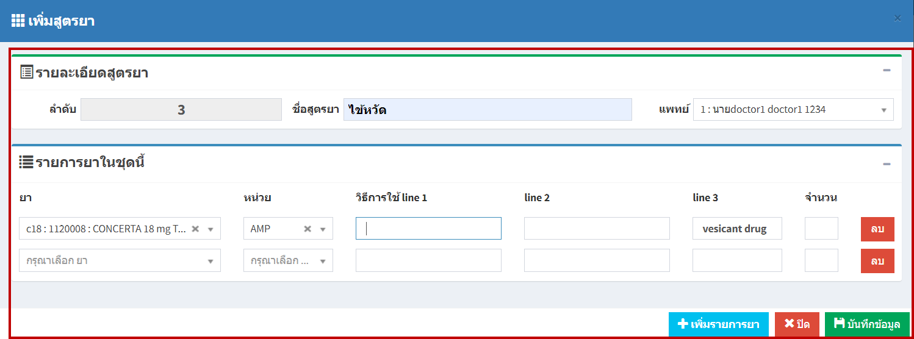
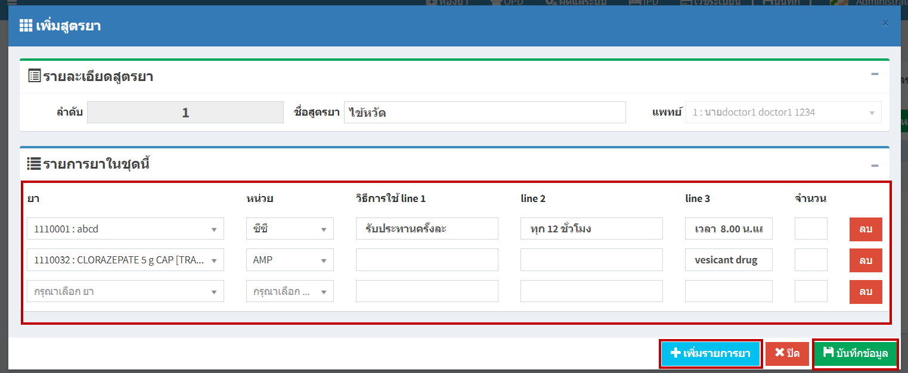
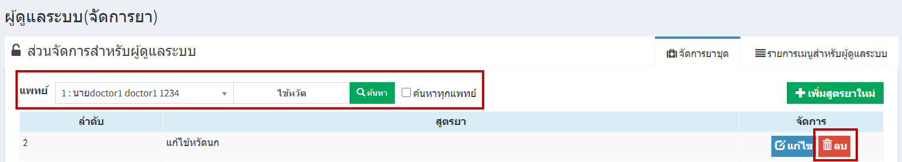

# 711 - การจัดการยาชุด
    

1. การค้นหา > เลือกชื่อแพทย์ก็จะสามารถเห็นชุดยาที่มีอยู่แล้ว และหากต้องการดูทั้งหมดให้คลิกช่อง "ค้นหาทุกแพทย์"

2. การเพิ่มสูตรยาใหม่ > กดปุ่ม เพิ่มสูตรยาใหม่ > กรอกรายละเอียดให้ครบถ้วน > กดปุ่ม "บันทึก"

3. การแก้ไข > ค้นหารายการที่ต้องการแก้ไข > กดปุ่มแก้ไข > ทำการแก้ไข > หากต้องการเพิ่มรายการยาชุดนี้ก็เพิ่มปุ่ม "เพิ่มรายการยา" > กดปุ่ม "บันทึก"

4. หากต้องการลบ > ค้นหารายการที่ต้องการ > กดปุ่ม "ลบ"

    
