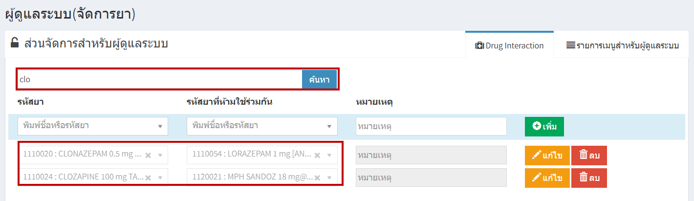
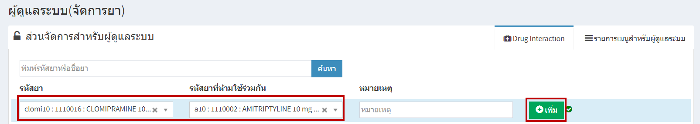
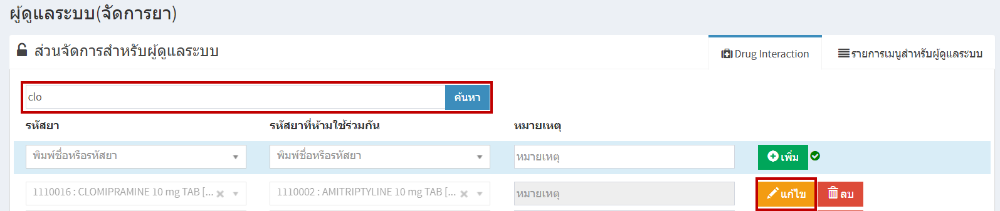
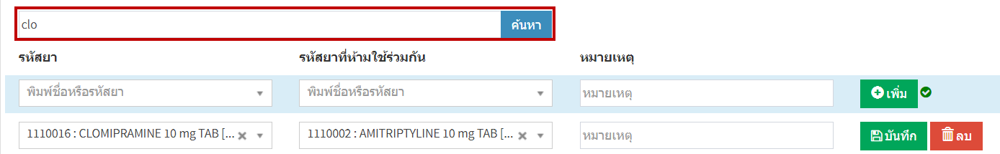
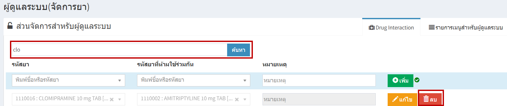

# 713 - ปฏิกิริยาระหว่างยา (Drug Interaction)

1. "การค้นหา" > พิมพ์ รหัสยา / ชื่อยา อย่างใดอย่างหนึ่ง แล้ว enter หรือกดปุ่ม "ค้นหา" > จะปรากฏรายการยา

2. "การเพิ่ม" > ระบุ รหัสยา > ระบุ รหัสยาที่ห้ามใช่ร่วมกัน > กดปุ่ม "เพิ่ม"

3. "การแก้ไข" > ค้นหารายการที่ต้องการแก้ไข > กดปุ่มแก้ไข > สามารถคลิกเลือกที่ต้องการแก้ไข > กดปุ่ม "บันทึก"

4. "การลบ" > ค้นหารายการที่ต้องการลบ > กดปุ่ม "ลบ" 

