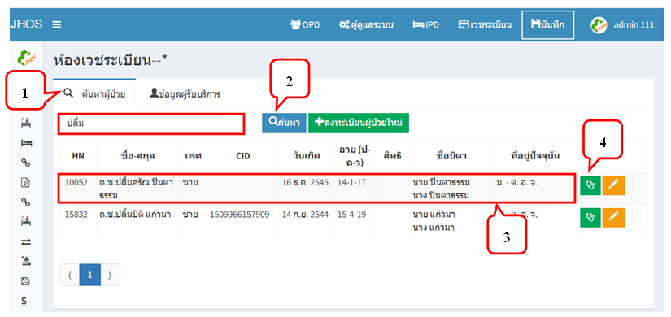
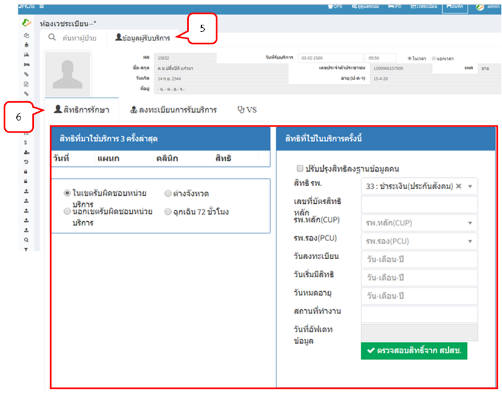
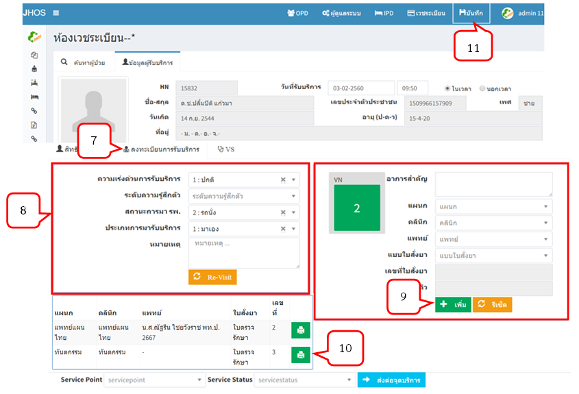
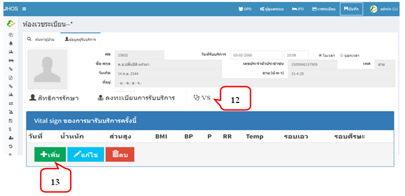
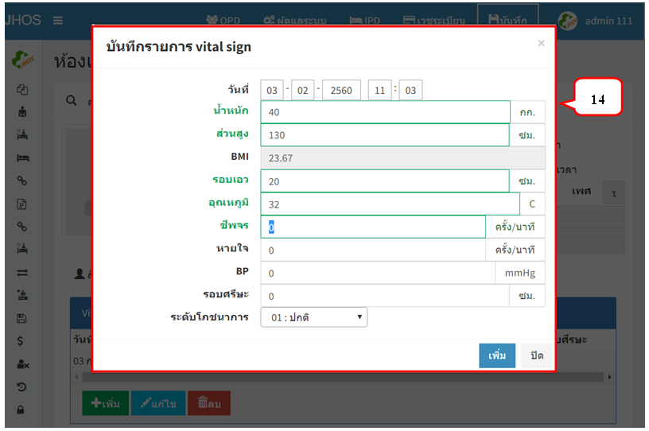
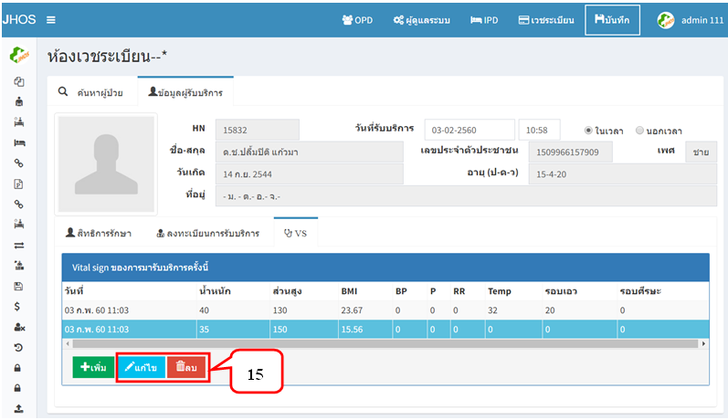

# 100 - เวชระเบียน
1. เลือกแท็บ "ค้นหาผู้ป่วย"
2. ค้นหาผู้ป่วยด้วย HN/ CID/ ชื่อ/ นามสกุล อย่างใดอย่างหนึ่ง แล้วกดปุ่มค้นหา
3. จะปรากฏข้อมูลของผู้ป่วยที่ค้นหา
4. กดปุ่ม          เพื่อลงทะเบียนผู้มารับบริการ

5. เลือกแท็บ "ข้อมูลผู้รับบริการ" มีแท็บการใช้งาน 3 แท็บ คือ สิทธิการรักษา ลงทะเบียนการรับบริการ และบันทึก Vital sign
6. แท็บ "สิทธิการรักษา" จะแสดงสิทธิที่มาใช้บริการ 3 ครั้งล่าสุด สิทธิที่ใช้ในบริการครั้งนี้และสามารถตรวจสิทธิ์จาก สปสช. ได้

7. แท็บ "ลงทะเบียนการรับบริการ" ต้องกรอกข้อมูลให้ครบ 
8. ระบุข้อมูลให้ครบ โดยส่วนนี้ที่มีปุ่ม                        ซึ่งจะดึงค่าจาก Visit ครั้งล่าสุด
9. ระบุข้อมูลอาการสำคัญ แผนก คลินิก แพทย์ และแบบใบสั่งยา จากนั้นกดปุ่มเพิ่ม
10. จะปรากฏข้อมูลต่าง ๆ ได้เลขที่ใบสั่งยา
11. กดปุ่มบันทึก (หากไม่บันทึกข้อมูล จะไม่สามารถบันทึก VS ได้)

12. แท็บ "บันทึก Vital sign"
13. กดปุ่ม "เพิ่ม" เพื่อบันทึก VS

14. จะแสดงหน้าบันทึกรายการ Vital sign กรอกข้อมูลให้ครบและกดปุ่ม "เพิ่ม"

15. รายการ Vital sign สามารถแก้ไข และลบได้
  - การแก้ไข คลิกเลือกบรรทัดที่ต้องการแก้ไข > กดปุ่มแก้ไข > ทำรายการที่ต้องการ   แก้ไข > กดปุ่มบันทึก
  - การลบ คลิกเลือกบรรทัดที่ต้องการลบ > กดปุ่มลบ 

