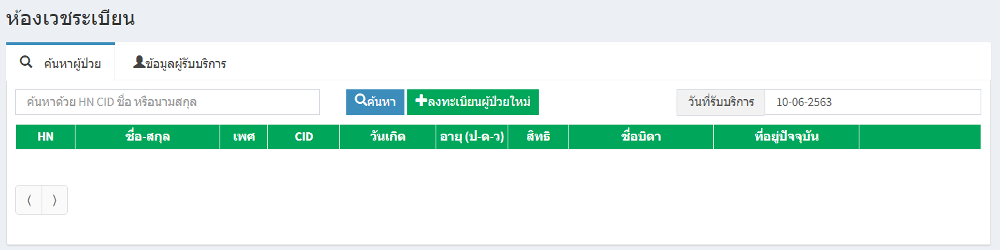
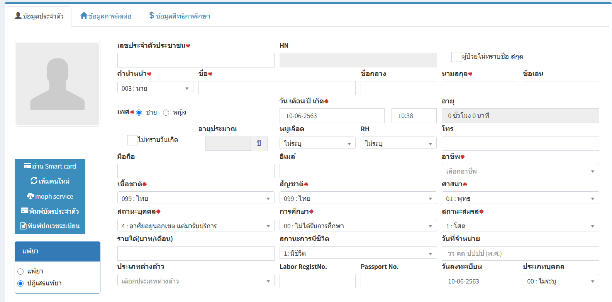
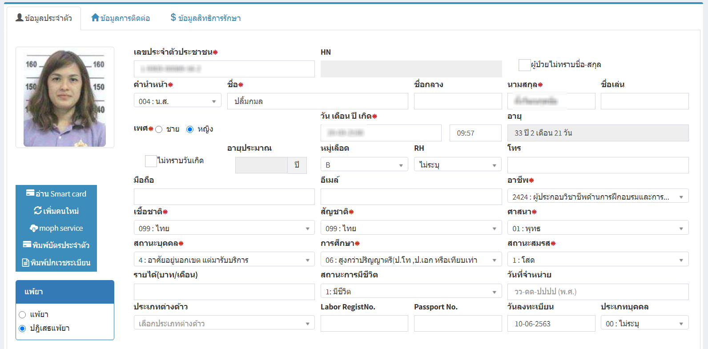
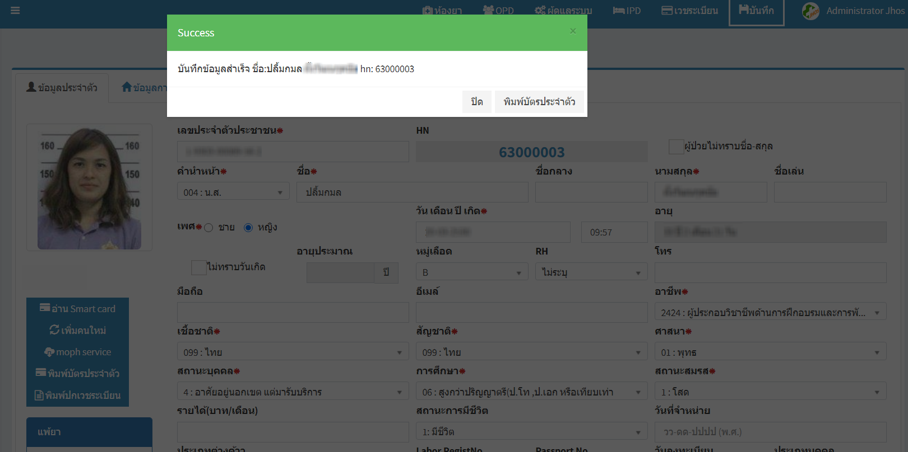
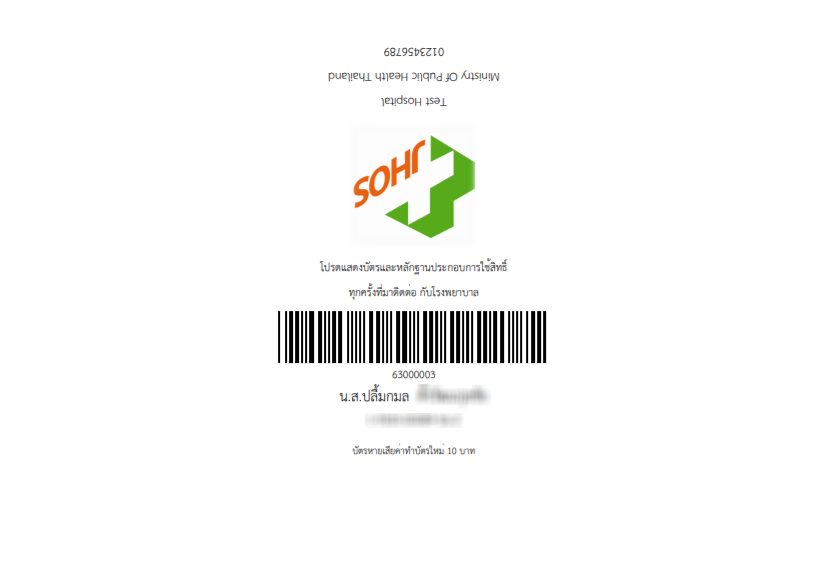
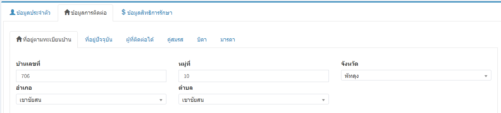
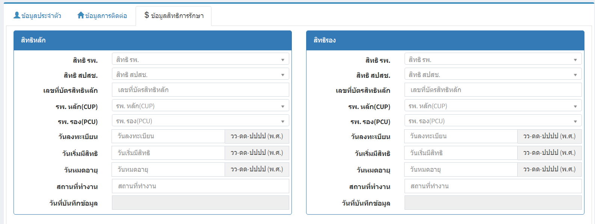

# 101 - ลงทะเบียนผู้ป่วยใหม่
1. คลิกเข้าหน้าจอห้องเวชระเบียน
2. กดปุ่ม "ลงทะเบียนผู้ป่วยใหม่"

3. จะปรากฏหน้าจอลงทะเบียนผู้ป่วยใหม่ มีแท็บการใช้งาน 3 แท็บ คือ ข้อมูลประจำตัว ข้อมูลการติดต่อ และข้อมูลสิทธิการรักษา
4. แท็บ "ข้อมูลประจำตัว" 

5. การใช้งานการ อ่าน Smart card  
  5.1 เสียบบัตรประจำตัวประชาชน  
  5.2 กดปุ่ม "อ่าน Smart card จะปรากฏข้อมูลตามบัตรประจำตัวประชาชนพร้อมทั้งรูป โดยจะได้ข้อมูลจากการอ่าน Smartcard ดังนี้  
    -- เลขที่บัตรประจำตัวประชาชน  
    --	คำนำหน้าชื่อ
    -- ชื่อ - สกุล  
    -- เพศ  
    -- วัน เดือน ปีเกิด  
    -- อายุ  
    -- ที่อยู่  

6. กรอกรายละเอียดข้อมูลใหม่ โดยช่องที่ไม่สามารถเป็นค่าว่างได้ จะมีเครื่องหมาย * อยู่ข้างหน้า จะต้องบันทึกรายละเอียดให้ครบ จากนั้น กดปุ่ม "บันทึก"

7. เมื่อบันทึกเรียบร้อยแล้ว จะแสดงหมายเลข HN ของผู้ป่วยใหม่ และสามาถพิมพ์บัตรประจำตัวได้
 

8. เมื่อกด "พิมพ์บัตรประจำตัว" ก็ปรากฎบัตรประจำตัวผู้ป่วย
 

9. แท็บ "ข้อมูลการติดต่อ" ประกอบด้วย  
  9.1 ที่อยู่ตามทะเบียนบ้าน ซึ่งหากใช้การอ่านจากบัตร Smart Card จะปรากฏข้อมูล > กดปุ่ม "บันทึก"
    
  9.2 ที่อยู่ปัจจุบัน หากเป็นที่อยู่เดียวกับที่อยู่ตามทะเบียนบ้านก็สามารถกดเลือกได้เลย หากไม่ตรงใช่ที่อยู่เดียวกัน ก็คีย์รายละเอียดของผู้ป่วย > กดปุ่ม "บันทึก"  
  9.3 ข้อมูลการติดต่อ ผู้ที่ติดต่อได้ / คู่สมรส / บิดา / มารดา จะมีหน้าจอการใช้งานเหมือนกัน หากเป็นที่อยู่เดียวกับที่อยู่ตามทะเบียนบ้าน / ที่อยู่ปัจจุบัน ก็สามารถเลือกได้เลย > กดปุ่ม "บันทึก"  

10. แท็บ "ข้อมูลสิทธิการรักษา" ประกอบด้วย  
  10.1 สิทธิหลัก  
  10.2 สิทธิรอง  
  10.3 เมื่อกรอกข้อมูลครบเรียบร้อย > กดปุ่ม "บันทึก"  
  
 
__**หมายเหตุ : ข้อมูลสิทธิการรักษา สามารถกรอกข้อมูลได้อีกครั้งตอนส่งตรวจ__