# 101 - ลงทะเบียนผู้ป่วยใหม่
1. คลิกเข้าหน้าจอห้องเวชระเบียน
2. กดปุ่ม "ลงทะเบียนผู้ป่วยใหม่"
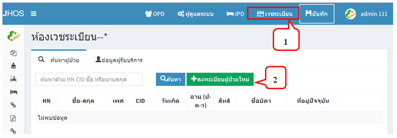
3. จะปรากฏหน้าจอลงทะเบียนผู้ป่วยใหม่ มีแท็บการใช้งาน 3 แท็บ คือ ข้อมูลประจำตัว ข้อมูลการติดต่อ และข้อมูลสิทธิการรักษา
4. แท็บ "ข้อมูลประจำตัว" 
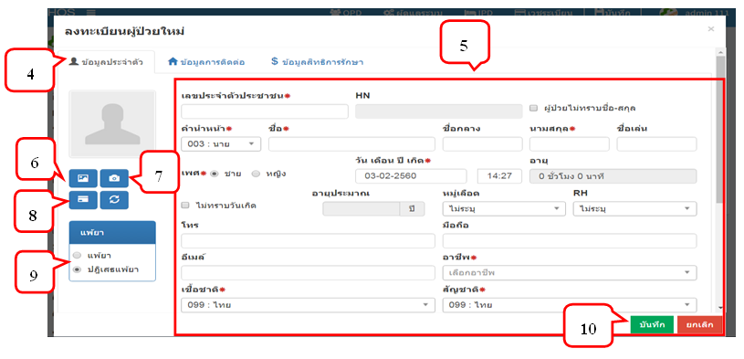
5. กรอกรายละเอียดข้อมูลใหม่ โดยช่องที่ไม่สามารถเป็นค่าว่างได้ จะมีเครื่องหมาย * อยู่ข้างหน้า จะต้องบันทึกรายละเอียดให้ครบ
6. ปุ่ม  คือการเลือกรูปที่มีอยู่ในเครื่อง
  - 6.1 กดเพิ่มรูป
  - 6.2 กดเลือกไอคอนเลือกรูปภาพที่มีอยู่ในเครื่อง
  - 6.3 เมื่อได้รูปที่ต้องการ กดปุ่ม Open
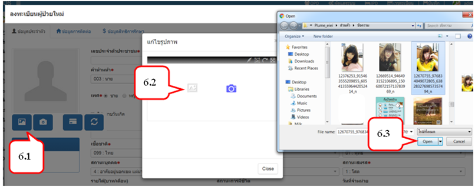
  - 6.4 คลิกปุ่ม Crop จะปรากฏเส้นประสีน้ำเงิน เพื่อจัดการรูปภาพในพอดี
  - 6.5 เมื่อได้ขนาดรูปที่ต้องการแล้ว กด √ 
  - 6.6 กดปุ่ม × ก็เป็นการเพิ่มรูปเสร็จเรียบร้อย
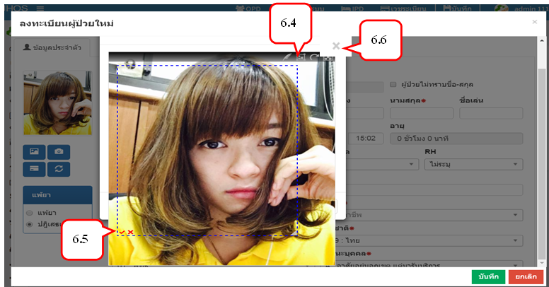

7. ปุ่ม           คือการถ่ายรูปด้วยกล้องจากคอมพิวเตอร์ (Firefox web browser)
  - 7.1 กดปุ่มถ่ายรูป
  - 7.2 กด Share Selected Device
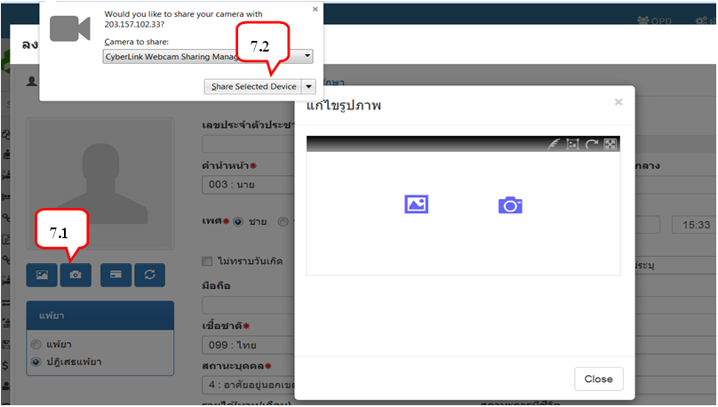
  7.3 กด √ เพื่อถ่ายภาพ
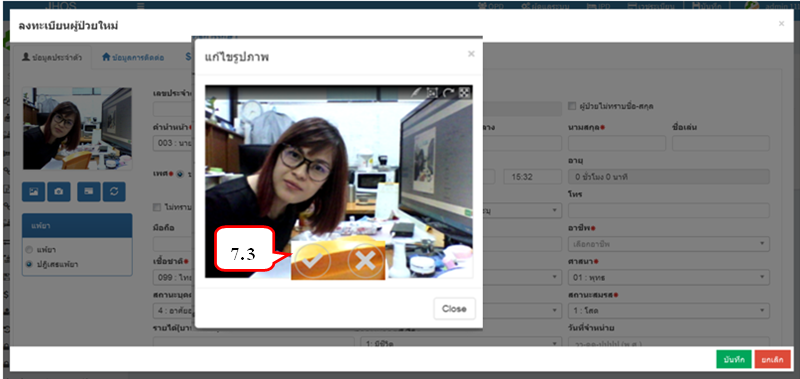

  7.4 คลิกปุ่ม Crop จะปรากฏเส้นประสีน้ำเงิน เพื่อจัดการรูปภาพในพอดี
  7.5 เมื่อได้ขนาดรูปที่ต้องการแล้ว กด √ 
  7.6 กดปุ่ม × ก็เป็นถ่ายรูปเสร็จเรียบร้อย
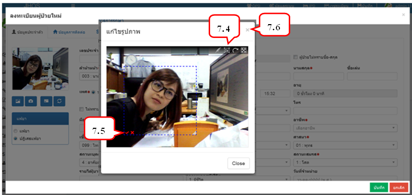
8. ปุ่ม           คือการอ่านข้อมูลจาก Smart card
  - เสียบบัตรประจำตัวประชาชน รอจนกว่าไฟกระพริบบนตัว  Smartcard Reader       จะหยุดกระพริบ (ไฟจะกระพริบ 2 ครั้ง ครั้งที่ 1 อ่านข้อมูลหน้าบัตร ไฟกระพริบครั้งที่ 2 อ่านข้อมูลรูปภาพ) แล้วกดปุ่ม
  - จะปรากฏข้อมูลตามบัตรประจำตัวประชาชนพร้อมทั้งรูป โดยจะได้ข้อมูลจากการอ่าน Smartcard ดังนี้
      -	เลขที่บัตรประจำตัวประชาชน
      -	คำนำหน้าชื่อ
      -	ชื่อ - สกุล
      -	เพศ
      -	วัน เดือน ปีเกิด
      -	อายุ
      -	ที่อยู่
9. หากผู้ป่วยใหม่มีการแพ้ยา สามารถคลิกการแพ้ยาได้
10. เมื่อบันทึกเรียบร้อยแล้ว จะแสดงหมายเลข HN ของผู้ป่วยใหม่ 
11. เมื่อแสดง HN ของผู้ป่วยแล้ว ก็จะมี Popup แจ้งว่าได้ทำการบันทึกข้อมูลสำเร็จแล้ว
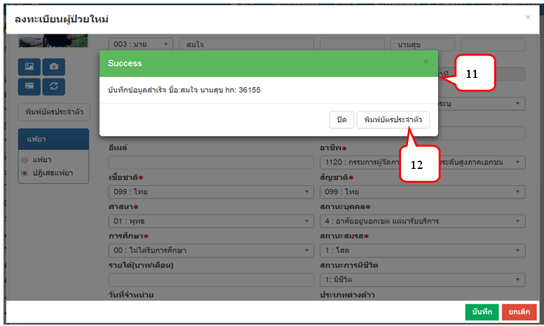
12. กดปุ่ม "พิมพ์บัตรประจำตัวผู้ป่วย" (มี 2กรณี คือแสดงหน้าบัตรประจำตัวก่อนพิมพ์ และไม่สามารถหน้าบัตรประจำตัวสามารถพิมพ์ได้เลย)  
__**กรณีแสดงหน้าบัตรประจำตัวก่อนพิมพ์__  
12.1 กดปุ่ม "พิมพ์บัตรประจำตัว"  
12.2 ให้สังเกตด้านขวาบนสุด จะมีสัญลักษณ์ Popup        คลิกสัญลักษณ์  
12.3 จะปรากฏ Popup ให้เลือก "อนุญาต Popup เสมอ"  
12.4 กดปุ่ม "เสร็จสิ้น"  
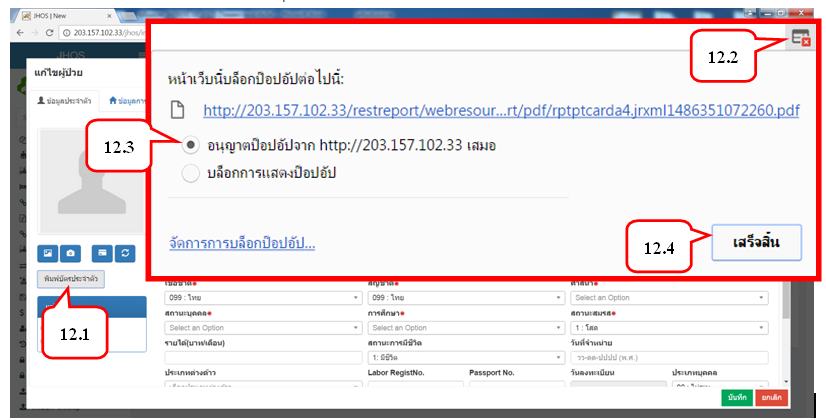
12.5 จะปรากฏหน้าบัตรประจำตัว  
12.6 กดปุ่ม         เพื่อพิมพ์บัตรประจำตัว  
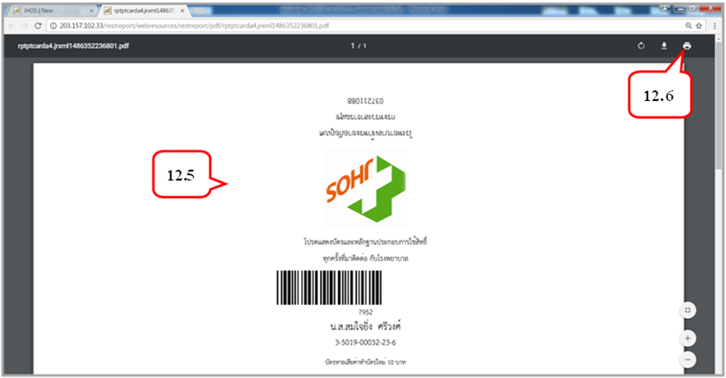
13. แท็บ "ข้อมูลการติดต่อ" ประกอบด้วย  
13.1 ที่อยู่ตามทะเบียนบ้าน ซึ่งหากใช้การอ่านจากบัตร Smart Card จะปรากฏข้อมูล > กดปุ่ม "บันทึก"
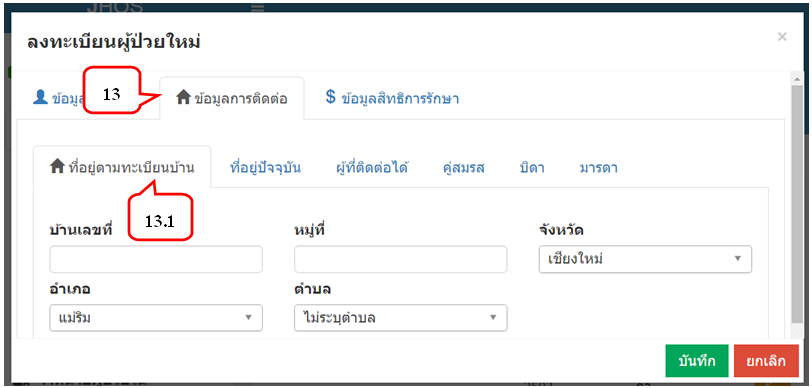  
13.2 ที่อยู่ปัจจุบัน หากเป็นที่อยู่เดียวกับที่อยู่ตามทะเบียนบ้านก็สามารถกดเลือกได้เลย หากไม่ตรงใช่ที่อยู่เดียวกัน ก็คีย์รายละเอียดของผู้ป่วย > กดปุ่ม "บันทึก"
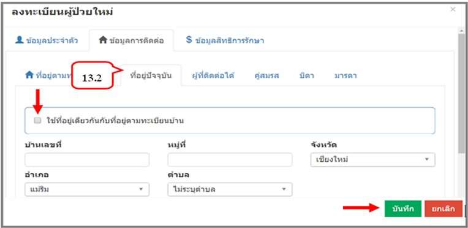
13.3 ข้อมูลการติดต่อ ผู้ที่ติดต่อได้ / คู่สมรส / บิดา / มารดา จะมีหน้าจอการใช้งานเหมือนกัน หากเป็นที่อยู่เดียวกับที่อยู่ตามทะเบียนบ้าน / ที่อยู่ปัจจุบัน ก็สามารถเลือกได้เลย > กดปุ่ม "บันทึก"
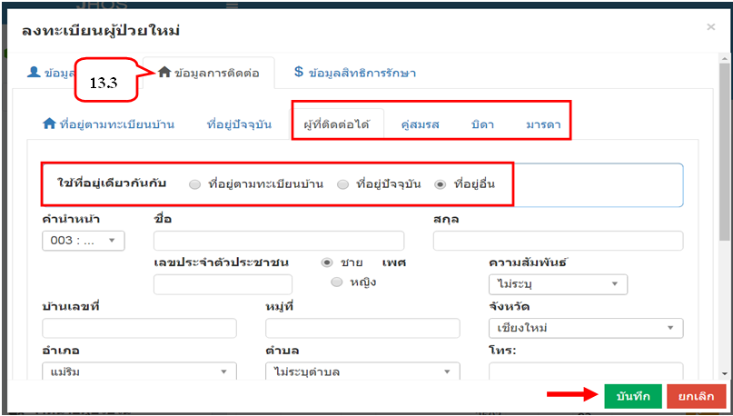
14. แท็บ "ข้อมูลสิทธิการรักษา" ประกอบด้วย  
14.1 สิทธิหลัก 	
14.2 สิทธิรอง  
14.3 เมื่อกรอกข้อมูลครบเรียบร้อย > กดปุ่ม "บันทึก"  
__**หมายเหตุ : ข้อมูลสิทธิการรักษา สามารถกรอกข้อมูลได้อีกครั้งตอนส่งตรวจ__