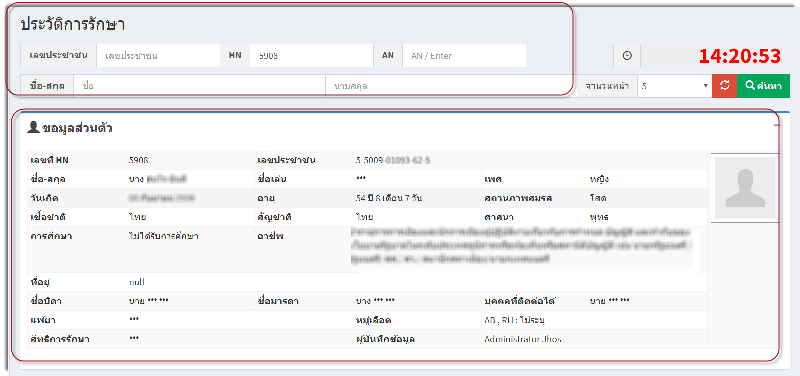
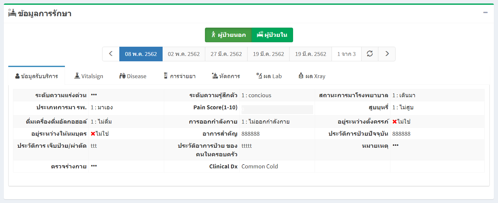

# 114 - ประวัติการรักษา
1. ระบุ CID / HN / AN / ชื่อ/ นามสกุล อย่างใดอย่างหนึ่งของผู้ป่วย แล้ว enter หรือกดปุ่ม "ค้นหา"
2. ส่วนแรกจะปรากฎข้อมูลของผู้ป่วย

3. ส่วนที่สองจะปรากฎข้อมูลการรักษาของผู้ป่วยทั้งหมด
 