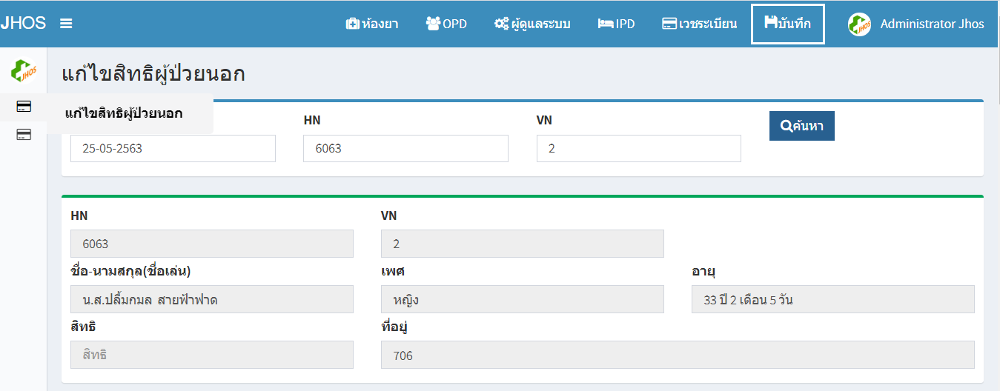
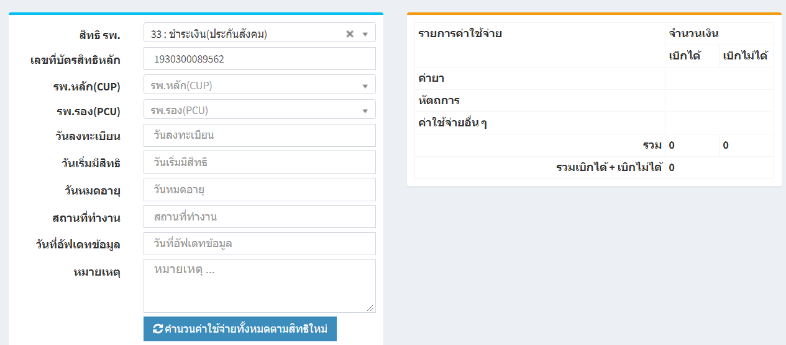
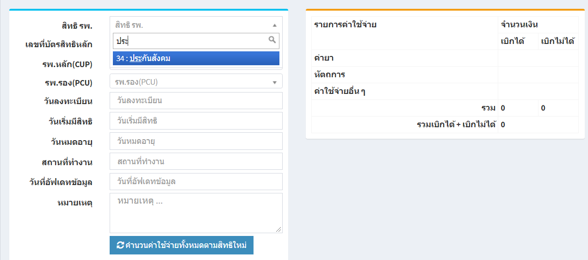

# 115 - แก้ไขสิทธิผู้ป่วยนอก
1. เลือกวันที่มารับบริการ (โปรแกรมจะ default เป็นวันที่ปัจจุบัน) 
2. ระบุ HN / VN ของผู้ป่วย แล้ว enter หรือกดปุ่ม "ค้นหา"
3. ส่วนแรกจะปรากฎข้อมูลของผู้ป่วย

4. ส่วนที่สองจะปรากฎข้อมูลสิทธิเดิมและรายการค่าใช้จ่ายของผู้ป่วย
 
5. สามารถเปลี่ยนสิทธิของผู้ป่วยรายการค่าใช้จ่ายจะเปลี่ยนแปลงไปตามสิทธิที่เลือก

6. กดปุ่มบันทึก