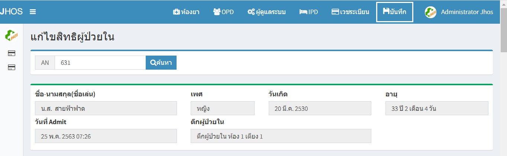
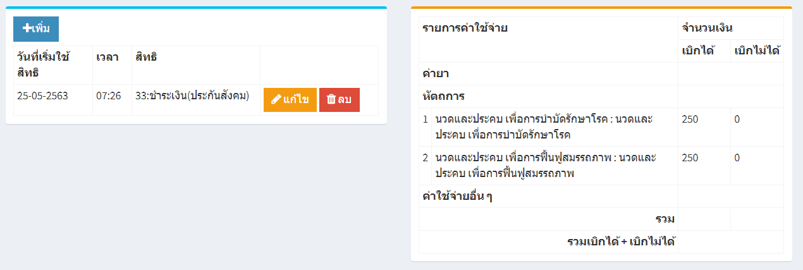
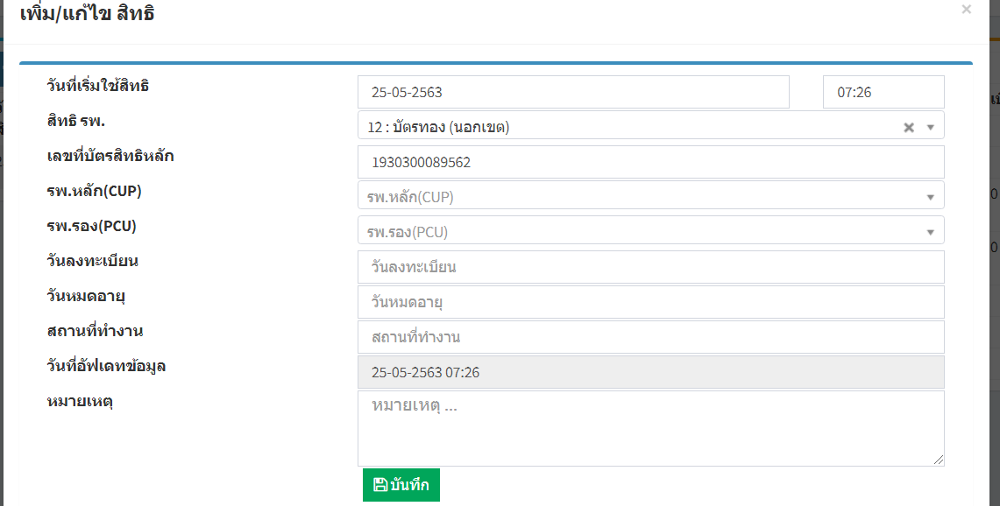
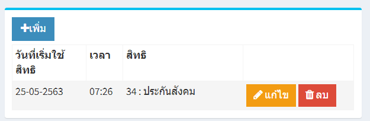
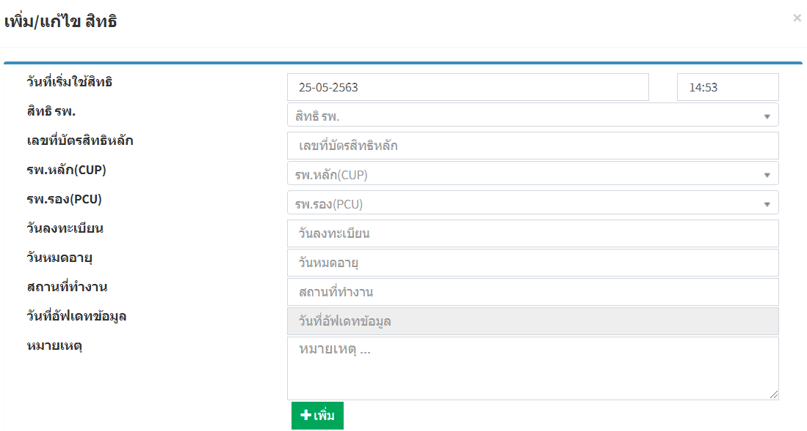

# 210 - แก้ไขสิทธิผู้ป่วยใน
1. ระบุ VN ของผู้ป่วย แล้ว enter หรือกดปุ่ม "ค้นหา"
3. ส่วนแรกจะปรากฎข้อมูลของผู้ป่วย

4. ส่วนที่สองจะปรากฎข้อมูลสิทธิเดิมและรายการค่าใช้จ่ายของผู้ป่วย
 
5. สามารถเปลี่ยนสิทธิของผู้ป่วยรายการค่าใช้จ่ายจะเปลี่ยนแปลงไปตามสิทธิที่เลือก

6. สามารถเพิ่มสิทธิการรักษา โดยกดปุ่มเพิ่ม

7. เลือกสิทธิการรักษาที่ต้องการเพิ่ม

8. กดปุ่มบันทึก