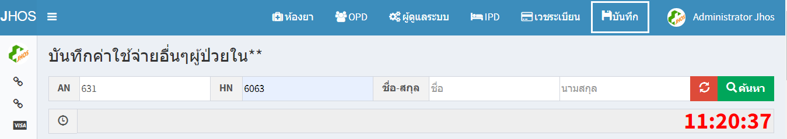
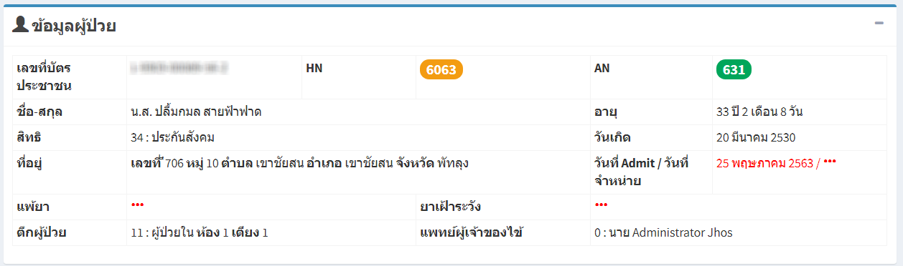
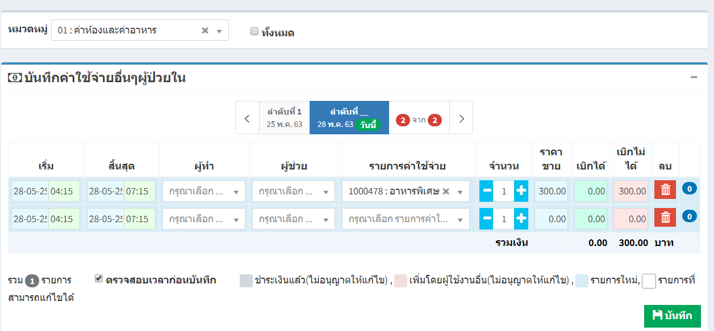

# 211 - ค่าใช้จ่ายอื่น ๆ ผู้ป่วยใน

1. ระบุ AN / HN / ชื่อ / นามสกุล อย่างใดอย่างหนึ่งของผู้ป่วย แล้ว enter หรือกดปุ่ม "ค้นหา"

2. จะปรากฎข้อมูลของผู้ป่วย

3. สามารถเลือกหมวดหมู่ของค่าใช้จ่ายได้ หรือจะให้แสดงทั้งหมด 
4. ระบุรายละเอียดรายการค่าใช้จ่าย
5. กดปุ่ม "บันทึก"

 
 