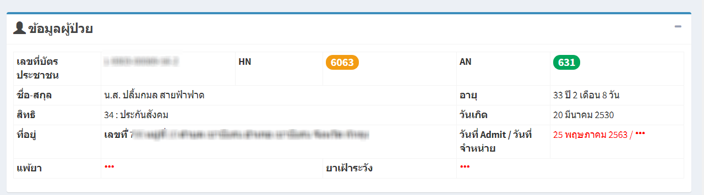

# 212 - ย้ายตึกผู้ป่วยใน

1. ระบุตึกผู้ป่วยในปัจจุบัน (ก่อนย้าย)
2. ระบุ AN / HN / ชื่อ / นามสกุล อย่างใดอย่างหนึ่งของผู้ป่วย แล้ว enter หรือกดปุ่ม "ค้นหา"

3. จะปรากฎข้อมูลของผู้ป่วย

4. ระบุรายละเอียดการย้ายตึกผู้ป่วย
5. กดปุ่ม "บันทึก"

 
 