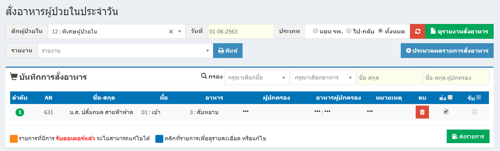

# 213 - สั่งอาหารผู้ป่วยในประจำวัน

1. กดปุ่ม "ประมวลผลรายการสั่งอาหาร" เพื่อดูรายการสั่งอาหารทั้งหมด

2. จะปรากฎข้อมูลการสั่งอาหารผู้ป่วยในทั้งหมด

3. ระบุค่าเริ่มต้น (มื้อของอาหาร)/เลือกรายการอาหาร(กรณีเป็นผู้ป่วยเด็ก สามารถเลือกอาหารผู้ปกครองได้ด้วย)
เสร็จแล้ว กดปุ่ม "ยืนยันและประมวลผล" 

4. กดปุ่ม "ดูรายงานสั่งอาหาร" ก็จะปรากฏข้อมูล

5. สามารถดูรายงานสั่งอาหารเฉพาะตึกได้
โดยระบุตึกผู้ป่วยใน / กดปุ่มรายงานสั่งอาหาร ก็จะปรากฎข้อมูลการสั่งอาหารของตึกนั้นๆ

6. หากมีการแก้ไข ให้คลิกที่ชื่อของผู้ป่วย

7. จากนั้นก็จะปรากฎหน้าจอให้แก้ไข เสร็จแล้ว กดปุ่ม "ตกลง"

8. กดปุ่ม "ส่งรายการ" เป็นอันเสร็จเรียบร้อยแล้ว จะปรากฎ "บันทึกสำเร็จ"

