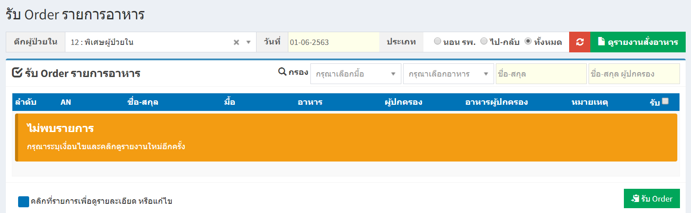
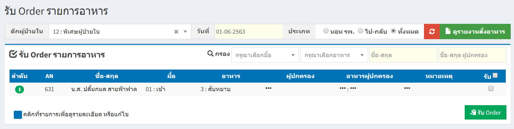
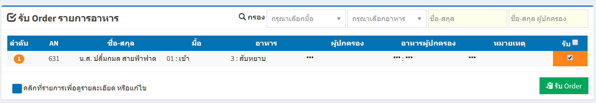
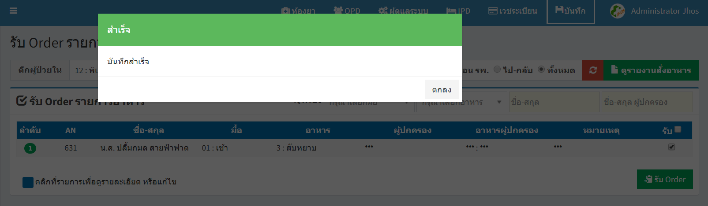

# 214 - รับ Order รายการอาหาร

1. เลือกตึกผู้ป่วยใน และกดปุ่ม "ดูรายงานสั่งอาหาร"

2. จะปรากฎข้อมูลการสั่งอาหารผู้ป่วย

3. คลิกเลือกช่อง "รับ" 
กดปุ่ม "รับ Order" เป็นอันเสร็จเรียบร้อยแล้ว จะปรากฎ "บันทึกสำเร็จ"

