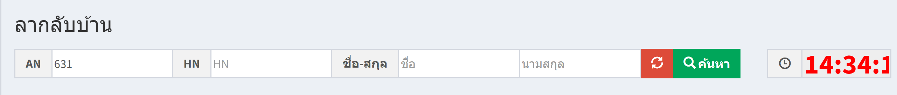
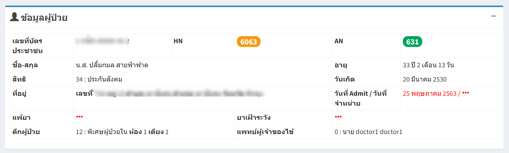
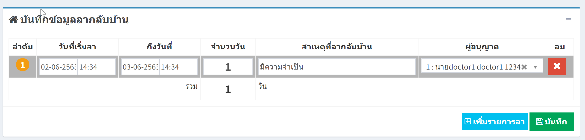

# 215 - ลากลับบ้าน

1. ระบุ AN / HN / ชื่อ / นามสุกล อย่างใดอย่างหนึ่ง แล้ว enter หรือ กดปุ่ม "ค้นหา"

2. จะปรากฎข้อมูลผู้ป่วยใน

3. บันทึกข้อมูลลากลับบ้านของผู้ป่วย และกดปุ่ม "บันทีก" / หากต้องการเพิ่มรายการลา กดปุ่มเพิ่มได้เลย

