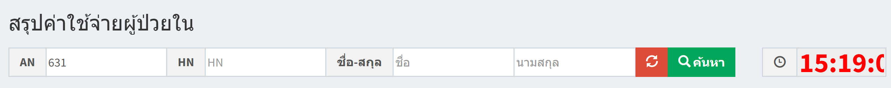
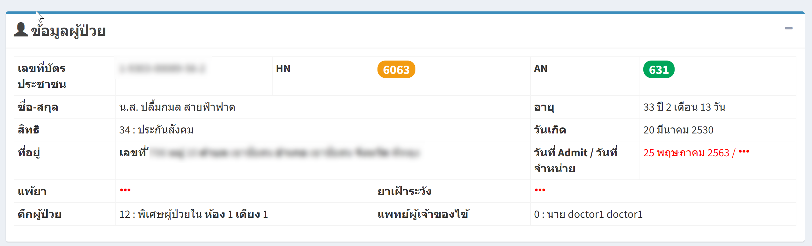
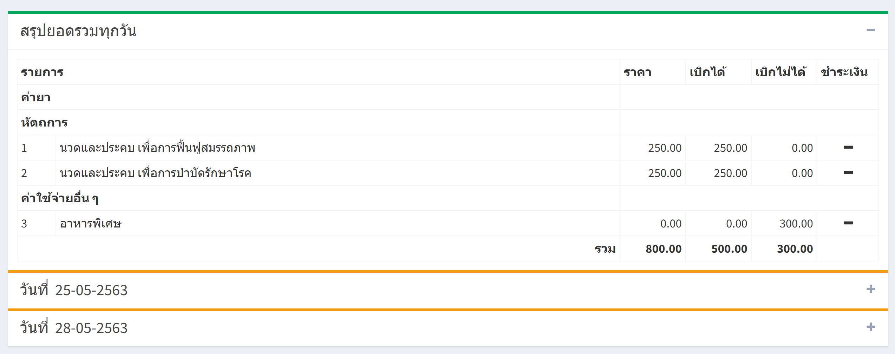
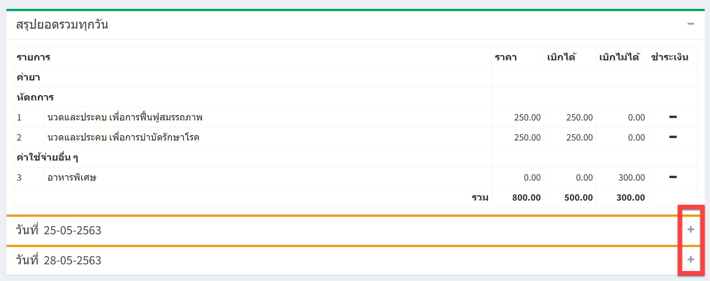
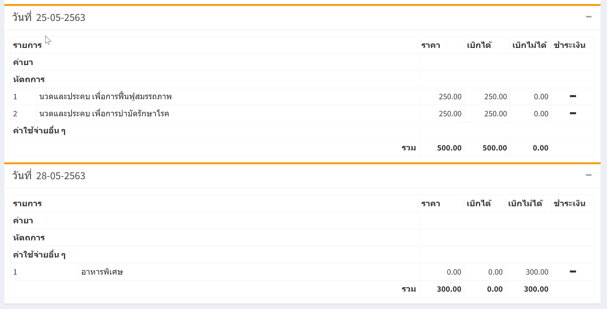

# 216 - สรุปค่าใช้จ่ายผู้ป่วยใน

1. ระบุ AN / HN / ชื่อ / นามสุกล อย่างใดอย่างหนึ่ง แล้ว enter หรือ กดปุ่ม "ค้นหา"

2. จะปรากฎข้อมูลผู้ป่วยใน

3. จะปรากฎข้อมูลสรุปค่าใช้จ่ายของผู้ป่วยทั้งหมด

4. สามารถดูรายละเอียดค่าใช้จ่ายของแต่ละวันของผู้ป่วยได้ โดยกดเครื่องหมาย + 

5. จะแสดงข้อมูลค่าใช้จ่ายของผู้ป่วยในแต่ละวัน

