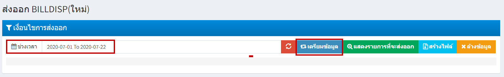
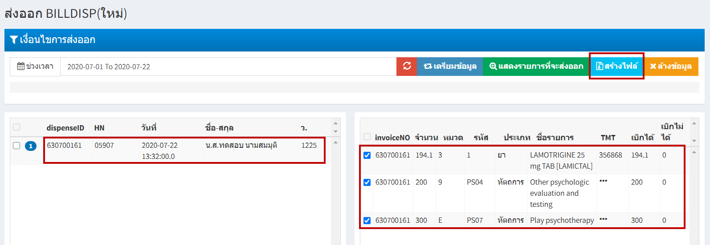
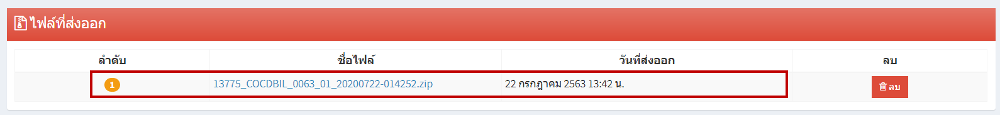

# 307 - ส่งออก BILLDISP

(ข้อมูลจากการบันทึกข้อมูล ยา หัตถการ
ค่าใช้จ่ายอื่นๆ โดยใช้สิทธิ เบิกต้นสังกัด(จ่ายตรง))

1. เลือกช่วงเวลา > กดปุ่ม "เตรียมข้อมูล"

2. ช่องด้านขาวจะปรากฎข้อมูลที่เลือกไว้ > คลิกหนึ่งครั้ง > ช่องด้านซ้ายจะปรากฎไฟล์ข้อมูล > สามารถคลิกเลือกหน้าไฟล์ที่ต้องการ > กดปุ่ม "สร้างไฟล์"

3. ด้านล่างจะปรากฎไฟล์ที่ส่งออก > คลิกที่ชื่อไฟล์ > จะได้ไฟล์ข้อมูลสิทธิการรักษาเบิกต้นสังกัด(จ่ายตรง)

 
 