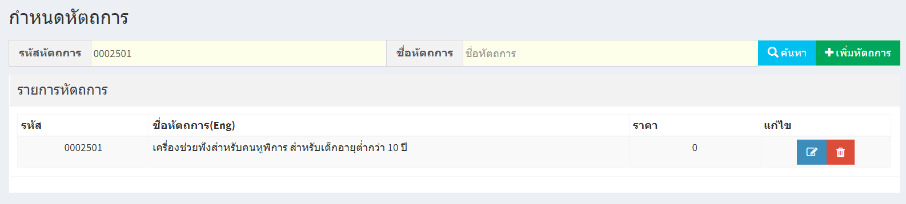
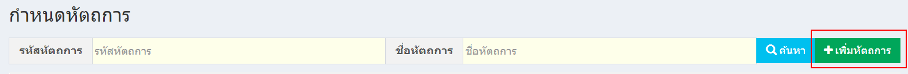
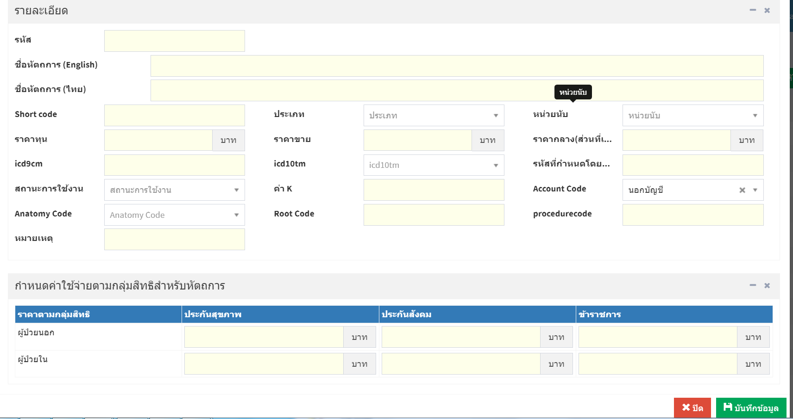
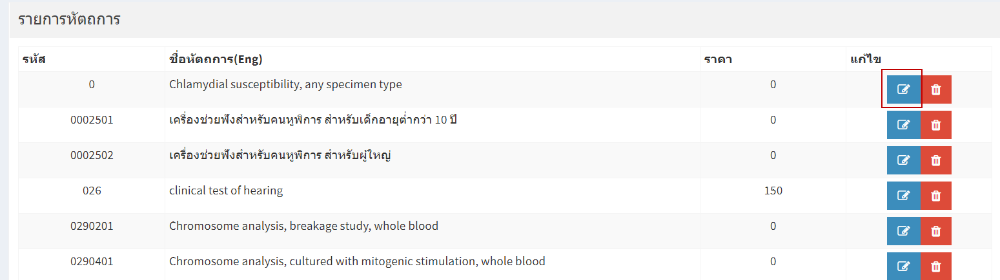
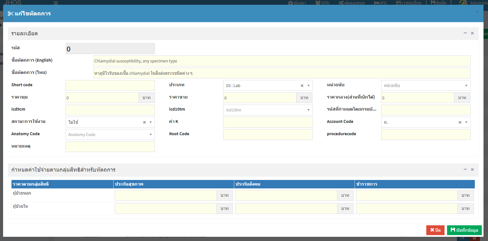
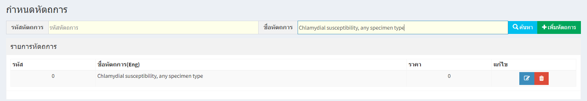
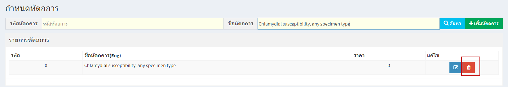
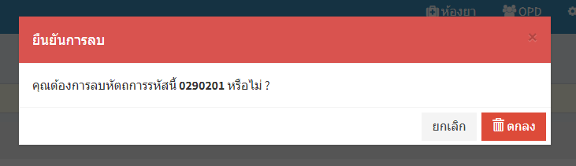

# 401 - กำหนดหัตถการ

1. การค้นหา

1.1 ระบุรหัสหัตถการ / ชื่อหัตถการ อย่างใดอย่างหนึ่ง แล้ว enter หรือกดปุ่ม "ค้นหา"

1.2 จะแสดงข้อมูลของรหัสถการที่ค้นหา

   
2. การเพิ่มหัตถการ

2.1 กดปุ่ม "เพิ่มหัตการ"

2.2 กรอกรายละเอียดเกี่ยวกับรหัตการ และกดปุ่ม "บันทึกข้อมูล"

 

3. การแก้ไขหัตถการ 
    
3.1 กดปุ่มสีฟ้า

 

3.2 แก้ไขรายละเอียดหัตถการ และกดปุ่ม "บันทึกข้อมูล"

4. การลบรายการหัตถการ

4.1 ค้นหาหัตถการที่ต้องการลบ

4.2 กดปุ่มลบ 

4.3 จะปรากฏยืนยันการลบ กดปุ่ม "ตกลง"

