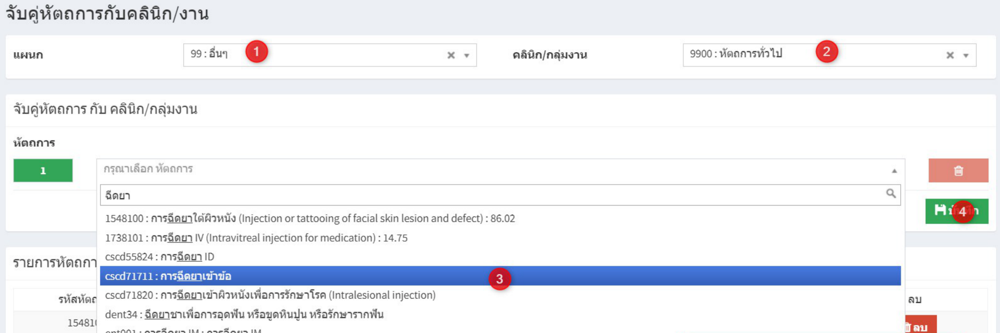
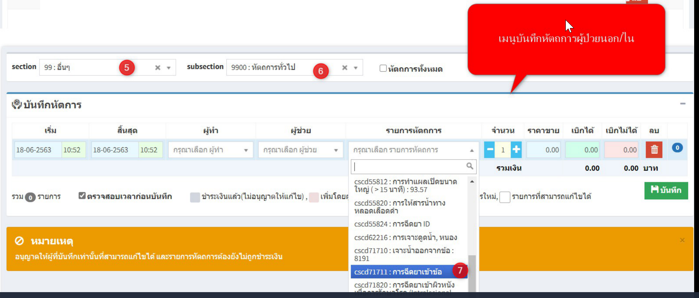

# 402 - จับคู่หัตถการกับคลินิก/งาน

เมนูใช้เพื่อจับคู่รหัสหัตถการกับคลินิกทีทำหัตถการ เพื่ออำนวยความสะดวกเวลาลงบันทึกหัตถการ ซึ่งถ้ามีการจับคู่ไว้แล้ว สามารถใช้งานได้ดังนี้
1. เลือกแผนก
2. เลือก คลินิก/กลุ่มงาน
3. เลือกหัตถการ
4. กดปุ่ม บันทึก
5. แสดงรายการหัตถการในแต่ละคลินิก/กลุ่มงานที่ได้จับคู่ไว้

6. ตัวอย่างในหน้าบันทึกหัตถการ ก็จะปรากฏหัตถการที่จับคู่กับคลินิกไว้แล้ว

