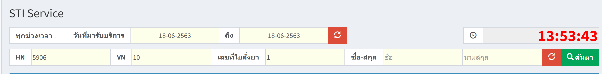
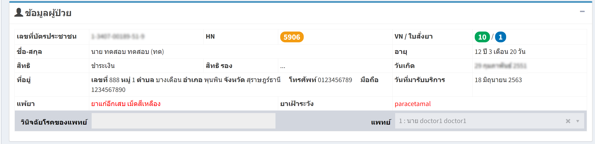
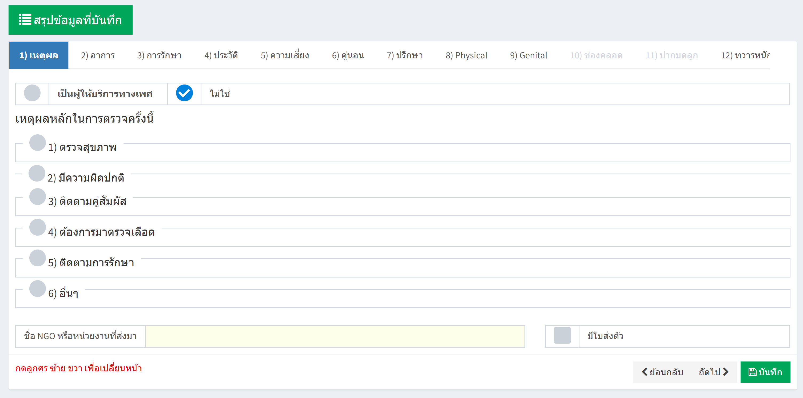
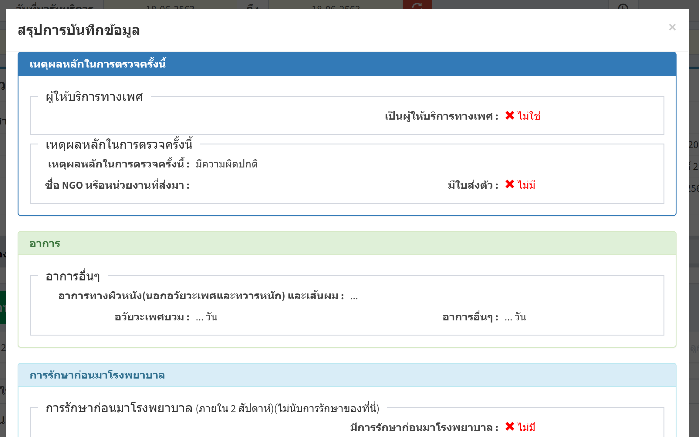

# 403 - STI Service 
(บันทึกข้อมูลเกี่ยวกับโรคติดต่อทางเพศสัมพันธ์)

1. เลือกวันที่มารับบริการ / ระบุ HN / VH / เลขที่ใบสั่งยา / ชื่อ-สกุล อย่างใดอย่างหนึ่ง แล้วกด enter หรือปุ่ม ค้นหา

2. จะปรากฎข้อมูลผู้ป่วย

3. จะมีแถบให้ระบุรายละเอียดต่างๆ / แล้วกดปุ่มบันทึกในแต่ละหน้า

4. สามารถดูสรุปข้อมูลที่บันทึกทั้งหมดได้ โดยกดปุ่ม "สรุปข้อมูลที่บันทึก"

