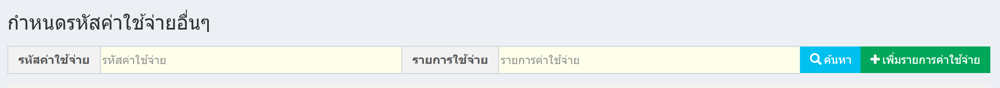
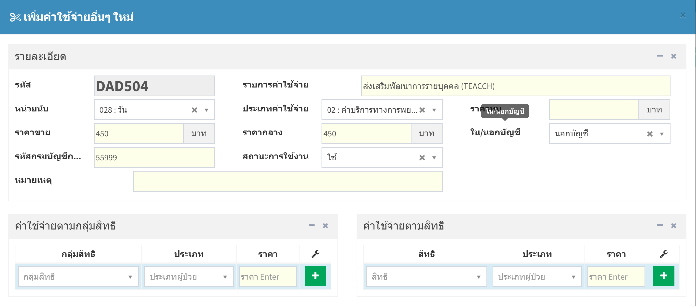
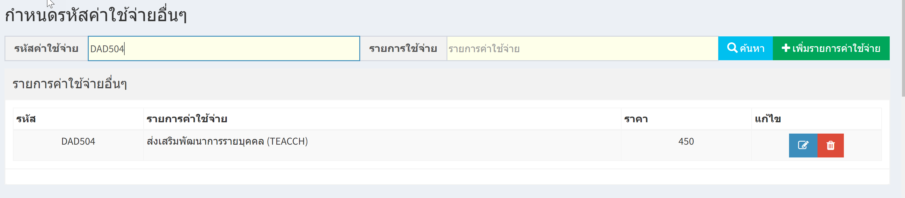
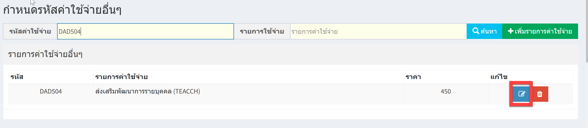
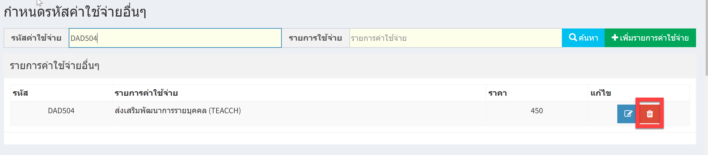
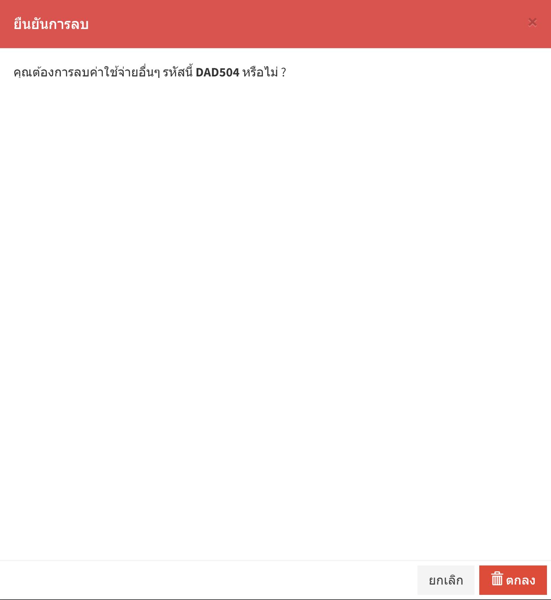

# 404 - กำหนดรหัสค่าใช้จ่ายอื่นๆ 

1. การกำหนดรหัสค่าใช้จ่ายอื่นๆ กดปุ่ม "เพิ่มรายการค่าใช้จ่าย"

2. กรอกรายละเอียด / ค่าใช้จ่ายตามกลุ่มสิทธิ / ค่าใช้จ่ายตามสิทธิ แล้วกดปุุม "บันทึกข้อมูล"

3. การค้นหา >> ระบุรหัสค่าใช้จ่าย / รายการใช้จ่าย อย่างใดอย่างหนึ่ง แล้ว enter หรือกดปุ่ม "ค้นหา"
จะปรากฎข้อมูลที่ค้นหา

4. การแก้ไข >> ค้นหารหัสที่ต้องการ >> กดปุ่มแก้ไขสีฟ้า 

>> จะปรากฎหน้าแก้ไข >> แก้ไขเสร็จแล้ว กดปุ่ม"บันทึกข้อมูล"

5. การลบ >> ค้นหารหัสที่ต้องการ >> กดปุ่มลบสีแดง >> 

>> จะปรากฎ popup ยืนยันการลบ >> กดปุ่ม "ลบข้อมูล"

