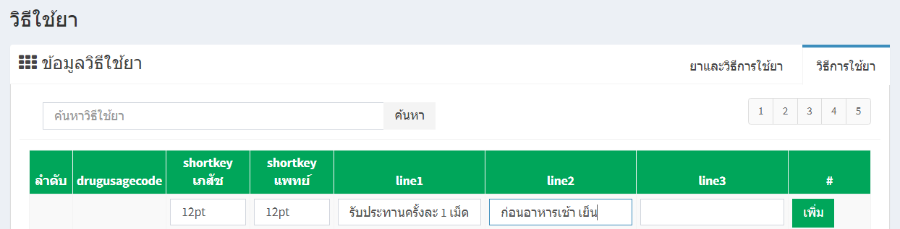

# 501 - วิธีใช้ยา 
เมนูวิธีใช้ยา มี 2 แถบการใช้งาน (ยาและวิธีการใช้ยา / วิธีการใช้ยา)

1. แถบ "วิธีการใช้ยา"  
   1.1 การค้นหา >> สามารถค้นหาด้วย "shortkey เภสัช" หรือ "shortkey แพทย์" 
   แล้ว enter หรือกดปุ่ม ค้นหา จะปรากฏวิธีการใช้ยาที่ค้นหา

   1.2 การเพิ่ม >> กรอกรายละเอียดต่างๆ แล้วกดปุ่ม "เพิ่ม" 

   1.3 การแก้ไข >> กรอกรายละเอียด แล้วกดปุ่ม "บันทึก" 

   1.4 ปุ่ม
    คือการเลือกยามาใส่วิธีการใช้ยา >> เลือกยา >> กดปุ่ม "เพิ่มยาที่ใช้วิธีการใช้ยานี้" >> ข้างล่างจะเป็นรายละเอียดการเลือกยามาใส่วิธิการใช้ยาที่เลือกไว้ >> และสามารถลบรายการยาที่เลือเอาไว้ได้
   

1. แถบ "ยาและวิธีการใช้ยา"
   2.1 การค้นหา >> สามารถค้นหาด้วย "ชื่อยา" หรือ "รหัสย่อ" 
   แล้ว enter หรือกดปุ่ม ค้นหา 

    2.2 ปุ่ม
 คือการเลือกวิธีการใช้ยา มาใส่ยา >> เลือกยา >> กดปุ่ม "เพิ่มวิธีการใช้ยากับยานี้" >> ข้างล่างจะเป็นรายละเอียดวิธีใช้ยา มาใส่ยา ที่ได้เลือกได้ >> และสามารถลบรายการได้
   