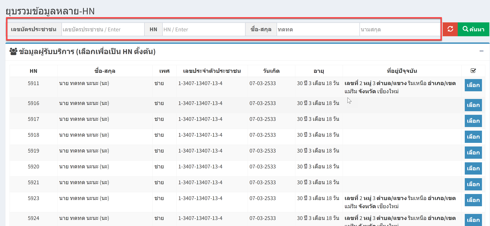
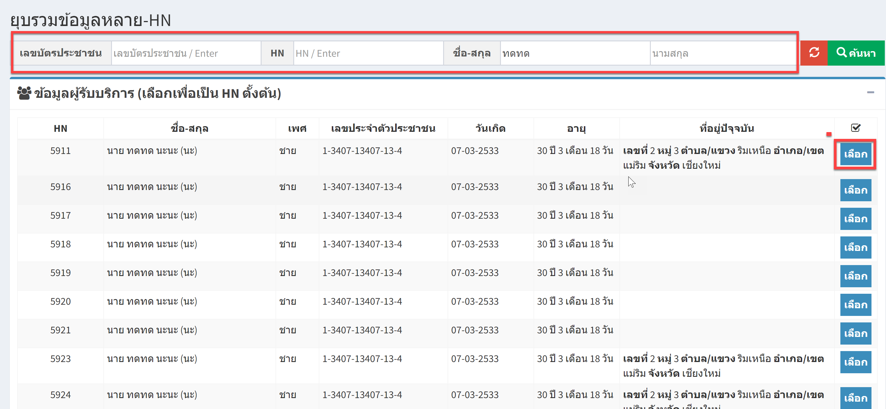
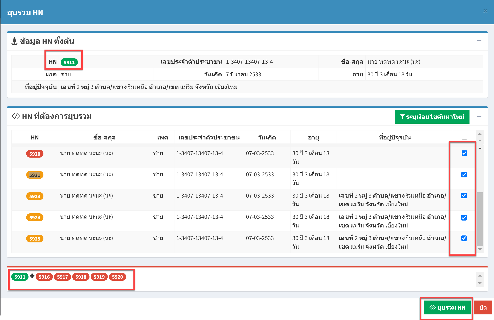

# 502 - ยุบรวมข้อมูลหลาย HN

1. ระบุ เลขบัตรประชาชน / HN / ชื่อ-สกุล / อย่างใดอย่างหนึ่ง แล้ว enter หรือปุ่ม "ค้นหา"
จะปรากฎข้อมูลของผู้ป่วย

2. กดปุ่ม เลือก 

จะปรากฏหน้าจอยุบรวม HN ของผู้ป่วย  
  2.1 ส่วนแรกจะเป็นข้อมูล HN ตั้งต้น จากในรูปคือ 5911  
  2.2 ส่วนที่สอง >> เลือก HN ที่ต้องการยุบรวม  
  2.3 จะสังเหตุเห็น เลข NH ที่จะยุบรวม  
  2.4 กดปุ่ม "ยุบรวม HN"

