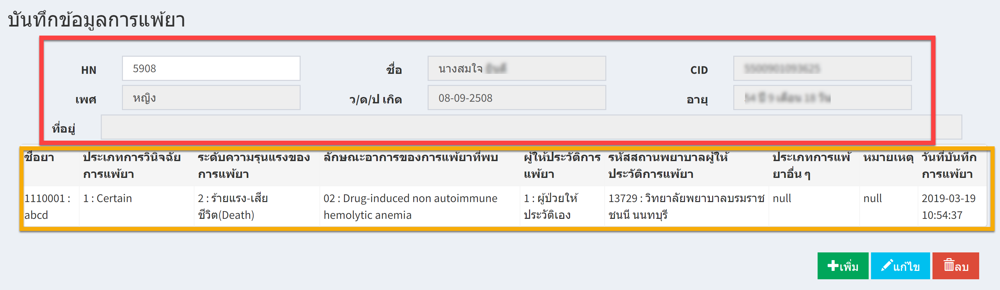
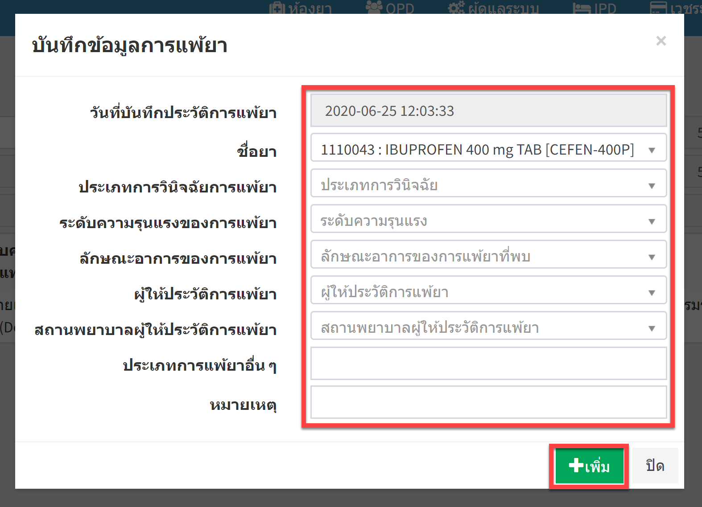
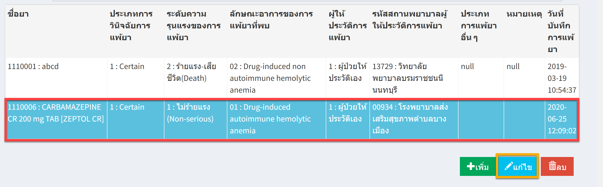
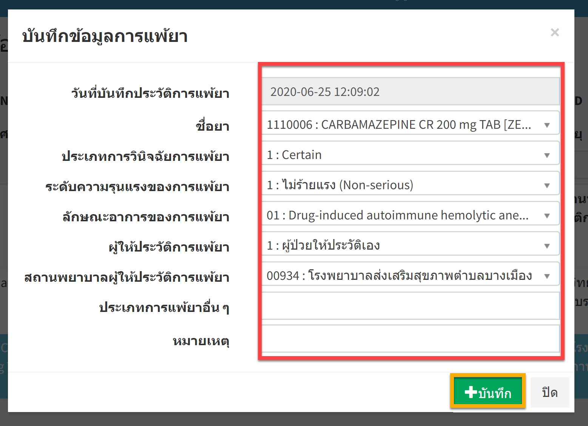
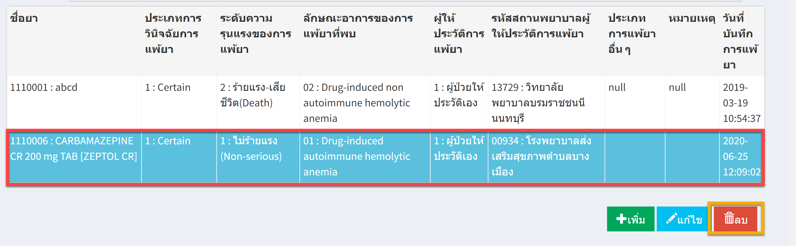

# 503 - บันทึกข้อมูลการแพ้ยา

1. ระบุ HN แล้ว enter >> จะปรากฎรายละเอียดข้อมูลผู้ป่วย และข้อมูลการแพ้ยาที่ได้บันทึกไว้แล้ว

2. การเพิ่มข้อมูลการแพ้ยา >> กดปุ่มเพิ่ม >> จะปรากฎหน้าให้บันทึกข้อมูลการแพ้ยา >> กรอกรายละเอียด >> กดปุ่ม "เพิ่ม" 

3. การแก้ไขข้อมูลการแพ้ยา >> กดรายการที่ต้องการแก้ไขให้เป็นแถบสีฟ้า >> และกดปุ่ม "แก้ไข" 

จะปรากฎหน้าให้แก้ไขข้อมูลแพ้ยา >> แก้ไขแล้วกดปุ่ม "บันทึก"

4. การลบข้อมูลการแพ้ยา >> กดรายการที่ต้องการแก้ไขให้เป็นแถบสีฟ้า >> และกดปุ่ม "ลบ" 

   