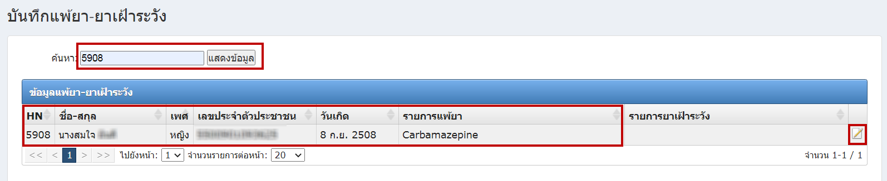
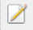
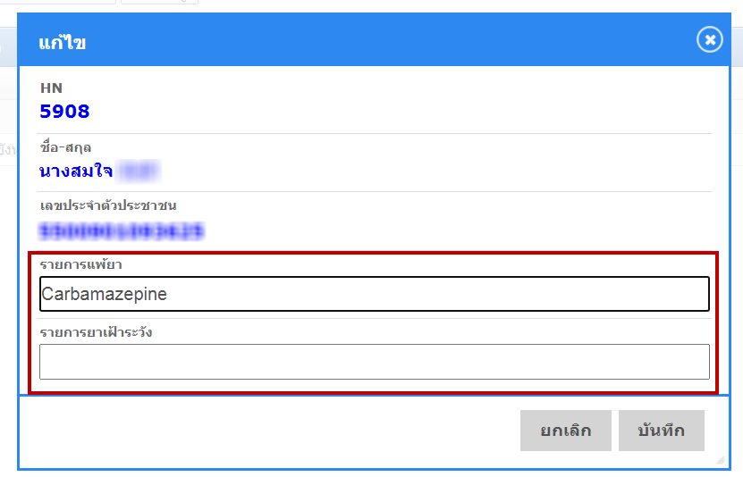

# 504 - บันทึกแพ้ยา-ยาเฝ้าระวัง

1. ระบุ HN แล้ว enter หรือกดปุ่ม "แสดงข้อมูล" 
2. จะปรากฎข้อมูลแพ้ยา-ยาเฝ้าระวัง ของผู้ป่วย

2. การเพิ่มหรือแก้ไขข้อมูลการแพ้ยา-ยาเฝ้าระวัง
   กดปุ่ม  
   จะปรากฎหน้า เพิ่ม/แก้ไข > กดปุ่ม "บันทึก"

