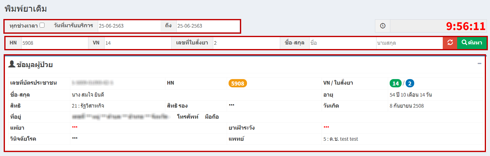
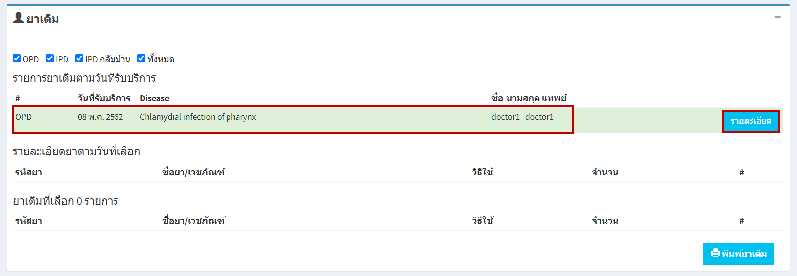
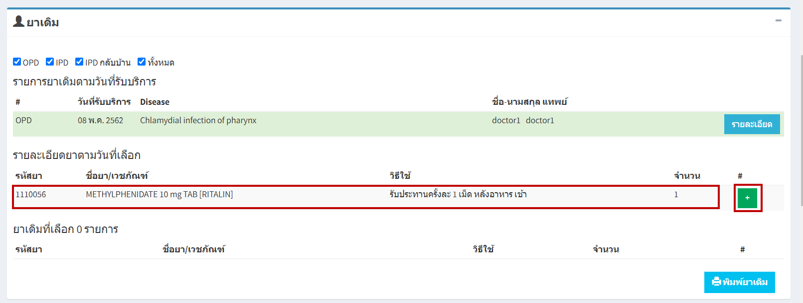
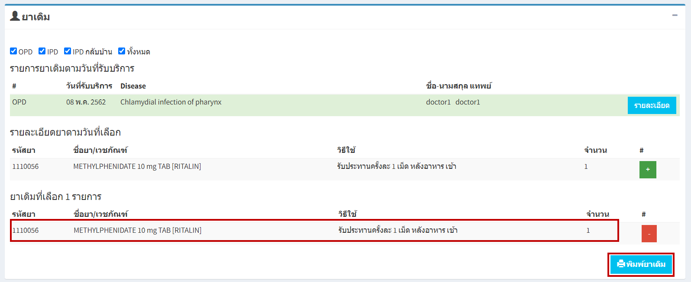

# 505 - พิมพ์ยาเดิม

1. เลือกช่วงเวลา / วันที่มารับบริการ 
2. ระบุ HN / VN / เลขที่ใบสั่งยา / ชื่อ-สกุล อย่างใดอย่างหนึ่ง แล้ว enter หรือกดปุ่ม "ค้นหา"
3. จะปรากฏข้อมูลผู้ป่วย

4. จะปรากฏข้อมูล "ยาเดิม" (โดยสามารถเลือกดูรายละเอียดได้ OPD / IPD / IPD กลับบ้าน / ทั้งหมด)
5. ส่วนแรกจะแสดงข้อมูล "รายการยาเดิมตามวันที่รับบริการ" > กดปุ่ม "รายละเอียด"

6. ส่วนที่สองจะแสดงข้อมูล "รายละเอียดยาตามวันที่เลือก" > กดปุ่ม เครื่องหมายบวก

7. ส่วนที่สามจะแสดงข้อมูล "ยาเดิมที่เลือก" >> จะปรากฏรายการยาเดิม > กดปุ่ม "พิมพ์ยาเดิม"

