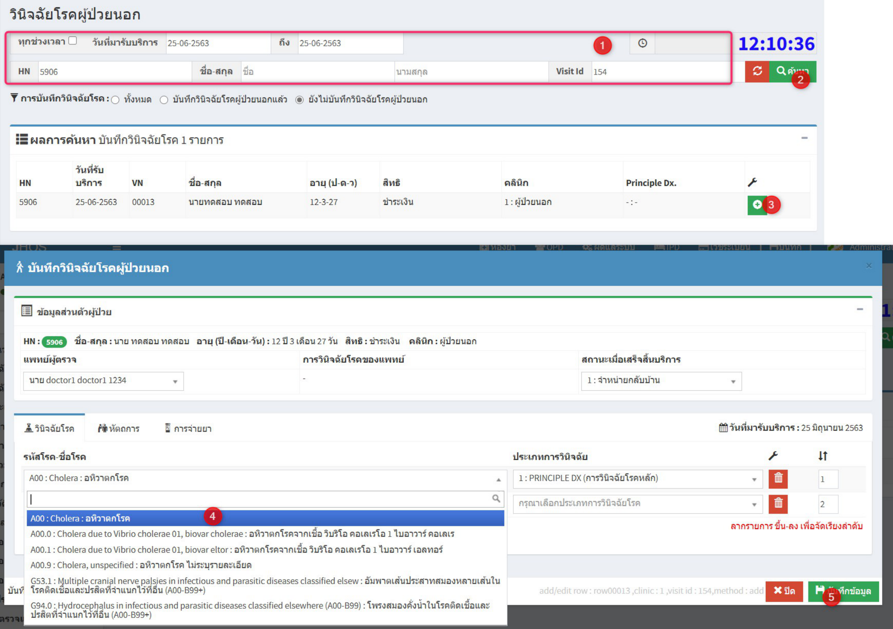
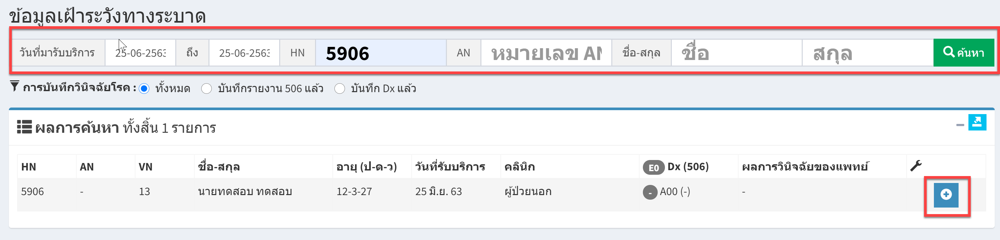
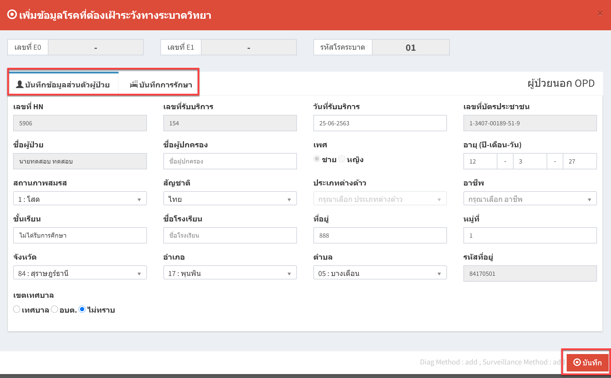

# 506 - บันทึกข้อมูลการแพ้ยา

1. ต้องลงวินิจฉัยโรค ในหน้าวินิจฉัยโรคผู้ป่วยนอก/ในก่อน โดยเลือกรหัสที่เป็นโรคระบาดเช่น A00 อหิวา

2. เมนูข้อมูลเฝ้าระวังทางระบาด  
ระบุ HN / AN / ชื่อ-สกุล อย่างใดอย่างหนึ่งแล้ว enter หรือกดปุ่ม "ค้นหา"  
จะปรากฏข้อมูลผู้ป่วย > กดปุ่ม "เพิ่มข้อมูลโรคที่ต้องเฝ้าระวังทางระบาดวิทยา"

3. จะปรากฎหน้า "เพิ่มข้อมูลโรคที่ต้องเฝ้าระวังทางระบาดวิทยา" >> บันทึกข้อมูลส่วนตัวผู้ป่วย และ บันทึกการรักษา >> กดปุ่ม "บันทึก"

