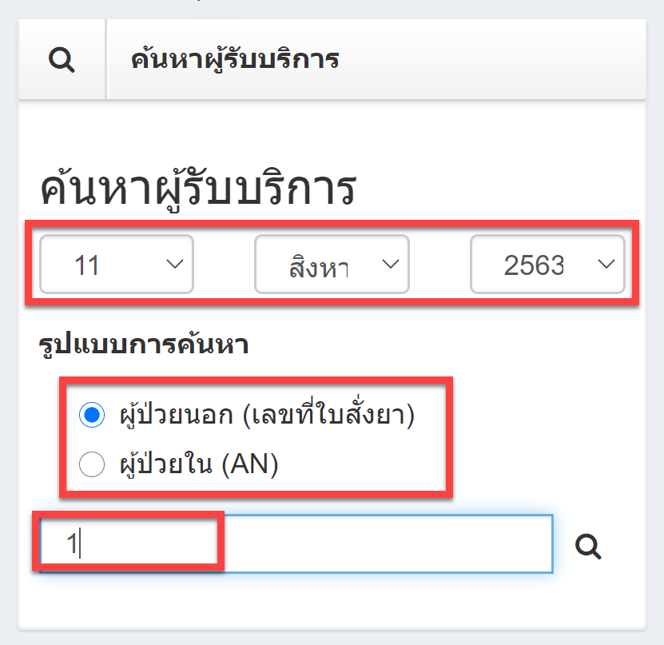
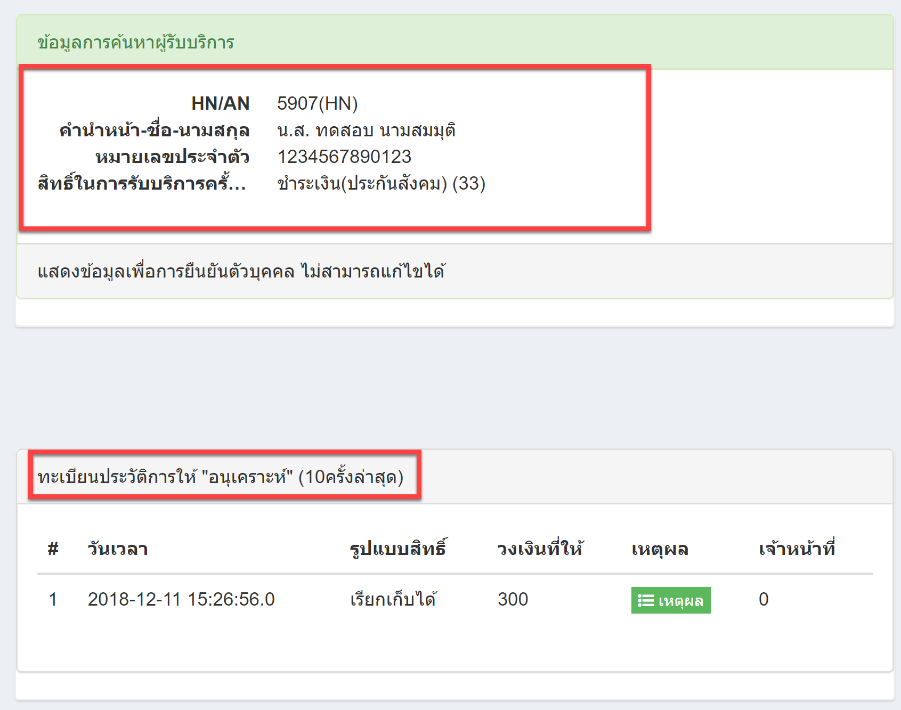
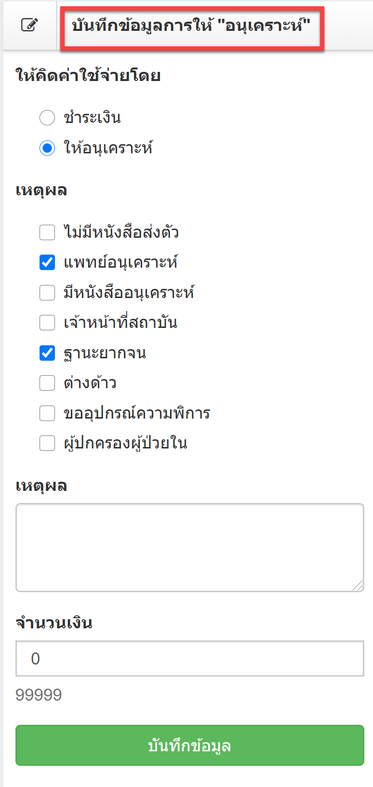

# 507 - บันทึกอนุเคราะห์

1. ค้นหาผู้รับบริการ > เลือกวันที่ > ค้นหาโดย ผู้ป่วยนอก(เลขที่ใบสั่งยา) หรือ ผู้ป่วยใน (AN) > enter หรือกดปุ่ม "ค้นหา"

2. จะปรากฏข้อมูลผู้มารับบริการ ประกอบด้วย ข้อมูลส่วนตัว และทะเบียนประวัติการให้ "อนุเคราะห์" (10 ครั้งล่าสุด)

3. การบันทึกข้อมูลการให้ "อนุเคราะห์" > เหตุผล > จำนวนเงิน > กดปุ่ม "บันทึกข้อมูล"

