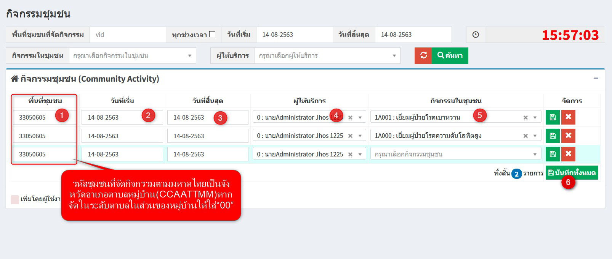

# 508 - กิจกรรมชุมชน

บันทึกเมื่อมีการออกเยี่ยมชุมชน จะไม่ใช่การเป็นบันทึกข้อมูลประชาชนรายบุคคล แต่บันทึกเป็นภาพรวมของชุมชน

1. พื้นที่ชุมชน (รหัสชุมชนที่จัดกิจกรรมตามมหาดไทยเป็นจังหวัด อำเภอ ตำบล หมู่บ้าน (CCAATTMM) หากจัดในระดับตำบลในส่วนของหมู่บ้านให้ใส่ "00")

2. วันที่เริ่ม
   
3. วันที่สิ้นสุด
   
4. ชื่อผู้ให้บริการ
   
5. กิจกรรมที่ตรวจเยี่ยมในชุมชน
   
6. กดปุ่ม "บันทึกทั้งหมด"
