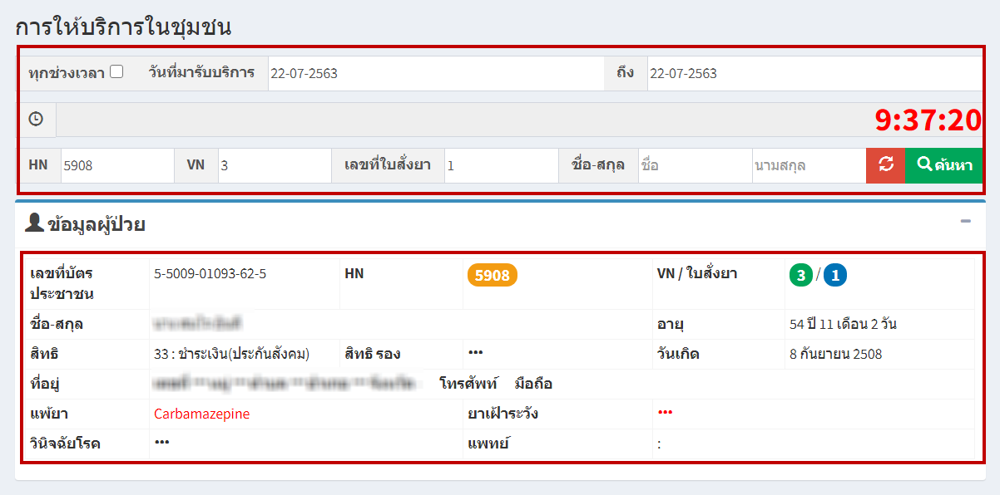
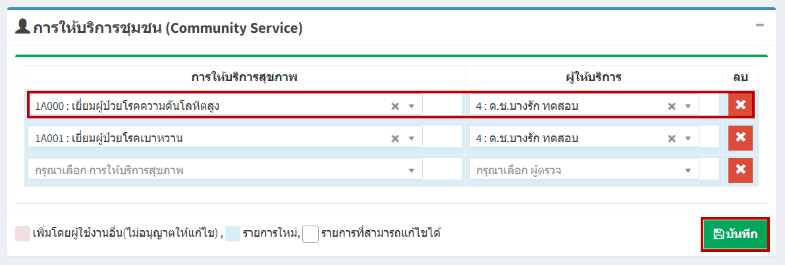

# 509 - การให้บริการในชุมชน

1. เลือกวันที่มารับบริการ / ระบุ HN / VN / เลขที่ใบสั่งยา / ชื่อ-สกุล อย่างใดอย่างหนึ่งแล้ว enter หรือกดปุ่ม "ค้นหา"  
จะปรากฏข้อมูลผู้ป่วย

2. ส่วนที่สองจะเป็น การให้บริการชุมชน (Community Service)
เลือกการให้บริการสุขภาพ > ระบุผู้ให้บริการ > กดปุ่ม "บันทึก"

