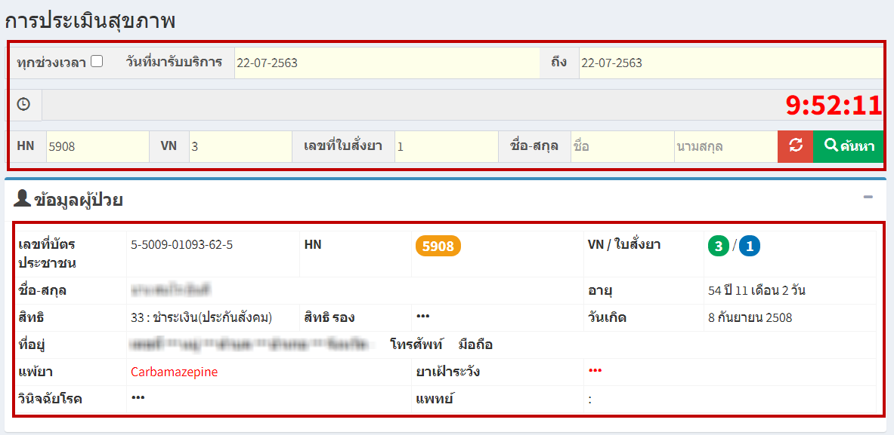
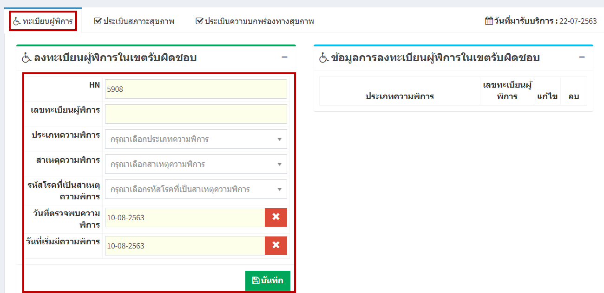
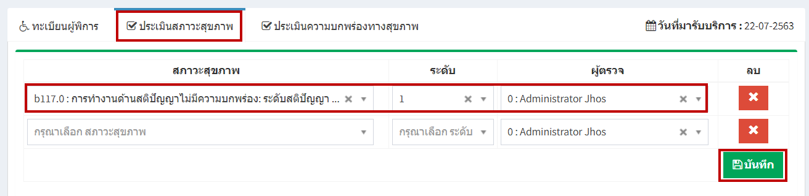
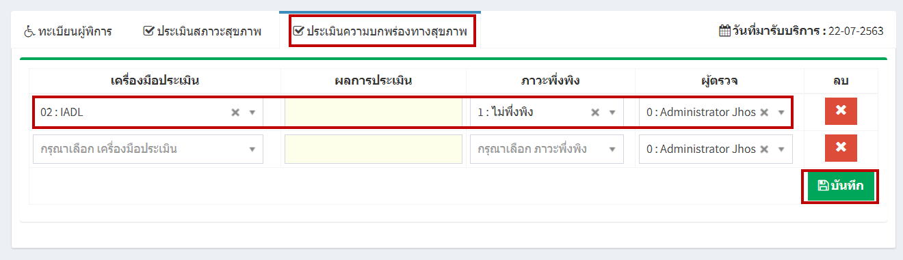

# 510 - การประเมินสุขภาพ

1. เลือกวันที่มารับบริการ / ระบุ HN / VN / เลขที่ใบสั่งยา / ชื่อ-สกุล อย่างใดอย่างหนึ่งแล้ว enter หรือกดปุ่ม "ค้นหา"  
จะปรากฏข้อมูลผู้ป่วย

ส่วนที่สองจะมี 3 แถบ คือ ทะเบียนผู้พิการ / ประเมินสภาวะสุขภาพ /ประเมินความบกพร่องทางสุขภาพ

2. แถบ "ทะเบียนผู้พิการ" > หากเป็นผู้พิการสามารถลงทะเบียนผู้พิการในเขตรับผิดชอบ > กดปุ่ม "บันทึก"

3. แถบ "ประเมินสภาวะสุขภาพ" > เลือกสภาวะสุขภาพ > ระดับ > ผู้ตรวจ > กดปุ่ม "บันทึก"

4. แถบ "ประเมินความบกพร่องทางสุขภาพ" > เลือกเครื่องมือประเมิน > ผลการประเมิน > ภาวะพึ่งพิง > ผู้ตรวจ > กดปุ่ม "บันทึก"

