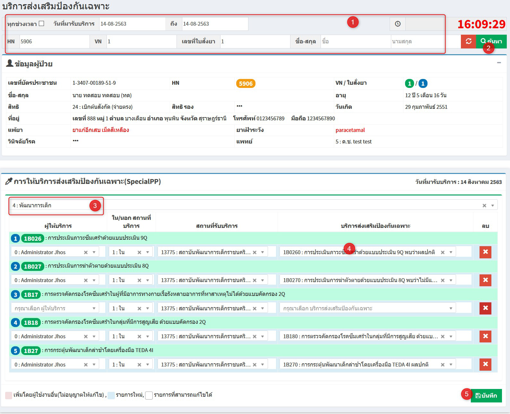

# 511 - บริการส่งเสริมป้องกันเฉพาะ

เป็นการบันทึกข้อมูลการให้บริการส่งเสริมสุขภาพป้องกันโรคเฉพาะสาหรับผู้ที่มารับบริการ

1. เลือกวันที่มารับบริการ > ระบ HN / VN / เลขที่ใบสั่งยา / ชื่อ-สกุล อย่างใดอย่างหนึ่ง 
   
2. แล้วกด enter หรือกดปุ่ม "ค้นหา" > จะปรากฏข้อมูลผู้ป่วย

3. เลือกประเภทให้บริการส่งเสริมป้องกันเฉพาะ
   
4. เลือกบริการส่งเสริมป้องกันเฉพาะ
   
5. กดปุ่ม "บันทึกทั้งหมด"
