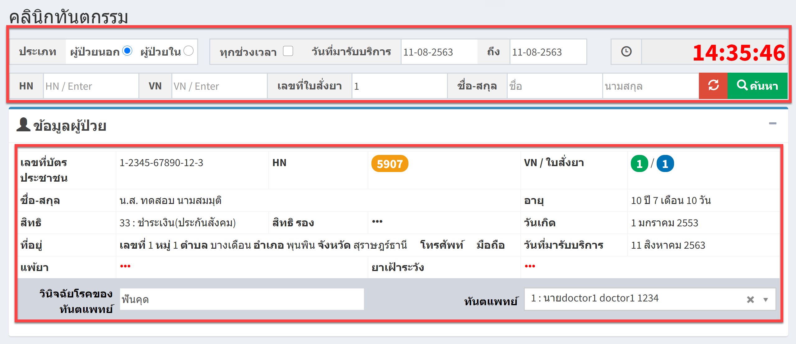
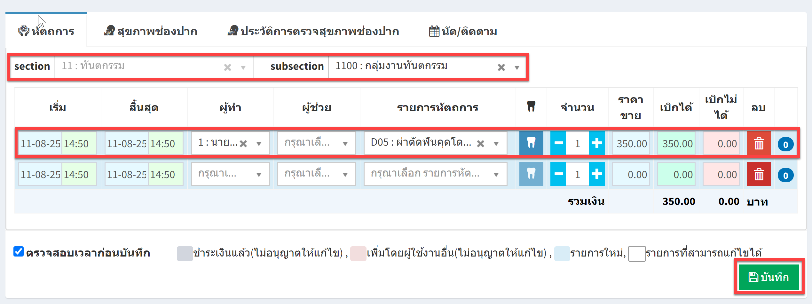
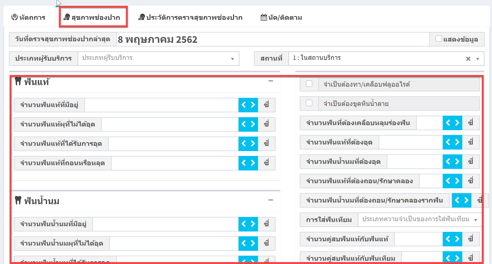
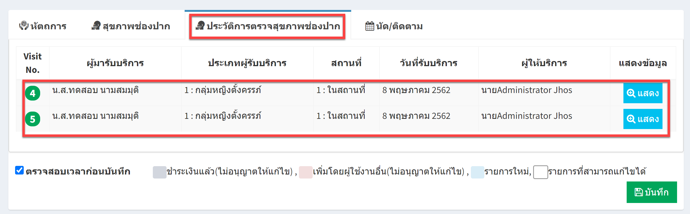
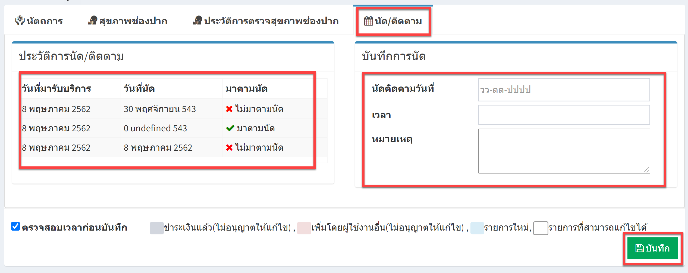
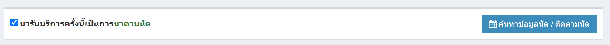
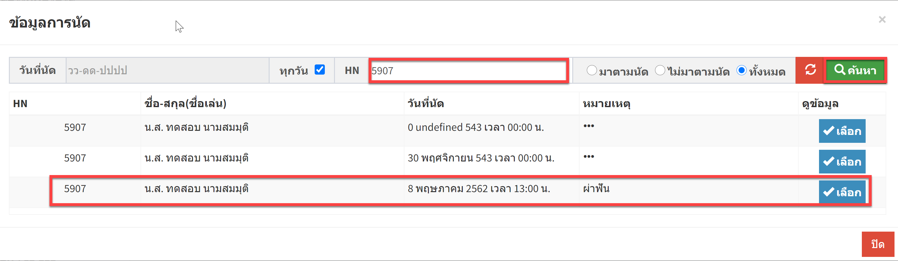
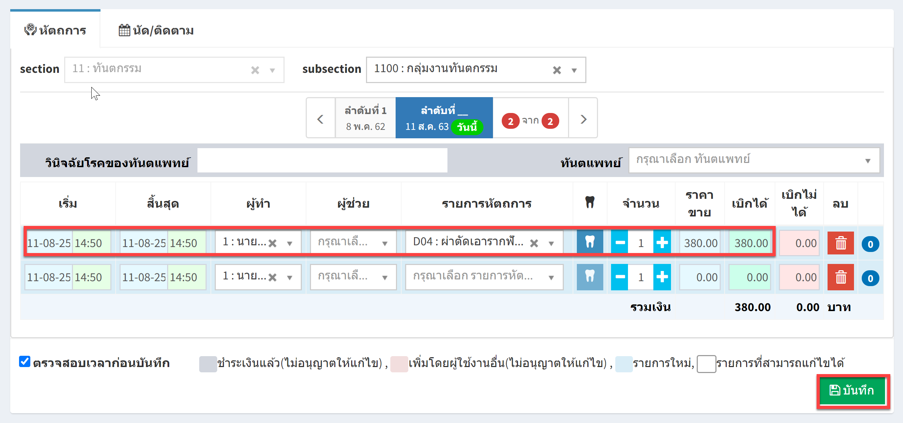

# 512 - คลินิกทันตกรรม

1. ระบุ HN / VN / เลขที่ใบสั่งยา / ชื่อ-สกุล อย่างใดอย่างหนึ่งแล้ว enter หรือกดปุ่ม "ค้นหา"  
จะปรากฏข้อมูลผู้ป่วย

2. ส่วนที่สองจะเป็น ผู้ป่วยที่มารับบริการตามปกติ (ไม่ได้นัด) > จะมีแถบใช้งาน 4 แถบ คือ หัตถการ / สุขภาพช่องปาก / ประวัติการตรวจสุขภาพช่องปาก / นัด/ติดตาม

แถบ "หัตถการ" สามารถเพิ่มรายการหัตถการที่ทำ > กดปุ่มบันทึก

แถบ "สุขภาพช่องปาก" สามารถคีย์รายการที่ตรวจได้> กดปุ่มบันทึก

แถบ "ประวัติการตรวจสุขภาพช่องปาก" จะปรากฎข้อมูลประวัติการตรวจสุขภาพช่องปาก > กดปุ่มบันทึก

แถบ "นัด/ติดตาม" สามารถดูข้อมูลการนัด หรือสามารถบันทีกการนัดครั้งต่อไป > กดปุ่มบันทึก

3. ส่วนที่สามจะเป็น ผู้ป่วยที่มารับบริการตามนัด > คลิกเลือกตรง มารับบริการครั้งนี้เป็นการมาตามนัด > กดปุ่ม "ค้นหาข้อมูลนัด/ติดตามนัด"
    

จะปรากฏข้อมูลการนัดของผู้มารับบริการ > กดปุ่ม "เลือก" > จะเข้าสู่หน้าหัตถการ > ดำเนินการระบุหัตถการ > กดปุ่ม "บันทึก"

