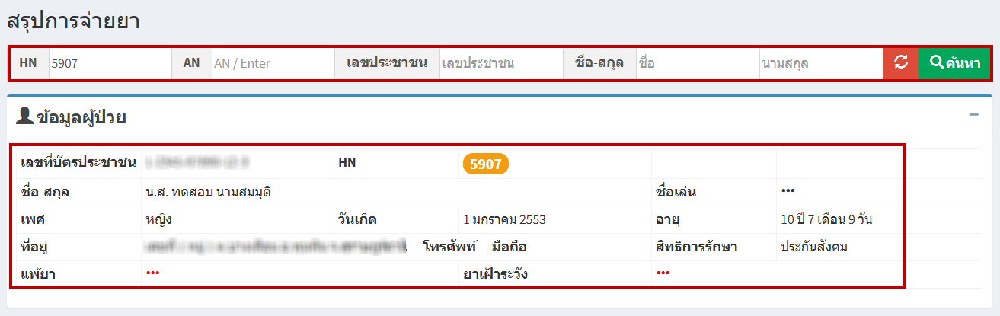
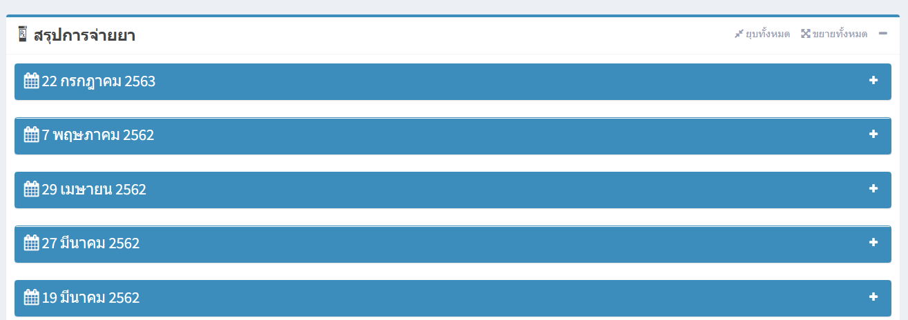
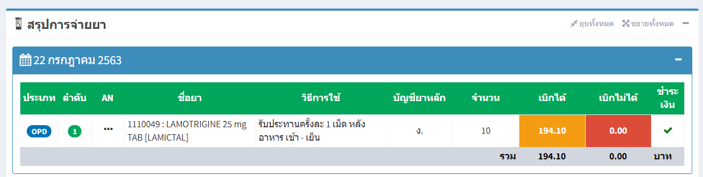
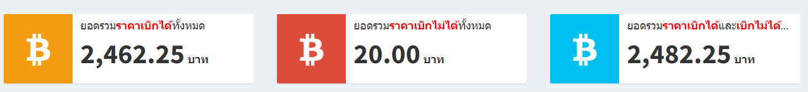

# 513 - สรุปการจ่ายยา

1. ระบุ HN / VN / เลขประชาชน / ชื่อ-สกุล อย่างใดอย่างหนึ่งแล้ว enter หรือกดปุ่ม "ค้นหา"  
จะปรากฏข้อมูลผู้ป่วย

2. ส่วนที่สองจะเป็น สรุปการจ่ายยา > จะปรากฎการจ่ายยาของผู้ป่วย

3. กดปุ่มเครื่องหมายบวก (+) เพื่อดูรายละเอียดการจ่ายยา

4. จะแสดงค่าใช้จ่ายทั้งหมด > ยอดรวมราคาเบิกได้ทั้งหมด / ยอดรวมราคาเบิกไม่ได้ท้งหมด / ยอดรวมราคาเบิกได้และเบิกไม่ได้ทั้งหมด

