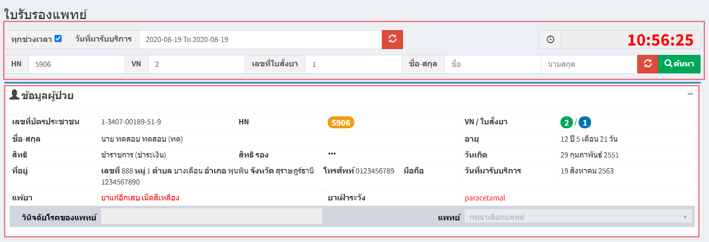

# 514 - ใบรับรองแพทย์

1. เลือกวันที่มารับบริการ > ระบุ HN / VN / เลขที่ใบสั่งยา / ชื่อ-สกุล อย่างใดอย่างหนึ่งแล้ว enter หรือกดปุ่ม "ค้นหา"  
จะปรากฏข้อมูลผู้ป่วย

2. ความคิดเห็นแพทย์ > เลือกประเภทใบรับรอง > กรอกข้อมูลให้ครบถ้วน

3. กดปุ่ม "บันทึกข้อมูล"

4. พิมพ์ใบรับรองสุขภาพ/ใบรับรองการป่วย

