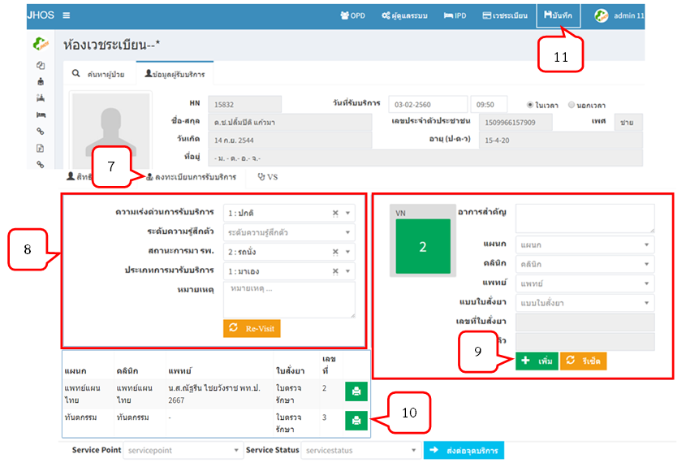
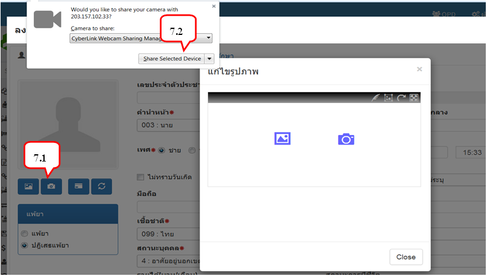
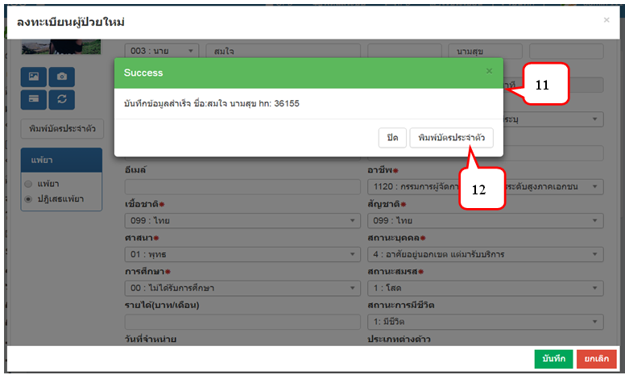
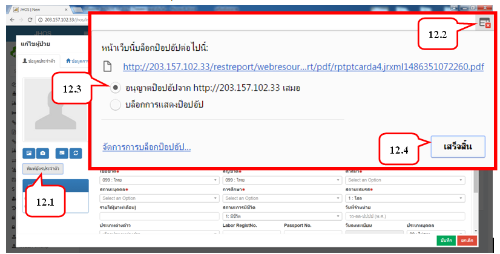
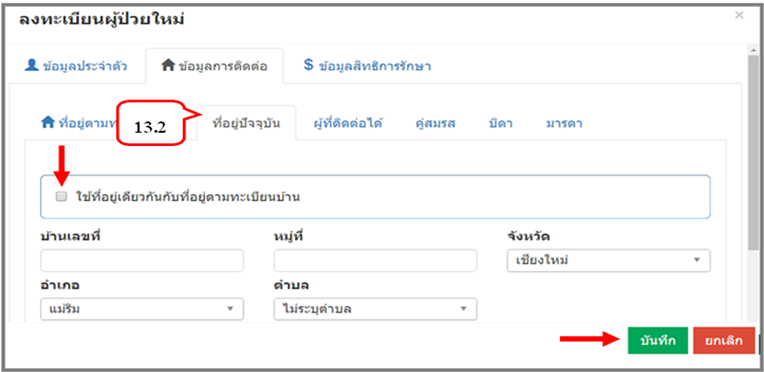

# จากเอกสารเดิมรอแก้ไข**
## หน้าหลักของโปรแกรม
- ซึ่งเป็นหน้าจอแรก ผู้ใช้งานจะต้องทำการล็อกอินเข้าสู่ระบบก่อน จึงจะสามารถใช้งานระบบได้ 
## เข้าสู่ระบบ
- ใส่ user name , password และจุดบริการของแต่ละบุคคล (ตามสิทธิการเข้าถึงที่ผู้ดูแลระบบกำหนดให้)
  
- เมื่อใส่ username และ password ถูกต้องระบบจะแสดงสถานะ Online และชื่อผู้เข้าใช้งาน 
## รายการเมนู 
- อยู่ด้านซ้ายของหน้าจอการทำงาน โดยจะแสดงเมนูตามสิทธิของผู้ใช้งาน ผู้ใช้งานสามารถเลือกรายการที่ต้องการ โดยการคลิกเมาส์เลือกได้ทันที 

## หน้าจอค้นหาผู้ป่วยหน้าห้องตรวจ
1. คลิกเลือก เมนู "ค้นหาผู้ป่วยหน้าห้องตรวจ"
2. ต้องระบุ วัน เดือน ปี แล้วกด Enter จะแสดงข้อมูลทั้งหมดของ วัน เดือน ปี ที่เลือก
- หากระบุ วัน เดือน ปี และเลือกคลินิก แล้วกด Enter จะแสดงข้อมูลทั้งหมดของวันเดือนปีและคลินิกที่เลือก 
- หากระบุ วัน เดือน ปี และเลือก HN แล้วกด Enter จะแสดงข้อมูลผู้ป่วย HN นั้น
3. จะปรากฏรายละเอียดของผู้ป่วย

## หน้าจอห้องเวชระเบียน
1. เลือกแท็บ "ค้นหาผู้ป่วย"
2. ค้นหาผู้ป่วยด้วย HN/ CID/ ชื่อ/ นามสกุล อย่างใดอย่างหนึ่ง แล้วกดปุ่มค้นหา
3. จะปรากฏข้อมูลของผู้ป่วยที่ค้นหา
4. กดปุ่ม          เพื่อลงทะเบียนผู้มารับบริการ

5. เลือกแท็บ "ข้อมูลผู้รับบริการ" มีแท็บการใช้งาน 3 แท็บ คือ สิทธิการรักษา ลงทะเบียนการรับบริการ และบันทึก Vital sign
6. แท็บ "สิทธิการรักษา" จะแสดงสิทธิที่มาใช้บริการ 3 ครั้งล่าสุด สิทธิที่ใช้ในบริการครั้งนี้และสามารถตรวจสิทธิ์จาก สปสช. ได้

7. แท็บ "ลงทะเบียนการรับบริการ" ต้องกรอกข้อมูลให้ครบ 
8. ระบุข้อมูลให้ครบ โดยส่วนนี้ที่มีปุ่ม                        ซึ่งจะดึงค่าจาก Visit ครั้งล่าสุด
9. ระบุข้อมูลอาการสำคัญ แผนก คลินิก แพทย์ และแบบใบสั่งยา จากนั้นกดปุ่มเพิ่ม
10. จะปรากฏข้อมูลต่าง ๆ ได้เลขที่ใบสั่งยา
11. กดปุ่มบันทึก (หากไม่บันทึกข้อมูล จะไม่สามารถบันทึก VS ได้)

12. แท็บ "บันทึก Vital sign"
13. กดปุ่ม "เพิ่ม" เพื่อบันทึก VS

14. จะแสดงหน้าบันทึกรายการ Vital sign กรอกข้อมูลให้ครบและกดปุ่ม "เพิ่ม"

15. รายการ Vital sign สามารถแก้ไข และลบได้
  - การแก้ไข คลิกเลือกบรรทัดที่ต้องการแก้ไข > กดปุ่มแก้ไข > ทำรายการที่ต้องการ   แก้ไข > กดปุ่มบันทึก
  - การลบ คลิกเลือกบรรทัดที่ต้องการลบ > กดปุ่มลบ 

## หน้าจอลงทะเบียนผู้ป่วยใหม่
1. คลิกเข้าหน้าจอห้องเวชระเบียน
2. กดปุ่ม "ลงทะเบียนผู้ป่วยใหม่"

3. จะปรากฏหน้าจอลงทะเบียนผู้ป่วยใหม่ มีแท็บการใช้งาน 3 แท็บ คือ ข้อมูลประจำตัว ข้อมูลการติดต่อ และข้อมูลสิทธิการรักษา
4. แท็บ "ข้อมูลประจำตัว" 

5. กรอกรายละเอียดข้อมูลใหม่ โดยช่องที่ไม่สามารถเป็นค่าว่างได้ จะมีเครื่องหมาย * อยู่ข้างหน้า จะต้องบันทึกรายละเอียดให้ครบ
6. ปุ่ม  คือการเลือกรูปที่มีอยู่ในเครื่อง
  - 6.1 กดเพิ่มรูป
  - 6.2 กดเลือกไอคอนเลือกรูปภาพที่มีอยู่ในเครื่อง
  - 6.3 เมื่อได้รูปที่ต้องการ กดปุ่ม Open

  - 6.4 คลิกปุ่ม Crop จะปรากฏเส้นประสีน้ำเงิน เพื่อจัดการรูปภาพในพอดี
  - 6.5 เมื่อได้ขนาดรูปที่ต้องการแล้ว กด √ 
  - 6.6 กดปุ่ม × ก็เป็นการเพิ่มรูปเสร็จเรียบร้อย

7. ปุ่ม           คือการถ่ายรูปด้วยกล้องจากคอมพิวเตอร์ (Firefox web browser)
  - 7.1 กดปุ่มถ่ายรูป
  - 7.2 กด Share Selected Device

  7.3 กด √ เพื่อถ่ายภาพ

  7.4 คลิกปุ่ม Crop จะปรากฏเส้นประสีน้ำเงิน เพื่อจัดการรูปภาพในพอดี
  7.5 เมื่อได้ขนาดรูปที่ต้องการแล้ว กด √ 
  7.6 กดปุ่ม × ก็เป็นถ่ายรูปเสร็จเรียบร้อย

8. ปุ่ม           คือการอ่านข้อมูลจาก Smart card
  - เสียบบัตรประจำตัวประชาชน รอจนกว่าไฟกระพริบบนตัว  Smartcard Reader       จะหยุดกระพริบ (ไฟจะกระพริบ 2 ครั้ง ครั้งที่ 1 อ่านข้อมูลหน้าบัตร ไฟกระพริบครั้งที่ 2 อ่านข้อมูลรูปภาพ) แล้วกดปุ่ม
  - จะปรากฏข้อมูลตามบัตรประจำตัวประชาชนพร้อมทั้งรูป โดยจะได้ข้อมูลจากการอ่าน Smartcard ดังนี้
      -	เลขที่บัตรประจำตัวประชาชน
      -	คำนำหน้าชื่อ
      -	ชื่อ - สกุล
      -	เพศ
      -	วัน เดือน ปีเกิด
      -	อายุ
      -	ที่อยู่
9. หากผู้ป่วยใหม่มีการแพ้ยา สามารถคลิกการแพ้ยาได้
10. เมื่อบันทึกเรียบร้อยแล้ว จะแสดงหมายเลข HN ของผู้ป่วยใหม่ 
11. เมื่อแสดง HN ของผู้ป่วยแล้ว ก็จะมี Popup แจ้งว่าได้ทำการบันทึกข้อมูลสำเร็จแล้ว

12. กดปุ่ม "พิมพ์บัตรประจำตัวผู้ป่วย" (มี 2กรณี คือแสดงหน้าบัตรประจำตัวก่อนพิมพ์ และไม่สามารถหน้าบัตรประจำตัวสามารถพิมพ์ได้เลย)  
__**กรณีแสดงหน้าบัตรประจำตัวก่อนพิมพ์__  
12.1 กดปุ่ม "พิมพ์บัตรประจำตัว"  
12.2 ให้สังเกตด้านขวาบนสุด จะมีสัญลักษณ์ Popup        คลิกสัญลักษณ์  
12.3 จะปรากฏ Popup ให้เลือก "อนุญาต Popup เสมอ"  
12.4 กดปุ่ม "เสร็จสิ้น"  

12.5 จะปรากฏหน้าบัตรประจำตัว  
12.6 กดปุ่ม         เพื่อพิมพ์บัตรประจำตัว  

13. แท็บ "ข้อมูลการติดต่อ" ประกอบด้วย  
13.1 ที่อยู่ตามทะเบียนบ้าน ซึ่งหากใช้การอ่านจากบัตร Smart Card จะปรากฏข้อมูล > กดปุ่ม "บันทึก"
  
13.2 ที่อยู่ปัจจุบัน หากเป็นที่อยู่เดียวกับที่อยู่ตามทะเบียนบ้านก็สามารถกดเลือกได้เลย หากไม่ตรงใช่ที่อยู่เดียวกัน ก็คีย์รายละเอียดของผู้ป่วย > กดปุ่ม "บันทึก"

13.3 ข้อมูลการติดต่อ ผู้ที่ติดต่อได้ / คู่สมรส / บิดา / มารดา จะมีหน้าจอการใช้งานเหมือนกัน หากเป็นที่อยู่เดียวกับที่อยู่ตามทะเบียนบ้าน / ที่อยู่ปัจจุบัน ก็สามารถเลือกได้เลย > กดปุ่ม "บันทึก"

14. แท็บ "ข้อมูลสิทธิการรักษา" ประกอบด้วย  
14.1 สิทธิหลัก 	
14.2 สิทธิรอง  
14.3 เมื่อกรอกข้อมูลครบเรียบร้อย > กดปุ่ม "บันทึก"  
__**หมายเหตุ : ข้อมูลสิทธิการรักษา สามารถกรอกข้อมูลได้อีกครั้งตอนส่งตรวจ__
## หน้าจอแก้ไขผู้ป่วย
1. เลือกเมนู "ห้องเวชระเบียน"  
2. เลือกแท็บ "ค้นหาผู้ป่วย"  
3. ค้นหาผู้ป่วยด้วย HN/ CID/ ชื่อ/ นามสกุล อย่างใดอย่างหนึ่ง แล้วกดปุ่มค้นหา  
4. จะปรากฏข้อมูลของผู้ป่วยที่ค้นหา  
5. กดปุ่ม         เพื่อแก้ไขข้อมูลผู้ป่วย  
6. จะปรากฏข้อมูลของผู้ป่วยที่ค้นหา จากนั้นก็ทำการแก้ไขได้ตามต้องการ  
7. กดปุ่ม "บันทึก"  
## หน้าจอห้องตรวจแพทย์ 
1. แท็บ "ค้นหาผู้รับบริการ"  
  1.1 เลือกวันที่รับบริการ  
  1.2 เลือกคลินิก  
  1.3 ระบุ HN แล้ว enter หรือกดปุ่ม "ค้นหา"  
  1.4 จะปรากฏรายละเอียดคิวรับบริการ  
  1.5 กดปุ่ม "ตรวจ" จะเข้าสู่แท็บ "ข้อมูลประจำตัว"  
2. แท็บ "ข้อมูลประจำตัว"  
  2.1 จะปรากฏข้อมูลผู้ป่วย  
  2.2 แสดงข้อมูลบันทึกคัดกรอง 3 ครั้งล่าสุด  
  2.3 แสดงข้อมูล Vital sign ของการรับบริการครั้งนี้  
  2.4 สามารถเพิ่ม แก้ไข ลบ ข้อมูล Vital sign ได้  
3. แท็บ "การตรวจ - วินิจฉัย"  
  3.1 ระบุรายละเอียดต่าง> อาการสำคัญ> HX> การตรวจร่างกาย> สาเหตุการจำหน่าย  
  3.2 ลงการวินิจฉัยโรค  
4. แท็บ "ส่งต่อไปจุดบริการอื่น"  
  4.1 ระบุรายละเอียด Service Point >Service Status  
## หน้าจอบันทึกวินิจฉัยผู้ป่วยนอก
__**มี 2 กรณี ดังนี้__
1. กรณีระบุตัวผู้ป่วยรายบุคคล  
  1.1 เลือกวันที่มารับบริการ โดยหากต้องการดูข้อมูลทั้งหมด ก็สามารถคลิกเลือก           "ทุกช่วงเวลา"  
  1.2 ค้นหาผู้ป่วยจาก HN / ชื่อ / นามสกุล โดยเลือกอย่างใดอย่างหนึ่ง กด enter /      ปุ่ม "ค้นหา" (Visit Id คือ เลขการลงทะเบียนรับบริการในแต่ละครั้งซึ่งจะไม่ซ้ำกัน)  
  1.3 จะปรากฏข้อมูลผู้ป่วย  
  1.4 กดปุ่ม       เพื่อบันทึกวินิจฉัยโรคผู้ป่วยนอก  
  1.5 จะปรากฏหน้าจอสำหรับบันทึกวินิจฉัยโรคผู้ป่วยนอก ส่วนแรกจะแสดงข้อมูลผู้ป่วย  
  1.6 ส่วนที่สองที่มีแท็บรายการ 3 รายการ คือ วินิจฉัยโรค / หัตถการ / การจ่ายยา  
  1.7 แท็บ "วินิจฉัยโรค" สามารถเลือกได้จากรหัสโรคหรือชื่อโรค โดยพิมพ์ข้อความอย่างน้อย 3 ตัวอักษร จากนั้นกดเลือกโรคที่ต้องการ  
  1.8 เลือกประเภทการวินิจฉัย  
  1.9 กดปุ่ม "บันทึกข้อมูล"  
__**ถ้ามีการบันทึกโรค ที่รหัสโรคขึ้นต้นด้วย S,T และมีประเภทการวินิฉัยเป็น Principle DX จะต้องมีการบันทึกโรคที่รหัสโรคขึ้นต้นด้วย V,X,X,Y และมีประเภทการวินิจฉัยเป็น External Cause ด้วย__  
  1.10 หากรหัสโรค-ชื่อโรคที่เลือก เป็นโรคที่ต้องเฝ้าระวังทางระบาดวิทยา ก็จะปรากฎหน้าเพื่อให้เพิ่มข้อมูลส่วนตัวของผู้ป่วย > กดปุ่ม "เพิ่ม"  
  1.11 หน้าบันทึการรักษา จะปรากฎรายละเอียดต่างๆ เช่น รหัส ICD10, ชนิดของเชื้อ >กดปุ่ม "เพิ่ม" > กดปุ่ม "บันทึกข้อมูล" ในหน้าวินิจฉัยโรคผู้ป่วยนอก  
  1.12 แท็บ "หัตถการ" สามารถบันทึกรายการหัตถการได้ หรือหากมีการบันทึกรายการหัตถการแล้วก็สามารถดูรายการที่บันทึกได้ > กดปุ่ม "บันทึกข้อมูล"  
  1.13 แท็บ "การจ่ายยา" สามารถดูรายการยาที่จ่ายยาให้ผู้ป่วยได้  
  1.14 ระบุสถานะเมื่อเสร็จสิ้นบริการ  
2. กรณีค้นหาเฉพาะ มี 3 ปุ่มให้เลือก (โดยต้องเลือกวันที่มารับบริการ และระบุเลข HN / ชื่อ / นามสกุล อย่างใดอย่างหนึ่งก่อน)  
  2.1 เลือกการบันทึกวินิจฉัยโรค : ทั้งหมด > กดปุ่ม "ค้นหา"  
  2.2 เลือกการบันทึกวินิจฉัยโรค : บันทึกวินิจฉัยโรคผู้ป่วยแล้ว > "ค้นหา"  
  2.3 เลือกการบันทึกวินิจฉัยโรค : ยังไม่บันทึกวินิจฉัยโรคผู้ป่วยนอก > "ค้นหา"  
เมื่อทำการเลือกค้นหาอย่างใดอย่างหนึ่งแล้ว ก็จะปรากฎข้อมูลผู้ป่วยตามที่เราเลือก
## หน้าจอลงทะเบียนผู้ป่วยใน
1. เลือกวันที่มารับบริการ 
2. ระบุเลข Visit No. แล้ว enter หรือ กดปุ่ม "แสดงข้อมูลผู้ป่วย"
3. จะปรากฏข้อมูลประจำตัวผู้ป่วย
4. ทำการลงทะเบียนผู้ป่วยใน โดยระบุรายละเอียดต่าง ๆ ให้ครบถ้วน
5. กดปุ่ม "ส่งเข้า ward
6. จะได้เลข AN ของผู้ป่วย
7. กดปุ่ม " พิมพ์ IPD Card" เมื่อต้องการพิมพ์
8. ระบุรายละเอียดการส่งต่อจุดบริการ > กดปุ่ม " ส่งต่อจุดบริการ"
9. การยกเลิก Admit ระบุสาเหตุการยกเลิก Admit > กดปุ่ม "บันทึกการยกเลิก"

## หน้าจอนัด
1. เลือกประเภทของผู้ป่วย (ผู้ป่วยนอก / ผู้ป่วยใน) กรณีที่เป็นผู้ป่วยนอกต้องระบุเลขที่ใบสั่งยา ถ้าเป็นผู้ป่วยในต้องระบุหมายเลข AN แล้วกด Enter
2. จะแสดงรายละเอียดของผู้มารับบริการ
3. กำหนดรายละเอียดบันทึกการนัด >แผนก >คลินิก >แพทย์ 
4. จะแสดงจำนวนผู้มารับบริการ โดยจะแสดงเฉพาะแผนก, แพทย์, วันที่เลือก เท่านั้น	
5. กำหนดรายละเอียดการนัดให้ครบ โดยการระบุวันที่ เวลา ประเภทการนัด โรคที่นัด ICT10TM การเตรียมตัว ฯลฯ และทำการคลิกปุ่ม  "บันทึก" หากต้องการพิมพ์ใบนัด คลิกที่ปุ่ม "รูปเครื่องพิมพ์"
## หน้าจอบันทึกจ่ายยาผู้ป่วยนอก
การค้นหาผู้ป่วย สามารถเลือกได้หลายรูปแบบ 
1. ค้นหาผู้ป่วยต้องระบุวันที่ จากนั้นคีย์ HN / เลขที่ใบสั่งยา/ ชื่อ / นามสกุล โดยเลือกอย่างใดอย่างหนึ่ง กด enter หรือกดปุ่ม "ค้นหา" 
2. หากต้องการค้นหาทุกช่วงเวลาของผู้ป่วย คลิก √ ในช่องทุกช่วงเวลา > ใส่เลข HN > enter หรือ กดปุ่ม "ค้นหา" 
3. ในกรณีนี้จะปรากฏข้อมูลวันที่มารับบริการทั้งหมดของผู้ป่วย HN นั้น
4. กดปุ่ม "เลือก" วันรับบริการที่ต้องการ >จะปรากฏข้อมูลของผู้ป่วย ระบุรายละเอียดรายการยาของผู้ป่วย 
5. คลิกที่ช่องค้นหารายการยา จะปรากฏหน้าจอเพิ่ม/แก้ไขยา
6. คีย์รายการยาที่ต้องการ
7. เมื่อตกลงเลือกยา จะปรากฏวิธีใช้ยาขึ้นมาให้ 
8. ในช่องจำนวนสามารถเปลี่ยนแปลงได้
9. ในช่อง NPC จะแสดงก็ต่อเมื่อผู้ป่วยมีสิทธิข้าราชการในการมารับบริการครั้งนี้            (ยาตัวนี้จะเบิกไม่ได้) ต้องกำหนด ABCDEF แต่ละตัวมีความหมายดังนี้
    - A : เกิดอาการข้างเคียงจากยา (ADR) หรือแพ้ยา
    - B : ผลการรักษาไม่บรรลุเป้าหมาย
    - C : ไม่มียาในบัญชียาหลักแห่งชาติให้ใช้ แต่ผู้ป่วยมีข้อบ่งใช้ยานี้ตามที่ อย.กำหนด
    - D : มี Contraindication หรือ drug interaction ต่อยาที่ได้รับอยู่
    - E : ยาในบัญชียาหลักแห่งชาติแพงกว่า
    - F : ผู้ป่วยแสดงความจำนงต้องการ (เบิกไม่ได้)
10. จำนวนของ Sticker สามารถเปลี่ยนแปลงได้
11. เมื่อกรอกข้อมูลครบแล้ว กดปุ่ม "บันทึก"
12. คลิกปุ่ม "ยาชุด"  
  12.1 แสดงรายการยาชุด  
  12.2 ดูรายละเอียด คลิกที่ปุ่ม "รายละเอียด"  
  12.3 เลือกรายการโดยคลิกที่ปุ่ม "ใช้"  
13. คลิกปุ่ม "ยาเดิม"  
  13.1 แสดงรายการ  
  13.2 หากต้องการดูรายละเอียด คลิกปุ่ม "รายละเอียด"  
  13.3 คลิกเลือกปุ่ม "ใช้"  
14. สามารถเลือกพิมพ์ใบสั่งยาได้โดยมีสองปุ่มให้เลือก   
  14.6.1 ปุ่ม "เครื่องพิมพ์" คือเลือกพิมพ์เฉพาะตัวยาที่ต้องการจะพิมพ์  
  14.6.2 ปุ่ม "พิมพ์ sticker ยาทั้งหมด"  คือพิมพ์ตัวยาทั้งหมดของผู้ป่วย  
15. คลิกปุ่ม "พิมพ์สรุปรายการยา" เมื่อต้องการพิมพ์รายละเอียดรายการยาทั้งหมดของผู้ป่วย
16. เมื่อทำการบันทึก หากผู้ป่วยมีการแพ้ยาหรือยาที่เฝ้าระวัง จะแสดงการแจ้งเตือน
17. แสดงสรุปรายการยาและค่าใช้จ่ายของผู้ป่วยทั้งหมด	 
## หน้าจอบันทึกผลLAB
1. เลือกประเภทผู้ป่วย ผู้ป่วยนอก หรือ ผู้ป่วยใน
2. หากเป็นผู้ป่วยนอก ต้องระบุวันที่ จากนั้นคีย์ HN / เลขที่ใบสั่งยา/ ชื่อ / นามสกุล โดยเลือกอย่างใดอย่างหนึ่ง กด enter หรือกดปุ่ม "ค้นหา" 
3. หากเป็นผู้ป่วยใน ต้องระบุวันที่ จากนั้นคีย์ AN / HN/ ชื่อ / นามสกุล โดยเลือกอย่างใดอย่างหนึ่ง กด enter หรือกดปุ่ม "ค้นหา"
4. หากต้องการค้นหาทุกช่วงเวลาของผู้ป่วย คลิก √ ในช่องทุกช่วงเวลา > ใส่เลข HN > enter หรือ กดปุ่ม "ค้นหา" 
5. จะปรากฏข้อมูลผู้มารับบริการ
6. ระบุรายละเอียดเกี่ยวกับ LAB ของผู้มารับบริการ
7. กดปุ่ม "บันทึก"
## หน้าจอบันทึกรายการ X-Ray ผู้ป่วยนอก
1. คีย์เลขที่ใบสั่งยา แล้วกด Enter
2. เลือก Tab เพื่อเลือกส่วนของร่างกายที่ต้องการ X-Ray
3. เลือกชุดรายการสำหรับการ X-Ray
4. กด Save
## หน้าจอบันทึกหัตถการผู้ป่วยนอก
1. ระบุวันที่มารับบริการ 
2. ถ้าต้องการดูข้อมูลทุกช่วงเวลา ทำเครื่องหมาย √ หน้าช่องทุกช่วงเวลา
3. ระบุ HN / เลขที่ใบสั่งยา/ ชื่อ/ นามสกุล อย่างใดอย่างหนึ่งของผู้ป่วย แล้ว enter หรือกดปุ่ม "ค้นหา"
4. จะปรากฏข้อมูลผู้ป่วย
5. เลือก section> subsection หรือ หากต้องการทำรายการหัตถการทั้งหมด ก็ทำเครื่องหมาย √ หน้าช่องหัตถการทั้งหมด
6. ระบุรายละเอียดเกี่ยวกับการทำหัตถการทั้งหมด
7. กดปุ่ม "บันทึก"
8. แถบสถานะต่าง ๆ จะมีสีบอก สามารถดูความหมายได้จากสี
## หน้าจอบันทึกรายการกายภาพบำบัด/กิจกรรมบำบัด
1. ระบุหมายเลขคิว แล้วกด Enter
2. เลือกประเภทของการทำกายภาพบำบัด/กิจกรรมบำบัด
3. เลือกรายการกายภาพบำบัด/กิจกรรมบำบัด
4. กดปุ่มบันทึก
## หน้าจอบันทึกค่าใช้จ่ายอื่น ๆ ผู้ป่วยนอก
1. ระบุวันที่มารับบริการ 
2. ถ้าต้องการดูข้อมูลทุกช่วงเวลา ทำเครื่องหมาย √ หน้าช่องทุกช่วงเวลา
3. ระบุ HN / เลขที่ใบสั่งยา/ ชื่อ/ นามสกุล อย่างใดอย่างหนึ่งของผู้ป่วย แล้ว enter หรือกดปุ่ม "ค้นหา"
4. จะปรากฏข้อมูลผู้ป่วย
5. เลือกหมวดหมู่ 
6. ระบุรายละเอียดรายการค่าใช้จ่าย
7. กดปุ่ม "บันทึก"

## หน้าจอสรุปค่าใช้จ่ายผู้ป่วยนอก
1. ระบุวันที่มารับบริการ 
2. ถ้าต้องการดูข้อมูลทุกช่วงเวลา ทำเครื่องหมาย √ หน้าช่องทุกช่วงเวลา
3. ระบุ HN / เลขที่ใบสั่งยา/ ชื่อ/ นามสกุล อย่างใดอย่างหนึ่งของผู้ป่วย แล้ว enter หรือกดปุ่ม "ค้นหา"
4. จะปรากฏข้อมูลผู้ป่วย
5. จะแสดงรายการค่าใช้จ่ายของผู้ป่วยทั้งหมด
__**หมายเหตุ  คำจำกัดความของบัญชีย่อยในบัญชียาหลักแห่งชาติ พ.ศ.2547 ดูได้ในภาคผนวก__
## หน้าจอรับผู้ป่วยเข้า Ward
1. ระบุเลข AN แล้วกด enter หรือ กดปุ่ม "ค้นหา"
2. จะปราฏหน้าจอรายการผู้ป่วยที่ Admit  กดปุ่ม "เลือก"
3. จะแสดงข้อมูลผู้ป่วย
4. กรอกรายละเอียดให้ครบถ้วน (กรณีข้อมูลของผู้ปกครอง จะใส่รายละเอียดหรือไม่ก็ได้)
5. กรอกข้อมูล Vital sign
6. กดปุ่ม "บันทึก" 
## หน้าจอค้นหาผู้ป่วยใน
1. ระบุ HN/ AN/ ชื่อ-สกุล/ เลือกตึกผู้ป่วยใน อย่างใดอย่างหนึ่ง แล้ว enter หรือ กดปุ่ม "ค้นหา"
2. สามารถเลือกสถานะของการค้นหาได้ 
3. เลือกรายชื่อผู้ป่วยที่ต้องการ

## หน้าจอบันทึกการจ่ายยาผู้ป่วยใน
1. ระบุเลข AN แล้วกด enter หรือกดปุ่ม "ค้นหา"
2. จะปรากฏรายละเอียดของผู้ป่วย
3. หากค้นหาด้วย HN/ ชื่อ/ นามสกุล อย่างในอย่างหนึ่ง แล้ว enter หรือกดปุ่ม "ค้นหา"
4. จะปรากฏหน้าจอเพื่อให้เลือกข้อมูล กดปุ่ม "เลือก"
*ระบุรายละเอียดรายการยาของผู้ป่วย*
5. คลิกที่ช่องค้นหารายการยา จะปรากฏหน้าจอเพิ่ม/แก้ไขยา6. คีย์รายการยาที่ต้องการ
7. เมื่อตกลงเลือกยา จะปรากฏวิธีใช้ยาขึ้นมาให้ 
8. ในช่องจำนวนสามารถเปลี่ยนแปลงได้
9. ในช่อง NPC จะแสดงก็ต่อเมื่อผู้ป่วยมีสิทธิข้าราชการในการมารับบริการครั้งนี้  (ยาตัวนี้จะเบิกไม่ได้) ต้องกำหนด ABCDF แต่ละตัวมีความหมายดังนี้
  - A : เกิดอาการข้างเคียงจากยา (ADR) หรือแพ้ยา
  - B : ผลการรักษาไม่บรรลุเป้าหมาย
  - C : ไม่มียาในบัญชียาหลักแห่งชาติให้ใช้ แต่ผู้ป่วยมีข้อบ่งใช้ยานี้ตามที่ อย.กำหนด
  - D : มี Contraindication หรือ drug interaction ต่อยาที่ได้รับอยู่
  - E : ยาในบัญชียาหลักแห่งชาติแพงกว่า
  - F : ผู้ป่วยแสดงความจำนงต้องการ (เบิกไม่ได้)
10. จำนวนของ Sticker สามารถเปลี่ยนแปลงได้
11. เมื่อกรอกข้อมูลครบแล้ว กดปุ่ม "บันทึก"
12. ยากลับบ้าน (สามารถคีย์ 1 ครั้งต่อ 1 Admit)  
  12.1 กดปุ่มเพื่อคีย์ยากลับบ้าน  
  12.2 คีย์รายละเอียดยาที่ต้องการ  
  12.3 วิธีการจ่ายยาของแต่ละรายการ  
    - O: One day คือยาที่ถูกจ่าย ณ ปัจจุบัน 
    - C: For continues  คือหมอสั่งให้ผู้ป่วยรับยาชนิดนี้ต่อเนื่อง  
    - O : Off  คือหมอวินิจฉัยให้หยุดรับยา  
  12.4  กดปุ่ม "บันทึก"
13. การสั่งพิมพ์ สามารถพิมพ์ได้ 3 รายการ   
  13.1 พิมพ์สรุปเฉพาะใบสั่งยานี้  
  13.2 พิมพ์สรุปรายการยาทั้งหมดของวันนี้  
  13.3 พิมพ์สติกเกอร์ทั้งหมดของใบสั่งยานี้  
14.หน้าสรุปค่าใช้จ่าย 
 หน้านี้จะแสดงรายละเอียดค่าใช้จ่ายทั้งหมดของผู้ป่วย

## หน้าจอบันทึกรายการ Lab ผู้ป่วยใน
1. ระบุเลข AN และกด Enter
การระบุรายการตรวจทำได้ 2 วิธี ดังนี้  

__วิธีที่ 1__  
2. เลือก Tab ประเภทของการตรวจ
3. เลือกรายการที่จะทำการตรวจ  

__วิธีที่ 2__  
4. สามารถคีย์รายการ Lab ได้จากรหัส Lab โดยส่วนมากขึ้นต้นด้วย LIS  
5. กดบันทึก  
6. เฉพาะหน้า Bacteria สามารถพิมพ์ Sticker ยาได้  
  - 6.1 หากต้องการพิมพ์ทั้งหมด  
  - 6.2 หากต้องการเลือกพิมพ์ที่ละรายการ ให้เอาเคอร์เซอร์ไปวางต้องช่องลำดับที่ต้องการ		พิมพ์ แล้วกดพิพม์  
## หน้าจอบันทึกรายการ X-Ray ผู้ป่วยใน
1. ระบุเลข AN  แล้วกด Enter
2. เลือก Tab เพื่อเลือกส่วนของร่างกายที่ต้องการ X-Ray
3. เลือกชุดรายการสำหรับการ X-Ray
4. กด Save

## หน้าจอหัตถการผู้ป่วยใน
1. ระบุ AN / HN/ ชื่อ/ นามสกุล อย่างใดอย่างหนึ่งของผู้ป่วย แล้ว enter หรือกดปุ่ม "ค้นหา"
2. จะปรากฏข้อมูลผู้ป่วย
3. เลือก section> subsection หรือ หากต้องการทำรายการหัตถการทั้งหมด ก็ทำเครื่องหมาย √ หน้าช่องหัตถการทั้งหมด
4. หากผู้ป่วยมีข้อมูลการทำหัตถการ สามารถเลือกดูได้เป็นรายวัน
5. ระบุรายละเอียดเกี่ยวกับการทำหัตถการทั้งหมด
6. กดปุ่ม "บันทึก"

## หน้าจอบันทึกรายการอื่น ๆ ผู้ป่วยใน
1. ระบุ AN / HN/ ชื่อ/ นามสกุล อย่างใดอย่างหนึ่งของผู้ป่วย แล้ว enter หรือกดปุ่ม "ค้นหา"
2. จะปรากฏข้อมูลผู้ป่วย
3. เลือกหมวดหมู่
4. หากผู้ป่วยมีข้อมูลการบันทึกรายการค่าใช้จ่าย สามารถเลือกดูได้เป็นรายวัน
5. ระบุรายละเอียดรายการบันทึกค่าใช้จ่าย
6. กดปุ่ม "บันทึก"
## หน้าจอสรุปค่าใช้จ่ายผู้ป่วยใน
1. ระบุ AN / HN/ ชื่อ/ นามสกุล อย่างใดอย่างหนึ่งของผู้ป่วย แล้ว enter หรือกดปุ่ม "ค้นหา"
2. จะปรากฏข้อมูลผู้ป่วย
3. จะแสดงรายการค่าใช้จ่ายของผู้ป่วยทั้งหมด  
**หมายเหตุ  คำจำกัดความของบัญชีย่อยในบัญชียาหลักแห่งชาติ พ.ศ.2547 ดูได้ในภาคผนวก*
## หน้าจอจำหน่ายผู้ป่วย
1. ระบุ HN/ AN ชื่อ/ นามสกุล / ตึกผู้ป่วย อย่างใดอย่างหนึ่งของผู้ป่วย แล้ว enter หรือกดปุ่ม "ค้นหา" 
2. สามารถเลือกสถานะของผู้ป่วยได้ 
3. จะปรากฏข้อมูลของผู้ป่วย
4. กรอกรายละเอียดการจำหน่ายผู้ป่วย >กดปุ่ม "บันทึก"
5. สามารถยกเลิกการจำหน่ายผู้ป่วยได้  
  5.1 ระบุสาเหตุที่ยกเลิกการจำหน่าย  
  5.2 กดปุ่ม "บันทึกการยกเลิก"  
## หน้าจอบันทึกวินิจฉัยผู้ป่วยใน
มี 2 กรณี ดังนี้
1. กรณีระบุตัวผู้ป่วยรายบุคคล  
  1.1 ค้นหาผู้ป่วยจาก HN/ AN/ ชื่อ / นามสกุล โดยเลือกอย่างใดอย่างหนึ่ง กด enter /      ปุ่ม "ค้นหา"  
  1.2 จะปรากฏข้อมูลผู้ป่วย  
  1.3 กดปุ่ม       เพื่อบันทึกวินิจฉัยโรคผู้ป่วยใน  
  1.4 จะปรากฏหน้าจอสำหรับบันทึกวินิจฉัยโรคผู้ป่วยใน ส่วนแรกจะแสดงข้อมูลผู้ป่วย  
  1.5 ส่วนที่สองที่มีแท็บรายการ 3 รายการ คือ วินิจฉัยโรค / หัตถการ / การจ่ายยา  
  1.6 แท็บ "วินิจฉัยโรค" สามารถเลือกได้จากรหัสโรคหรือชื่อโรค โดยพิมพ์ข้อความอย่างน้อย 3 ตัวอักษร จากนั้นกดเลือกโรคที่ต้องการ  
  1.7 เลือกประเภทการวินิจฉัย  
  1.8 กดปุ่ม "บันทึกข้อมูล"  
  1.12 แท็บ "หัตถการ" สามารถบันทึกรายการหัตถการได้ หรือหากมีการบันทึกรายการหัตถการแล้วก็สามารถดูรายการที่บันทึกได้ > กดปุ่ม "บันทึกข้อมูล"  
  __**ทำถึงตรงไหน รอถามตะวัน__  
  1.13 แท็บ "การจ่ายยา" สามารถดูรายการยาที่จ่ายยาให้ผู้ป่วยได้  
  1.14 ระบุสถานะเมื่อเสร็จสิ้นบริการ  
2. กรณีค้นหาเฉพาะ มี 3 ปุ่มให้เลือก (โดยต้องเลือกวันที่มารับบริการ และระบุเลข HN / ชื่อ / นามสกุล อย่างใดอย่างหนึ่งก่อน)  
  2.1 เลือกการบันทึกวินิจฉัยโรค : ทั้งหมด > กดปุ่ม "ค้นหา"  
  2.2 เลือกการบันทึกวินิจฉัยโรค : บันทึกวินิจฉัยโรคผู้ป่วยแล้ว > "ค้นหา"  
  2.3 เลือกการบันทึกวินิจฉัยโรค : ยังไม่บันทึกวินิจฉัยโรคผู้ป่วยนอก > "ค้นหา"  
_*เมื่อทำการเลือกค้นหาอย่างใดอย่างหนึ่งแล้ว ก็จะปรากฎข้อมูลผู้ป่วยตามที่เราเลือก_
## หน้าจอการเงิน 
_*(การใช้หน้าจอการเงิน มีทั้งกรณีผู้ป่วยนอก และผู้ป่วยใน)_
1. เข้าสู่หน้าจอการเงิน ให้ใส่เล่มที่ , เลขที่ 
2. กรณีผู้ป่วยนอก เลือกวันที่ และคีย์เลขที่ใบสั่งยา แล้วกด Enter จะปรากฏข้อมูลและรายละเอียดการเงินทั้งหมดของผู้ป่วย
3. กรณีผู้ป่วยใน คลิกช่องค้นหาด้วย AN คีย์เลข AN  แล้วกด Enter จะปรากฏข้อมูลและรายละเอียดการเงินทั้งหมดของผู้ป่วย
4. คีย์จำนวนเงินที่รับชำระจากผู้ป่วย แล้วกด Enter จะมีปรากฏข้อความเพื่อยืนยันการบันทึก
รายการ
5. การใช้งานปุ่มต่าง ๆ ดังนี้  
  5.1 ปุ่ม : เพิ่มค่าใช้จ่าย  
  5.2 ปุ่ม : รายงาน  
  5.3 ปุ่ม : ยกเลิกใบเสร็จ  _*(คีย์เล่มที่ กับ เลขที่ใบเสร็จ)_  
  5.4 ปุ่มพิมพ์รายงาน (หากต้องการพิมพ์ใบเสร็จแบบไหน สามารถเลือกปุ่มนั้นได้เลย)  
6. จะแสดงรายการค่าใช้จ่ายทั้งหมด
