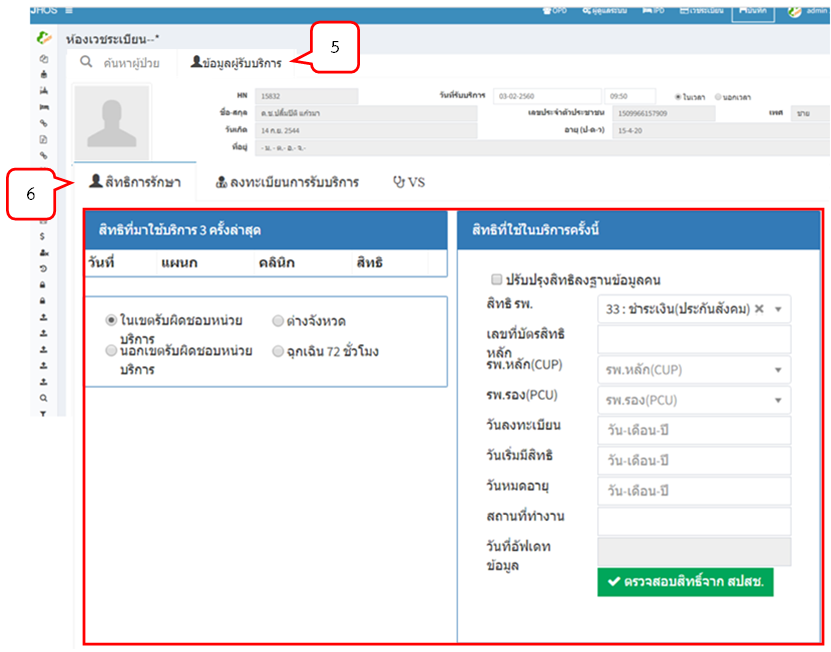

# ห้องเวชระเบียน
## ค้นหาผู้ป่วย
- คลิกที่แท็บ "ค้นหาผู้ป่วย" หมายเลข 1 ตามรูปภาพด้านล่าง
- กรอก HN/ CID/ ชื่อ/ นามสกุล อย่างใดอย่างหนึ่ง แล้วกดปุ่มค้นหา หมายเลข 2 ตามรูปภาพด้านล่าง
- ระบบแสดงข้อมูลผู้ป่วยที่ค้นหา
## ลงทะเบียนผู้มารับบริการ
- กดปุ่ม (4) ตามรูปภาพด้านล่าง เพื่อลงทะเบียนผู้มารับบริการ

## ข้อมูลผู้รับบริการ
- เลือกแท็บ "ข้อมูลผู้รับบริการ" มีแท็บการใช้งาน 3 แท็บ คือ สิทธิการรักษา ลงทะเบียนการรับบริการ และบันทึก Vital sign

## สิทธิการรักษา
- แท็บ "สิทธิการรักษา" จะแสดงสิทธิที่มาใช้บริการ 3 ครั้งล่าสุด สิทธิที่ใช้ในบริการครั้งนี้และสามารถตรวจสิทธิ์จาก สปสช. ได้
