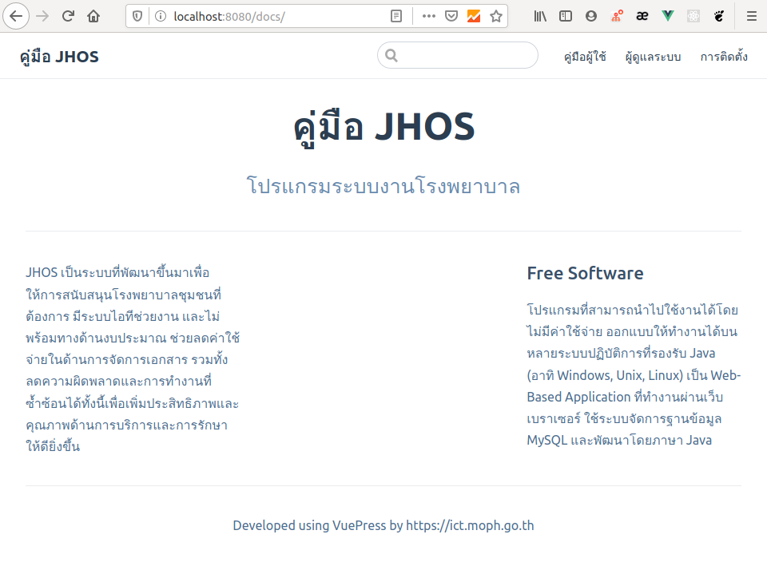
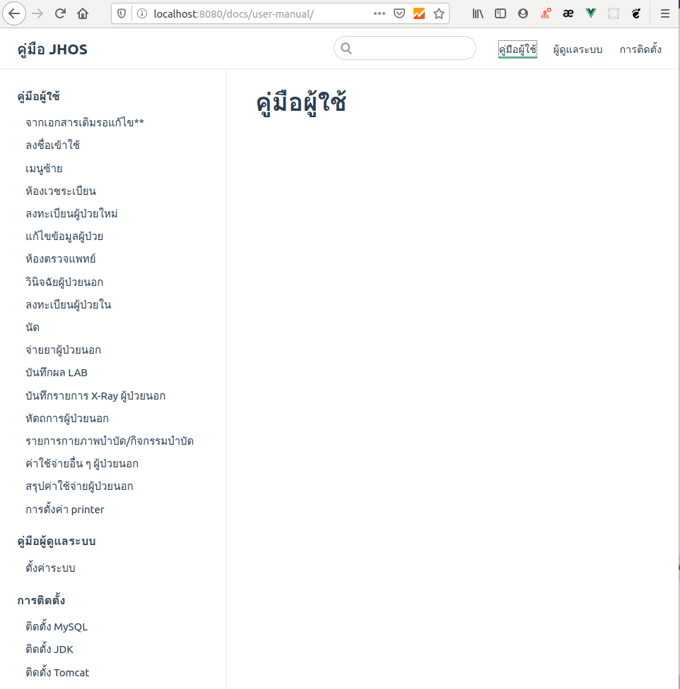
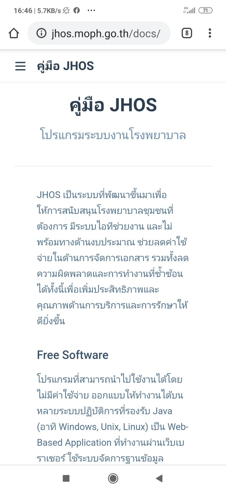
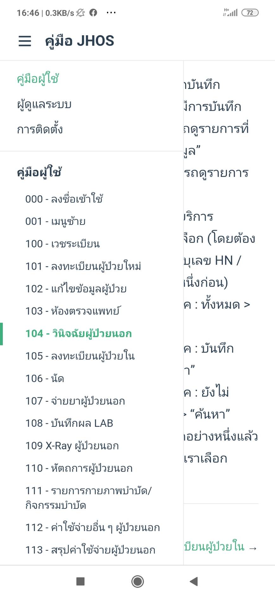
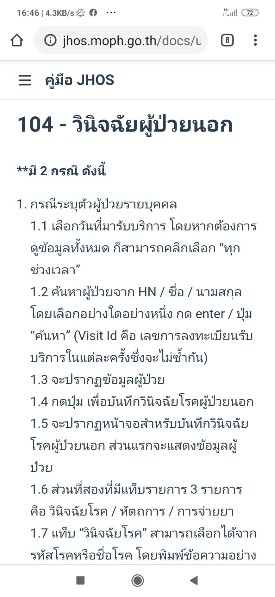

## วิธีเขียน
- [VuePress ใน 30 นาที](https://www.khomkrit.com/blog/2019-07-01-vuepress-quicklook.html)
- [ลองใช้ Vuepress ทำ Document หรือเนื้อหาประกอบคอร์สเรียน](https://devahoy.com/blog/2019/11/documentation-with-vuepress/)

## install dependencies
```
npm install
```

## run
```
npm run docs:dev
```

## build
```
npm run docs:build
```








ref:
- [scp with port number specified])(https://stackoverflow.com/a/10341062/2462784)
- [มี git แล้วชีวิตง่ายขึ้น เรามา Set ให้ Jenkins กับ gitlab รู้จักกันดีกว่า](https://medium.com/devopsthailand/%E0%B8%A1%E0%B8%B5-git-%E0%B9%81%E0%B8%A5%E0%B9%89%E0%B8%A7%E0%B8%8A%E0%B8%B5%E0%B8%A7%E0%B8%B4%E0%B8%95%E0%B8%87%E0%B9%88%E0%B8%B2%E0%B8%A2%E0%B8%82%E0%B8%B6%E0%B9%89%E0%B8%99-%E0%B9%80%E0%B8%A3%E0%B8%B2%E0%B8%A1%E0%B8%B2-set-%E0%B9%83%E0%B8%AB%E0%B9%89-jenkins-%E0%B8%81%E0%B8%B1%E0%B8%9A-gitlab-%E0%B8%A3%E0%B8%B9%E0%B9%89%E0%B8%88%E0%B8%B1%E0%B8%81%E0%B8%81%E0%B8%B1%E0%B8%99%E0%B8%94%E0%B8%B5%E0%B8%81%E0%B8%A7%E0%B9%88%E0%B8%B2-65c983c6720